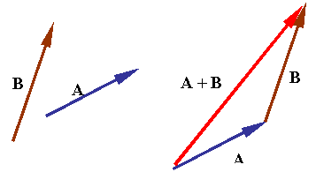
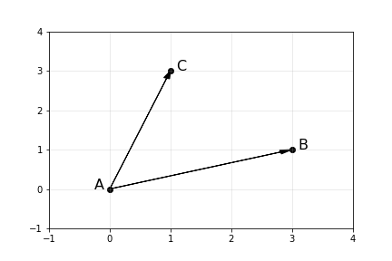
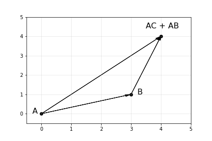
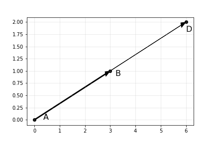

# Урок 1. Векторы

Материал по математике во всем курсе будет даваться довольно сжато, но в необходимом для прохождения курса объеме. Если какая-то из тем вас заинтересует, в конце урока будут ссылки на доп. информацию по теме.

Начнем плавно погружаться в математику с раздела, который называется линейная алгебра. Этот раздел посвящен векторам, матрицам и операциям над ним. Благодаря матрицам мы можем хранить в структурированном виде большое количество данных и успешно с ними работать. Вектор - более простой объект, с него мы и начнем.

## Что такое вектор?

Наверняка, вам еще со школы знакомо понятие вектора. Давайте сначала вспомним, что это такое, а затем узнаем где и как это можно применить.

Если по-простому, вектор - это "отрезок со стрелочкой". Вектор можно нарисовать, например, на плоскости. Для векторов доступно две операции - сложение и умножение на число.

При сложении векторов начало одного вектора прикладывается к концу другого и рисуется результирующий вектор.

В школе векторы часто записывают со стрелкой наверху: $\vec{a}$, мы же будем опускать стрелку и обозначать векторы просто латинскими буквами. Например, выражение с картинки можно записать так: $a + b$. Также можно обозначать вектора точками, которые его формируют. Например, если вектор идет из точки $A$ в точку $B$, то его можно записать как $AB$.

Пока понятие вектора выглядит каким-то простым и бесполезным. Давайте введем систему координат на плоскости и нарисуем на ней несколько векторов.

Как бы мы могли описать, например, вектор $AC$? Он начинается в точке $A(0, 0)$ и кончается в точке $C(1, 3)$. Можно вычесть координаты конца из координат начала и получить радиус-вектор.

**Радиус-вектор** - вектор, отложенный от начала координат. Обычно нам не интересно откуда начинается вектор, но интересно его направление и длина.

Посчитаем радиус-вектор $AC$:

$$AC = C(1, 3) - A(0, 0) = (1 - 0, 3 - 0)$$

$$AC = (1, 3)$$

Заметим, что координаты вектора $AC$ совпадают с координатами точки $C$. Так получилось лишь потому, что точка $A$ лежит в начале координат.

Аналогично можно посчитать вектор $AB = (3, 1)$.

**Задача** Найдите радиус-вектор $CB$.

## Операции над векторами

Итак, любой вектор на плоскости мы можем обозначить как пару чисел. Давайте научимся складывать векторы.

**Суммой векторов** будет сумма их координат. Давайте посчитаем $AC + AB$ из прошлого примера.

$$(1, 3) + (3, 1) = (1 + 3, 3 + 1) = (4, 4)$$

Если нарисовать этот вектор на плоскости, то он будет равен тому, что мы получим при геометрическом сложении векторов.

**Произведение вектора на число** можно получить, если умножить каждую компоненту вектора на это число.

$$2 * (3, 1) = (2 * 3, 2 * 1) = (6, 2)$$

Если нарисовать эти два вектора, то это будет равносильно растяжению вектора в два раза.

Если умножать вектора на число, большее 1, то вектор будет растягиваться. Если умножить вектор на число от 0 до 1 (например, 0.5), то вектор будет сжиматься. При этом направление у него останется тем же.

## Характеристики вектора

Мы уже изучили как можно задать вектор, используя координаты. Но это не единственный способ. Также мы можем задать вектор, если скажем его длину и угол наклона относительно оси X.

Давайте представим, что один вектор мы представили при помощи координат: $a=(1, 1)$, а другой при помощи длины и угла: $b=(3, 30^\circ)$. Как нам работать с векторами в разных форматах? Нужно привести их к одному виду. Давайте для начала научимся переводить координаты в длину и угол наклона.

Длину вектора обычно обозначают либо так: $|a|$, либо так $||a||$. Эти обозначения равнозначны.

Длину можно вычислить используя теорему Пифагора:

$$d = \sqrt{x^2 + y^2}$$

Чтобы вычислить угол, можно вспомнить определение синуса угла. Синус равен длине противолежащего катета, деленного на длину гипотенузы. В нашем случае катетом будет координата $y$, а гипотенузой длина вектора:

$$sin(\alpha) = \frac{y}{d}$$

Тогда можно вычислить угол:

$$\alpha = arcsin(\frac{y}{d})$$

Чтобы сделать обратное преобразование, можно использовать то же определение синуса и вспомнить определение косинуса. Косинус равен длине прилежащего катета, деленного на длину гипотенузы. Здесь катетом будет $x$:

$$cos(\alpha) = \frac{x}{d}$$

Тогда можно выразить $x$ и $y$:

$x = d \ cos(\alpha)$

$y = d \ sin(\alpha)$

Таким образом, мы выразили координаты через длину и угол.

Кстати, существует [полярная система координат](https://function-x.ru/geometry_coordinates_polar.html), где все точки задаются через длину и угол.

## Нормировка вектора

Иногда нам нужно получить вектор длины один. Такой вектор называют **единичным**.

Чтобы получить такой вектор, нужно разделить вектор на его длину. Пусть дан вектор $a$, тогда единичный вектор $e$ будет равен:

### $e = \frac{a}{|a|}$

## Скалярное произведение

Это операция, которая считает "схожесть" двух векторов. Если векторы направлены в одну сторону, то мы просто умножим их длины. Если они перпендикулярны друг другу, то получим 0. Скалярное произведение векторов $a$ и $b$ обозначается как $(a, b)$ и определяется вот такой формулой:

$(a, b) = |a||b|cos(\alpha),$

где $\alpha$ - угол между векторами. Этой формулой удобно пользоваться, когда нужно посчитать угол между векторами (он легко выражается отсюда). Если же нужно найти само значение скалярного произведения, то лучше использовать альтернативную формулу:

$(a, b) = x_1 x_2 + y_1 y_2$

## Вектора в многомерных пространствах

До этого момента мы рассматривали вектора в двумерном пространстве для простоты. На практике, вектора могут быть произвольной размерности. Чисто математически вектор задается набором чисел и нам совсем необязательно ассоциировать его с геометрическим определением (потому что тогда мы ограничены тремя пространствами).

Например, вектор $a=(1, 25, 180, 70, 1)$ будет пятимерным. Нарисовать его не получится, но зато мы можем сказать, что этот вектор кодирует собой какой-то объект из реального мира. Например, столбцы могут расшифровываться так:

1. Номер строки в таблице
2. Возраст человека
3. Рост
4. Вес
5. Если это мужчина, то записываем 1, если женщина - 0

Обычно компоненты вектора обозначаются нижним индексом. То есть, если мы хотим использовать рост человека, то можем использовать запись $a_3$.

Если мы возьмем несколько таких векторов, то мы сможем оперировать уже с набором объектов.

Если бы у нас было больше измерений, которые бы описывали интересы человека, то посчитав скалярное произведение (ну или просто угол между векторами), мы бы смогли определить насколько люди похожи между собой.

Кстати, удобную формулу для скалярного произведения мы определили только для двух измерений. В многомерном случае мы можем записать ее через знак суммы:

$(a, b) = \sum^{n}_{i=1} a_i b_i,$

где $n$ - размерность векторов. Обратите внимание, что в случае когда $n=2$, формула не изменилась.

## Полезные ссылки

- [Сайт с теорией и задачками](http://mathprofi.ru/vektory_dlya_chainikov.html)
