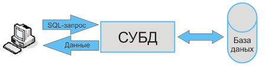

# Урок 1. Введение в БД

## Что такое база данных?

База данных - это файл (набор файлов), который хранит информацию в каком-то структурированном виде. В базах данных можно хранить любую информацию - от списка покупок до банковских транзакций.

Мы будем работать с **реляционными базами данных**. Это базы данных, в которых информация представляется в виде таблиц и таблицы могут быть связаны между собой. Также существуют нереляционные базы данных, которые позволяют хранить информацию в виде документов, графов или пар ключ-значение, но в основе этих баз данных лежат те же принципы. Базово реляционные базы данных работают быстрее.

Обычно когда говорят о базах данных, имеют ввиду СУБД (система управления базой данных). СУБД - прослойка между данными и человеком. Мы можем составлять запросы к данным при помощи специального языка SQL, СУБД превратит этот запрос набор команд и проделает нужные операции над данными (например, выгрузит информацию о нужной таблице). Используя СУБД нам совсем неважно в каком виде записаны данные, мы общаемся на языке, понятном нам, а СУБД уже обращается с данными.

Часто термин СУБД используют как синоним БД, но если встает вопрос об определениях, то это эти понятия следует разделять.

## Примеры СУБД

Существует множество реляционных баз данных. Во многом они взаимозаменяемы, различия в деталях. Ниже краткий обзор популярных СУБД:

- SQLite - самая простая СУБД. Хранит все данные в одном файле. Библиотека для работы с SQLite входит в стандартную библиотеку Python. Такую БД просто развернуть и обычно используют для разработки и тестирования, и именно ей мы и будем пользоваться. В продуктивном решении лучше использовать другие базы данных.
- PostgreSQL - быстрая и достаточно умная СУБД. Отлично подойдет для продуктива, но настроить сложнее.
- MySQL - аналог PostgreSQL. Раньше была популярна в связке с PHP, поэтому сейчас очень много сайтов используют именно эту СУБД.

Конкретную технологию выбирают в зависимости от потребностей и нагрузки проекта. Этим занимаются разработчики и инженеры баз данных. Задача аналитика чаще всего сводится к тому, чтобы успешно выгрузить данные из таблицы и записать результаты в другую таблицу при необходимости.
