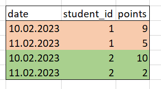

# Урок 2. SQL

Мы разобрались с тем, как должна выглядеть база данных, и какие в ней должны быть таблицы. Теперь нужно загрузить это все в компьютер. Для работы нам понадобится [SQLite Studio](https://sqlitestudio.pl/) или любой другой редактор, в котором можно просматривать базы данных и отправлять запросы.

## Оператор SELECT

При помощи оператора SELECT можно выбирать какие данные мы хотим достать из таблица. Например, можно выгрузить данные обо всех учениках при помощи такого запроса:

```sql
SELECT * FROM student
```

Звездочка означает, что мы берем все колонки, которые есть в таблице. Это равносильно такому запросу:

```sql
SELECT id, name, birth_date FROM student
```

Колонок в таблице может быть очень много, поэтому лучше не использовать лишний раз звездочку и явно указывать какие колонки понадобятся. Каждая лишняя колонка замедляет ваш запрос, хотя на маленьких учебных таблицах это может быть незаметно.

Если мы хотим изменить название колонки для удобства, то можем использовать оператор `as` (такой же трюк работает с названиями таблиц):

```sql
SELECT 
  id as number, 
  name as student_name, 
  birth_date as date 
FROM student
```

Обратите внимание, что на языке SQL принято писать ключевые слова большими буквами. Запрос будет работать вне зависимости от регистра, но принято использовать большие буквы.

## Фильтрация - WHERE

Иногда нам нужны не все строки из таблицы. При помощи оператора `WHERE` мы можем убрать лишнее. Например, если мы хотим получить учеников, которые родились после 2008 года, то мы можем сделать это при помощи такого запроса:

```sql
SELECT name, birth_date
  FROM student
 WHERE birth_date > "2008-01-01"
```

Вместо знака > можно подставить любой другой знак сравнение: <, ==, != или какое-то другое условие. Например, мы можем вывести людей с именем Антон:

```sql
SELECT name, birth_date
  FROM student
 WHERE name LIKE "% Антон %"
```

Эта конструкция будет искать строки, в которых имя содержит подстроку " Антон ". Обратите внимание, что если убрать пробелы по бокам, то найдется человек с отчеством Антонович.

## Сортировка - ORDER BY

Строки в таблице не упорядочены. Если мы хотим получить отсортировать таблицу по какой-то колонке, то можно сделать это при помощи конструкции `ORDER BY`. Например, давайте отсортируем учеников по дате рождения:

```sql
SELECT name, birth_date
  FROM student
 ORDER BY birth_date
```

Если мы хотим оставить только трех самых старших, то можем использовать `LIMIT`:

```sql
SELECT name, birth_date
  FROM student
 ORDER BY birth_date
 LIMIT 3
```

Конструкции можно соединять между собой. Найдем старшего человека, который родился после 2008 года:

```sql
SELECT name, birth_date
  FROM student
 WHERE birth_date > "2008-01-01"
 ORDER BY birth_date
 LIMIT 1;
```

## Соединяем таблицы - JOIN

До текущего момента мы работали с одной таблицей. Допустим, мы хотим узнать в каком классе учится каждый ученик. Для этого нам нужно для каждой строчки из таблицы student сопоставить строку из таблицы class. Сопоставлять будем по полю class_id и id, соответственно.

Выведем кто в каком классе учится

```sql
SELECT student.name AS name,
       class.name AS class
  FROM class
       JOIN
       student ON class.id == student.class_id;
```

Что произойдет, если у какого-то ученика в колонке class_id будет стоять значение NULL (т.е. пустое значение)? По умолчанию такая строка просто не отобразится в финальной таблице, так как по умолчанию используется "внутренний" JOIN. Если нам хочется все равно включить такую строку итоговую таблицу, то мы можем использовать один из видов JOIN-ов:


Например, используя `LEFT JOIN`, в таблицу попадут все те же значения, которые были при обычном JOIN-е, а также добавятся строки, для которых не нашлось пары из правой таблицы. В таком случае значения всех колонок, которые принадлежат правой таблице будут `NULL`.

Аналогично работает right join, только теперь таблицы A и B мы поменяли местами.

Если нам нужны все строки из обеих таблиц, и нам все равно, что любая из колонок теперь может быть `NULL`, то мы будем использовать `FULL JOIN`. По сути, `FULL JOIN` - это `LEFT JOIN` + `RIGHT JOIN`.

Если мы хотим для каждой строки из таблицы A сопоставить все строки из таблицы B, то мы можем использовать `CROSS JOIN`. Если бы в школе из примера каждый учитель вел все предметы, то мы могли бы использовать `CROSS JOIN`, чтобы вывести таблицу, где было бы указано какой учитель ведет какой предмет.

Потренируемся и выведем классных руководителей и их учеников:

```sql
SELECT teacher.name,
       class.name,
       student.name
  FROM teacher
    JOIN class 
        ON teacher.classroom_teacher_class_id == class.id
    JOIN student 
        ON student.class_id == class.id;
```

Использование `JOIN` не мешает нам использовать все остальные конструкции. Найдем старшего ученика 11 В класса:

```sql
SELECT student.name AS name,
       student.birth_date as date,
       class.name AS class
  FROM class
       JOIN
       student ON class.id == student.class_id
WHERE class.name == '11 "В"'
ORDER BY birth_date DESC
LIMIT 1;
```

Обратите внимание на порядок выполнения запроса. Сначала будет сделан `JOIN`, потом `WHERE`, затем `ORDER BY` и `LIMIT`. Операция `SELECT` выполняется в самом конце, но при этом если в таблице 100 колонок, а в `SELECT` мы указали только три, то СУБД поймет, что можно не тащить через весь запрос все 100 колонок и отберет только необходимые.

## Агрегируем данные - GROUP BY

Часто нам хочется как-то сгруппировать строки между собой и работать с группой строк как с одним объектом. В таких ситуациях на помощь приходит GROUP BY.

Давайте посчитаем сколько учеников учится в каждом из классов:

```sql
SELECT class_id, COUNT(*) as student_count
FROM student
GROUP BY class_id
```

Указав название столбца после `GROUP BY` мы соберем все строки, у которых значения столбца одинаковое, в одну группу. Дальше нужно что-то сделать с каждой группой - посчитать количество строк (функция `COUNT`), вычислить максимум какого-то столбца (функция `MAX`), или вычислить среднее значение (функция `AVG`). Важно начинать запрос с тех же столбцов, которые мы указали в `GROUP BY`. Например, такой запрос **будет неправильным**:

```sql
SELECT name, COUNT(*)
FROM student
GROUP BY class_id
```

Из запроса неясно какое имя в каждое группе вывести, а также мы не увидим для какого `class_id` посчитано значение `COUNT`.

При помощи `GROUP BY` удобно находить уникальные значения. Например, если мы хотим посчитать сколько учеников с каждым именем встречаетс в школе, то это можно сделать так:

```sql
SELECT name, COUNT(*) as num FROM student GROUP BY name
```

Если нам нужны только уникальные имена, то можно убрать `COUNT`:

```sql
SELECT name FROM student GROUP BY name
```

А такую конструкцию можно упростить при помощи `DISTINCT`:

```sql
SELECT DISTINCT name FROM student
```

`DISTINCT` выбирает уникальные значения в столбце. Например, если мы хотим посчитать количество уникальных имен, то проще всего это сделать так:

```sql
SELECT COUNT(DISTINCT name) FROM student
```

Напоследок напишем сложный запрос. В `GROUP BY` можно указывать несколько столбцов, если нам нужны уникальные пары значений. Давайте посчитаем сколько учеников у каждого классного руководителя:

```sql
SELECT teacher.name as teacher_name,
       class.name as class_name,
       COUNT(*) as student_count
  FROM teacher
    JOIN class 
        ON teacher.classroom_teacher_class_id == class.id
    JOIN student 
        ON student.class_id == class.id
GROUP BY teacher.name, class.name;
```

## Подзапросы

Иногда могут возникать ситуации, когда нужно для каждой строки таблицы выполнить свой запрос. SQL позволяет это сделать при помощи механизма подзапросов. Это выглядит как будто мы вместе одной из колонок вписываем новый SQL-запрос.

Важно: подзапрос должен возвращать ровно одно значение. Если строк будет больше, чем одна, то возьмется первая, но мы помним, что строки неупорядоченны, поэтому вообще-то вернется случайная строка.

Давайте для каждого ученика выведем дату рождения младшего ученика из его класса:

```sql
SELECT name,
       birth_date,
       class_id,
       (
           SELECT MAX(birth_date)
           FROM student as s
           WHERE student.class_id == s.class_id
       ) as max_birth_date
  FROM student;
```

Внутри запроса в таблицу `student` мы делаем еще один запрос в эту же таблицу, только чтобы различать эти два обхода, задаем в подзапросе имя `s`. Тогда в подзапросе у нас есть доступ ко всем данным из основного запроса. Подзапрос возвращает максимум из дат рождений всех одноклассников текущего ученика из внешнего запроса. Значение будет ровно одно.

Давайте теперь добавим к этой таблице колонку с названием класса:

```sql
SELECT student.name AS name,
       student.birth_date as date,
       class.name AS class,
       (
           SELECT MAX(birth_date)
           FROM student
           WHERE class_id == class.id
       ) as max_birth_date
  FROM student
  JOIN class
  ON class.id == student.class_id
  WHERE max_birth_date == birth_date;
```

Тоже самое можно сделать при помощи двух подзапросов:

```sql
SELECT student.name AS name,
       student.birth_date as date,
       (
           SELECT name
           FROM class as c
           WHERE c.id == student.class_id
       ) AS class,
       (
           SELECT MAX(birth_date)
           FROM student as s
           WHERE student.class_id == s.class_id
       ) as max_birth_date
  FROM student
  WHERE max_birth_date == birth_date;
```

Для тяжелых таблиц подзапросы будут работать намного быстрее, чем JOIN, но если подзапрос будет сложновычислимым, то выгоднее будет использовать JOIN. Отслеживайте скорость выполнения ваших запросов. Иногда поменяв JOIN на подзапрос можно ускорить запрос с трех часов до 5 минут.

## Временные таблицы

Как и при написании кода на Python, нужно стараться не переусложнять код. В частности, если ваш запрос выглядит слишком громоздко, то попробуйте его разбить на несколько запросов попроще, и результат каждого положить во временную таблицу.

Синтаксис выглядит так:

```sql
WITH tmp_table(name, class) AS (
  SELECT student.name as name, class.name as class FROM student
  JOIN class ON student.class_id == class.id
)
```

Этот код создает временную таблицу tmp_table с полями name и class, и дальше можно писать запрос, ссылаясь на эту таблицу. Эта таблица существует только внутри одного запроса, поэтому допишем в тот же файл:

```sql
SELECT * FROM tmp_table
```

Дальше если нам нужно будет несколько раз обратиться к этой таблице в подзапросах, то мы без проблем сможем это сделать, не копируя лишний код.

## Оконные функции

Разберем последнюю тему и сделаем небольшой аналитический проект.

Нам понадобится таблица mark с такими колонками: id, subject_id, student_id, value, datetime. В ней хранится информация об оценках учеников по всем предметам.

Поставим себе задачу посчитать рейтинг учеников. Нужно написать запрос, который для каждого дня, в который поставлена хотя бы одна оценка, будет формировать рейтинговую таблицу с именем ученика, его номером в рейтинге и количеством баллов.

Рейтинг хотим формировать как сумму баллов по всем предметам.

Например, в первый день Вася получил 3, 5, 4, значит у него 12 баллов, а Петя получил 3, 4, 3 и у него 10 баллов. Вася будет на первом месте, а Петя на втором. На второй день Вася получил двойку, а Петя получил пятерку, и тогда у Васи будет 14 баллов, а у Пети 15 баллов, и на второй день Петя будет на первом месте, а Вася на втором.

Задача - вывести лидера в каждый из дней и его количество баллов.

Начнем с того, что посчитаем сумму оценок каждого ученика на каждый день:

```sql
SELECT date(datetime) as date, student_id, SUM(value) as points FROM mark
GROUP BY date(datetime), student_id
```

Проверим, что все работает, сохраним все во временную таблицу:

```sql
WITH aggregated_marks(date, student_id, points) AS (
    SELECT date(datetime) as date, student_id, SUM(value) as points FROM mark
    GROUP BY date(datetime), student_id
)
```

Теперь нам нужно определить номер каждого ученика в рейтинге. В этом нам помогут оконные функции. Благодаря оконным функциям мы можем "вспоминать" что было в предыдущих строках таблицы. Для этого нужно задать окно, в котором мы будем просматривать таблицу, и задать порядок в котором нужно пройти это окно. Например, нам нужно разбить всю таблицу на кусочки по датам и упорядочить по количеству очков, а потом вывести номер строки в каждом таком кусочке.

Допустим, до применения оконной функции таблица выглядела так:


Тогда после применения окна, мы будем обходить таблицу вот так:



Синтаксис у оконной функции такой:

```sql
SELECT date, student_id, points, ROW_NUMBER() over w as rating
FROM aggregated_marks
WINDOW w AS (PARTITION BY date ORDER BY points DESC)
```

При помощи `WINDOW w AS` мы говорим, что объявляем окно с именем `w`, а дальше в скобках перечисляем, что хотим разбить таблицу по полю `date` на кусочки (партиции) и каждый кусочек отсортировать по `points`. Чтобы вспомнить, что мы обходим таблицу по специальному правилу, добавим столбец `rating`. Функция `ROW_NUMBER()` является оконной и имеет смысл только если применяется к какому-то окну (то есть обязательно нужно дописать `over w`). Эта функция выведет номер строки с учетом партиции и ее упорядоченности.

Операции `PARTITION BY` и `GROUP BY` очень похожи - они делят таблицу на кусочки по каким-то колонкам. Разница состоит в том, что после группировки количество строк в таблице станет меньше, а после применения оконной функции всегда останется тем же. Группировка агрегирует данные, окно просто задает порядок обхода таблицы.

Этот запрос мы также положим во временную таблицу:

```sql
WITH rating_table(date, student_id, points, rating) AS (

    WITH aggregated_marks(date, student_id, points) AS (
        SELECT date(datetime) as date, student_id, SUM(value) as points FROM mark
        GROUP BY date(datetime), student_id
    )

    SELECT date, student_id, points, DENSE_RANK() over w as rating
    FROM aggregated_marks
    WINDOW w AS (PARTITION BY date ORDER BY points DESC)
)
```

Остается последнее - из этой таблицы взять всех, кто занимал первые места в рейтинге:

```sql
SELECT date, name, points FROM rating_table
JOIN student ON rating_table.student_id == student.id
WHERE rating == 1
GROUP BY date
```

## Практика

1. Посчитать сколько оценок получил каждый ученик за все время. Колонки, которые должны получиться на выходе: student.name, marks_number
2. Вывести предмет, по которому больше всего оценок. Колонки на выходе: subject.name, marks_number
3. В последнем задании строить рейтинг для каждого предмета. Колонки на выходе: date, subject, name, points.
4. (со звездочкой) В последнем задании выводить топ-3 ученика в рейтинге на каждый день. Для решения понадобится [одна из функций LAG/LEAD](http://www.sql-tutorial.ru/ru/book_lag_and_lead_functions.html). Колонки на выходе: date, name_1, name_2, name_3

## Решения

1. .

```sql
SELECT student.name, COUNT(*) as marks_number 
FROM mark JOIN student 
ON mark.student_id == student.id
GROUP BY student.id
```

2. .

```sql
SELECT subject.name, COUNT(*) as marks_number 
FROM mark JOIN subject
ON mark.subject_id == subject.id
GROUP BY subject.id
```

3. .

```sql
WITH rating_table(date, student_id, subject_id, points, rating) AS (

    WITH aggregated_marks(date, student_id, subject_id, points) AS (
        SELECT date(datetime) as date, student_id, subject_id, SUM(value) as points FROM mark
        GROUP BY date(datetime), subject_id, student_id
    )

    SELECT date, student_id, subject_id, points, DENSE_RANK() over w as rating
    FROM aggregated_marks
    WINDOW w AS (PARTITION BY date, subject_id ORDER BY points DESC)
)

SELECT date, subject.name as subject_name, name as student_name, points FROM rating_table
JOIN student ON rating_table.student_id == student.id
JOIN subject ON rating_table.subject_id == subject.id
WHERE rating == 1
GROUP BY date, subject_id
```

4. Для топ-2 ниже, для топ-3 аналогично:

```sql
WITH rating_table(date, student_id, points, rating, student_id_2) AS (

    WITH aggregated_marks(date, student_id, points) AS (
        SELECT date(datetime) as date, student_id, SUM(value) as points FROM mark
        GROUP BY date(datetime), student_id
    )

    SELECT date, student_id, points, ROW_NUMBER() over w as rating, LEAD(student_id) over w as student_id_2
    FROM aggregated_marks
    WINDOW w AS (PARTITION BY date ORDER BY points DESC)
)


SELECT 
  date, 
  name as name_1, 
  points as points_1, 
  (
    SELECT name 
    FROM student 
    JOIN rating_table as r 
    ON student.id == r.student_id_2
  ) as name_2
FROM rating_table
JOIN student ON rating_table.student_id == student.id
WHERE rating == 1
WINDOW w AS (PARTITION BY date ORDER BY rating)
```
