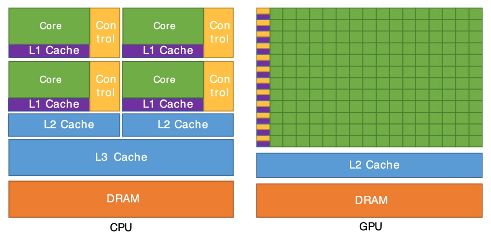

# Как работает компьютер

В дальнейшем мы будем часто говорить о том, что какие-то алгоритмы разрабатывались только для того, чтобы их можно было быстрее считать на компьютере, либо для того, чтобы они занимали меньше памяти. Но сколько вообще можно хранить данных в рамках одной программы? С какой скоростью будут обрабатываться данные и от чего это зависит? Почему для обучения нейросетей и майнинга криптовалют используют видеокарты? Давайте разбираться.

## Процессор

Чтобы лучше понять как работает компьютер, давайте представим, что компьютер - это предприятие с гигантским офисом и складами. На каждом этаже офиса происходят какие-то сложные процессы, но для начала давайте познакомимся с процессором. Самая важная часть процессора - **ядро**, для удобства давайте назовем его Мишей. Для процессора выделен целый этаж и Миша здесь главный, ведь он очень-очень важный сотрудник для компании. Работа Миши заключается в том, что на его этаж на грузовом лифте привозят кучу коробок с бумагами, которые он должен по очереди открыть, прочитать содержимое и поставить нужную печать. Миша работает очень быстро и за секунду может обрабатывать примерно миллиард коробок. Скорость работы Миши измеряется в герцах и называется **тактовой частотой процессора**. Каждая коробка - это **инструкция процессора**, а лифт - это **шина**, по которой доставляются данные. При помощи шины данные передаются внутри всего компьютера, и в том числе из оперативной памяти в процессор. Также на этаже Миши есть специальная комната для коробок, в которой удается сохранить только несколько десятков килобайт данных (одна коробка весит несколько байт, зависит от размера коробки), но зато не нужно никуда ездить. Эта комната называется **кэш процессора** или **сверхоперативная память**. Вообще, кэш делится на три уровня - L1, L2, L3, и чем больше цифра, тем он дальше от ядра, но нам это не так важно.

Откуда к Мише приезжают коробки? Он их заказывает с других этажей. Для того, чтобы заказать коробки, он звонит на этаж **оперативной памяти**, просит коробки и ждет их. Чтобы попросить коробки, нужно знать точные адреса по которым эти коробки располагаются. Обычно эта информация хранится в тех коробках, которые уже поступали до этого. Миша смотрит на содержимое коробок, запоминает какие данные ему нужно запросить и запрашивает.

Давайте знакомиться с оперативной памятью. Назовем ее Алена, она также работает одна на своем этаже, и у нее тут гораздо больше места, чем у Миши. На этаже Алены есть место для хранения нескольких гигабайт коробок. Когда поступает звонок от Миши, в котором он сообщает точный адрес каждой нужной коробки (или диапазон адресов), Алена идет к нужному шкафу и перетаскивает коробки оттуда в лифт. Скорость передачи у Алены ниже, чем скорость работы Миши. Когда мы пишем программу, она вся целиком загружается в оперативную память и все перменные, которые мы используем, хранятся в оперативной памяти. Однако есть одна проблема - после окончания рабочей смены (когда компьютер выключается), все коробки с этажа Алены пропадают. На следующий рабочий день (при включении компьютера) оперативная память опять постепенно заполняется. Откуда поступают данные в оперативную память? Из постоянной памяти.

Постоянная память представляет из себя гигантский склад на сотни гигабайт, который находится далеко от здания, где сидят Алена и Миша. Склад хорошо охраняется и при выключении электричества, оттуда ничего не пропадает. Данные внутри постоянной памяти важны для пользователя. В постоянной памяти хранится операционная система, а также все документы и файлы, которыми вы пользуетесь. Из постоянной памяти коробки с данными отправляются специальными грузовиками. Чтобы Миша получил доступ к этой информации, Алене нужно разгрузить грузовики и отправить их Мише. Может случиться так, что вся необходимая информация из постоянной памяти за раз не может поместиться в оперативной памяти. Например, пользователь решил посмотреть фильм, который весит 15 гигабайт, а оперативная память всего 8 гигабайт. Но нам ведь и не нужно сразу отображать на мониторе весь фильм, нужно лишь отображать кадры и звук в нужной последовательности. В таком случае постепенно будут отправляться кусочки фильма из постоянной памяти в оперативную, при этом старые кадры удаляются из оперативной памяти.

Для разных компьютеров существуют разные виды постоянной памяти. Самый простой вид памяти - жесткий диск (HDD). Жесткие диски очень дешевые, но с них довольно медленно считывается информация (медленнее, чем 200 Мб/сек). Есть более быстрый вид памяти - твердотельные накопители (SSD), скорость которых намного выше (как и цена) и достигает 550 Мб/сек. SSD хоть и работает достаточно быстро, но все еще значительно медленнее, чем оперативная память, которая может передавать гигабайты данных за секунду, но и цена оперативной памяти значительно выше. Скорость передачи данных внутри процессора достигает десятков гигабайт данных за секунду, но внутри процессора хранится очень малое и ограниченное количество данных.

Еще один важный факт - есть разница между скоростью чтения и записи. Миша может не только читать данные, которые отправляет ему Алена, но и отправлять какие-то данные с просьбой записать их в определенные ячейки. Точно также Миша может попросить Алену отправить какие-то коробки на склад. Скорость записи обычно немного ниже, чем скорость чтения.

## Оптимизируем процессор

Современные процессоры ускоряются чаще всего не за счет увеличения тактовой частоты (скорости работы Миши), а за счет того, что к Мише подселяют соседа (назовем его Миша-2), который умеет делать все то же самое. Одну коробку может обрабатывать только один Миша. Мало того, чаще всего коробки связаны между собой и если один Миша начал обрабатывать связанные между собой коробки, то второй Миша не может ему никак помочь. Однако если приходит две не связанные между собой группы коробок, то они их могут делать параллельно и тогда вся задача решится гораздо быстрее. Благодаря этому мы можем одновременно слушать музыку, смотреть новости и скачивать фильм. Эти процессы не связаны между собой и могут выполняться разными **ядрами процессоров**.

Можно ли делать несколько независимых дел одновременно на одноядерном процессоре? Конечно, можно. Для этого вводят понятие **потока**. Давайте представим, что все коробки имеют свой цвет. Например, коробки, отвечающие за ввод-вывод, розового цвета, а за работу с сетью зеленого. Тогда постоянно Миша будет обрабатывать розовые коробки, потому что с мыши и клавиатуры постоянно приходят сообщения, но когда вы зайдете в Интернет, к нему также иногда начнут поступать зеленые коробки. Из-за того, что Миша очень быстро работает, мы не замечаем, что на самом деле эти процессы работают в разных потоках на одном ядре и обрабатываются не одновременно. Однако для того, чтобы обрабатывать коробки какого-то цвета, Мише нужна специальная печать, которую он поставит на бумаги внутри коробки. Если Миша обрабатывает только розовые коробки, то ему нужна всего одна печать, но если появляются зеленые коробки, то ему понадобится вторая печать. В один момент времени Миша может использовать только одну печать и ее смена занимает время. Каждый раз, когда цвет коробки будет меняться, необходимо запомнить состояние потока - **контекст** - текущего потока, затем вспомнить контекст нового потока и начать обрабатывать его.

Благодаря тому, что даже одно ядро процессора работает достаточно быстро, на нем можно делать несколько независимых операций последовательно, но пользователь этого не заметит и ему будет казаться, что оно выполняется параллельно. Если же есть несколько физических ядер, то можно добиться большего ускорения.

А теперь давайте представим, что мы захотели поиграть в новую 3D-игру. Компьютеру нужно посчитать все вершины всех объектов, найти их пересечения, просчитать всю физику в игре, а также не забывать про игровую логику, звуки, ввод-вывод и многое другое. По отдельности все эти задачи не такие уж и сложные. Любой из Миш без проблем смог бы заниматься только отрисовкой какой-нибудь ёлки, или отвечать только за звук внутри игры, но если дать ему больше задач, то он перестанет успевать и игра начнет тормозить. Что же делать? На помощь приходит видеокарта.

Видеокарта состоит из сотен и даже тысяч маленьких ядер. Назовем одно такое маленькое ядро Сережей. Сережа не такой эффективный как Миша, у Сережи нет своей комнаты для коробок, да и все что умеет делать Сережа - это складывать и умножать числа. Но зато их очень много и они могут работать независимо друг от друга. Нанять несколько десятков Сереж намного дешевле, чем одного Мишу. Также Миша умеет не только складывать и умножать числа, но и обращаться к памяти (когда звонит Алене), и многое другое. Помните, что Миша без проблем бы мог рисовать ёлку? Так вот Сережа тоже может. Дело в том, что для этого нужно просто посчитать вершины и отправить их на отрисовку, а считать Сережа умеет. А тысяча Сереж могут нарисовать тысячу ёлок. Но обычно нам не нужно рисовать тысячу ёлок, вместо этого мы можем кому-то отдать отрисовку главного героя, кому-то отрисовку противников, а кто-то будет заниматься физикой или игровой логикой.

У видеокарты также есть своя память, которую называют **видеопамятью** и она обычно измеряется гигабайтами. Сережи могут без проблем читать и записывать эту память, и делают они это достаточно быстро, при этом не происходит обращений в оперативную память. Чем лучше видеокарта, тем больше в ней процессоров и тем больше видеопамять.

Этаж, где живут Миши, называют **центральным процессором (CPU)**, а этаж, где живут Сережи, называют **графическим процессором (GPU)**. Если нужно за раз посчитать большое количество связанных между собой коробок, то обращаются к Мишам. Если коробки между собой не связаны, то их отдают Сережам. Графический процессор используют для игр, видеомонтажа, 3D-моделирования и других задач, где требуется много вычислений. Центральный процессор отвечает за поддержание операционной системы, за ввод-вывод, воспроизведение звуков, поддержание интернет-соединения и прочих задач, которые сложно распараллелить и где требуется большая тактовая частота.

Если собрать компьютер, в котором будет самый мощный процессор и самая мощная видеокарта, но при этом в нем будет медленная шина или там будет стоять HDD диск, то такой компьютер будет медленно работать. В современном мире производительность компьютеров уперлась в предел пропускной способности шины, а не в мощность процессоров. Если купить процессор в два раза дороже, то прирост в производительности в повседневных задачах вы не ощутите, но если замените память на более быструю, или купите компьютер с быстрой шиной, то это повлияет куда больше. Миша будет очень долго ждать, пока лифт поднимется к нему, затем моментально все делать и ждать пока приедет новая порция данных.

А что там с нейросетями? Дело в том, что в основе обучения нейросетей лежат простые арифметические операции и умножение матриц. Эти операции хорошо параллелятся для многих видов нейросетей и поэтому то, что на центральном процессоре может считаться годами, на видеокарте посчитается за несколько часов. По этой же причине криптовалюты майнят на видеокарте. В основе майнинга лежит вычисление математических функций. Чем быстрее вычисляются эти функции, тем больше шанс получить единицу криптовалюты. А функции можно считать параллельно, так как они не связаны между собой.
