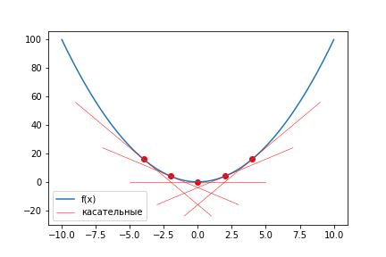
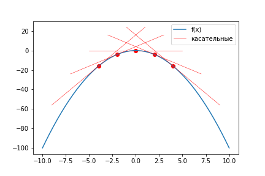
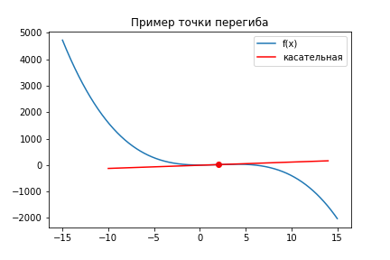

# Нахождения максимума и минимума функции. Частные производные

Как мы уже выяснили, производные помогают находить максимумы и минимумы функций. Давайте посмотрим как именно это происходит и какая интуиция лежит за этим.

## Производная и максимум/минимум

В прошлом уроке мы говорили, что производная положительна, если функция возрастает, и отрицательна, если функция убывает. Что будет, если производная равна нулю?

Давайте посмотре на функцию $x^2$ на отрезке от -2 до 2. В начале отрезка функция будет убывать и касательная будет под углом. Но при прохождении через 0 касательная станет горизонтальной линией и производная станет равна нулю. Это произошло в минимуме функции.

Если график мысленно перевернуть, то получим такой же результат для максимума (производная тоже будет равна нулю).

Точка, в которой производная достигает нуля, называется **точкой экстремума**. Пусть мы нашли такую точку $x_0$. Для удобства возьмем одну точку слева и одну точку справа: $x_1 < x_0 < x_2$. Точки экстремума можно поделить на три типа:

- максимум функции - до этой точки функция возрастала $f'(x_1) > 0$, после убывает $f'(x_2) < 0$
- минимум функции - до этой точки функция убывала $f'(x_1) < 0$, после возрастает $f'(x_2) > 0$
- точка перегиба как до, так и после этой точки функция продолжит убывание/возрастание. Так как производные до и после точки одного знака, то можно записать так: $f'(x_1)f'(x_2) > 0$

Используя это можно сформулировать простой алгоритм нахождения всех точек минимума и максимума функции:

1. Вычислить производную функции - $f'(x)$
2. Найти точки, в которых производная равна нулю - $f'(x)=0$
3. Проверить каждую из точек на максимум/минимум, используя три типа точек экстремума

## Производная от функции нескольких переменных

Давайте рассмотрим функцию от двух переменных - $f(x,y)$. Как найти максимум такой функции? Просто так тут производную уже не посчитаешь. Или посчитаешь?

Давайте зафиксируем одну из переменных (например $y$), и возьмем производную только по $x$, представляя, что $y$ - это просто константа. Например, вот так:

$$f(x) = x^2 + y^2 + 2x + y$$

$$f'_x(x, y) = 2x + 2$$

Аналогично можно взять производную по $y$:

$$f'_y(x, y) = 2y + 1$$

Полученные производные $f'_x, f'_y$ называют **частными производными**. Каждая из производных говорит о том, насколько сильно будет расти функция, если менять только эту переменную. Также иногда частные производные обозначают так: $\frac{\delta f}{\delta x}$, причем в знаменателе пишут параметр, по которому дифференцируют.

Когда у функции два аргумента, ее графиком будет являться объемная поверхность. Давайте возьмем какую-то точку $(x_0, y_0)$, найдем значение функции для этой точки и посчитаем частные производные в этой точке: $(f'_x, f'_y)$. Из этих частных производных можно сформировать вектор. Этот вектор называют **градиентом** и он указывает направление роста производной. Также градиент обозначают так: $\nabla f$, $grad f$.

Если приравнять градиент к нулю $\nabla f = 0$, то можно получить систему уравнений. Посмотрим как будет выглядеть эта система для нашей функции $f(x, y)$:

$$
\begin{cases}
2x + 2 = 0 \\
2y + 1 = 0
\end{cases}
$$

В данном случае получилась простейшая система линейных уравнений, решением которой является точка $M(-1, -0.5)$ но в общем случае уравнения могут быть нелинейными и их решение может быть затруднительным.

Точка, в которой градиент равен нулю, является **критической точкой** для функции нескольких переменных. Чтобы проверить, является ли эта точка экстремумом, нужно сделать еще одну проверку. Для того, чтобы проверить максимум это или минимум, способ из начала урока не поможет, так как мы не сможем выбрать точку "до" и "после". Для таких случаев есть второй способ, но для него нужно будет посчитать вторые производные функции. Также обозначим буквами каждую вторую производную:

$$A = f'_{xx} = 2$$
$$B = f'_{xy} = 0$$
$$C = f'_{yy} = 2$$
$$D = AC - B^2$$

Далее возможны три ситуации:

1. $D>0$ в точке $M$ есть экстремум, причем $A<0$ => максимум, $A>0$ => минимум.
2. $D<0$ в точке $M$ нет экстремума.
3. $D=0$ нужны дополнительные исследования

В нашем случае все хорошо, и точка является максимумом.
