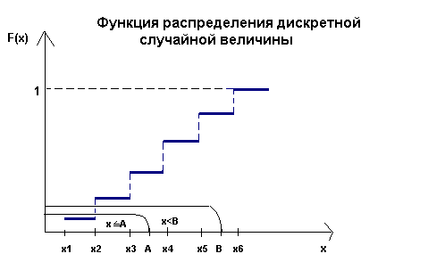
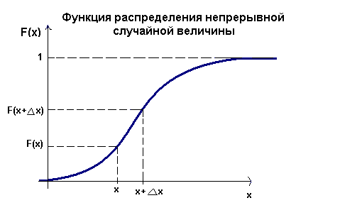

# Случайные величины

Этот урок будет посвящен теории вероятности.

## Что такое вероятность?

Некоторые процессы мы не можем описать точно, либо это может потребовать слишком сложных вычислений. Например, когда мы подкидываем монетку, то, конечно, мы можем составить физическую модель, которая скажет как приземлится монетка, но чаще всего нам проще сказать, что выпадет либо одна, либо другая сторона с одинаковым шансом. В таком случае говорят о вероятности события.

Формальное определение вероятности достаточно сложное, поэтому мы ограничимся несколькими более простыми определениями вероятности, которых достаточно для того, чтобы работать с ней. Когда говорят о том, что нужно найти вероятность какого-то события, то мы вольны выбирать любое из этих определений.

1. Вероятность - величина от 0 до 1. Если вероятность какого-то события равна 1, то говорят, что такое событие **достоверное**, а если вероятность равна 0, то такое событие **невозможное**. Вероятность события $A$ обычно обозначают как $P(A)$.

2. Часто в теории вероятности говорят о **полной группе событий**. Это такой набор событий, одно из которых произойдет наверняка. Например, при броске 6-гранного кубика достоверно известно, что он упадет на одну из сторон, а всего возможно 6 вариантов. Эти 6 вариантов будут образовывать полную группу событий. Сумма вероятностей всех элементов такой группы равна 1.

3. Чтобы посчитать вероятность события $A$, нужно рассмотреть все возможные варианты $N$, выбрать из них $k$ подходящих и вычислить:

$$P(A) = \frac{k}{N}$$

Этот подход называют **классическим определением вероятности**.

4. В случае, когда мы не можем вычислить все возможные варианты, мы можем прибегнуть к другой формуле. Если у нас есть какой-то набор данных размера $N$ и в них нужное нам событие $A$ происходит $k$ раз, то вероятность можно записать так:

$$P(A) = \lim_{N \rightarrow \infty} \frac{k}{N}$$

Разница с предыдущей формулой состоит в том, что мы не знаем всех возможных вариантов, но по существующим данным можем посчитать приближенное значение вероятности. При появлении большего количества данных, значение станет более точным.

Это называют **статистическим определением вероятности**.

5. Предыдущие подходы не подходят для случая, когда количество всех исходов бесконечно. Для таких случаев мы можем использовать **геометрическое определение вероятности**. Представим плоскость $S$, внутри которой мы случайно выбираем точку раз за разом. Какова вероятность, что мы попадем в область $G$ внутри этой плоскости? Пусть площадь $S$ равна $s$, а площадь $G$ равна $g$, а событие $A$ - точка попала в $G$. Тогда вероятность можно записать так:

$$P(A) = \frac{g}{s}$$

## Непрерывные и дискретные случайные величины

Понятие вероятности содержательно, но все еще довольно абстрактное. Сделаем следующий шаг - введем понятие случайной величины, с помощью которых можно описывать реальные процессы.

**Случайной** называют **величину**, которая в результате испытания примет только одно из возможных значений. Случайные величины обозначают заглавными латинскими буквами: $X, Y, Z, \dots$.

Например, $X$ - количество очков, которое выпадет на кубике. В результате эксперимента мы получим значение от 1 до 6.

Случайные величины бывают двух видов - дискретные и непрерывные. Если случайная величина дискретная, то мы можем посчитать количество всех ее исходов (хотя оно может быть бесконечным). В случае с непрерывной случайной величиной множество всех исходов несчетно и всегда бесконечно велико.

Примеры дискретных случайных величин:

- бросок кубика/монетки
- пол ребенка
- количество голов, которое будет забито в футбольном матче

Примеры непрерывных случайных величин:

- Температура в комнате (температура - вещественное число)
- Время, через которое приедет следующий автобус к остановке

Любая случайная величина формирует **распределение**. Рассмотрим на примере дискретной случайной величины.

Мы можем составить таблицу, где сопоставим исход и его вероятность. Пусть $X$ - количество очков, выпавших на кубике. $x_i$ соответствует выпаданию $i$ очков. Тогда можно составить такую таблицу:

| $x_1$ | $x_2$ | $x_3$ | $x_4$ | $x_5$ | $x_6$ |
| -- | -- | -- | -- | -- | -- |
| $\frac{1}{6}$ | $\frac{1}{6}$ | $\frac{1}{6}$ | $\frac{1}{6}$ | $\frac{1}{6}$ | $\frac{1}{6}$ |

Вероятности, соответствующие $x_1, \dots, x_n$ обычно обозначают $p_1, \dots, p_n$.

Сумма всех значений в таблице должна быть равна 1 (то есть, они образуют полную группу событий).

Дискретная случайная величина однозначно задается таблицей распределения.

Записывать распределение в виде таблицы очень наглядно, но чаще всего неудобно, поэтому давайте введем **функцию распределения**, которая также позволяет однозначно задать распределение.

Функцией распределения $F(x_i)$ называется функция, которая показывать вероятность наступления события $x_i$ и всех событий до него. Например $F(x_3) = p_1 + p_2 + p_3$. Чтобы посчитать вероятность $p_i$, мы можем посчитать разницу:

$$p_i = F(x_{i-1}) - F(x_i)$$

График функции распределения будет выглядеть как ступеньки:

Обратите внимание, что график разрывен в каждой точке $x_i$.

Для непрерывных случайных величин мы не можем построить таблицу как для дискретных величин, зато можем задать функцию $F(x)$, и такая функция будет непрерывной.

Графики функции распределения всех непрерывных случайных величин выглядят примерно одинаково, хотя сами распределения могут быть очень разными. В случае с дискретной случайной величиной мы смотрели на разность между двумя соседними точками. Аналогом этого действия для непрерывных случайных величин будет взятие производной $F'(x)$. После дифференцирования получится новая функция $f(x)$, которую называют **плотностью распределения случайной величины**. Плотности разных распределения уже хорошо различаются между собой.

Чтобы лучше понять что такое плотность распределения, нам понадобится интеграл. Если мы хотим узнать вероятность того, что случайная величина примет значение на промежутке $(a, b)$, то нам нужно будет посчитать площадь под функцией плотности на этом отрезке:

$$P(a < X < b) = \int_a^bf(x)dx$$

Любопытный факт - вероятность того, что случайная величина примет любое конкретное значение $a$ равна нулю, потому что интеграл от $a$ до $a$ равен нулю. Поэтому всегда рассматривают вероятность на каком-то промежутке.

## Матожидание и дисперсия

### Матожидание

Для случайных величин нам бы хотелось знать какое значение величина принимает в среднем. **Матожидание** $E[X]$ дает ответ на этот вопрос.

Если мы возьмем кубик, подбросим его несколько раз и запишем значения после каждого броска, а потом посчитаем среднее количество очков, то мы получим число, близкое к матожиданию. Однако нам придется очень долго бросать кубик, чтобы **точно** узнать какое же значение будет у кубика.

Для дискретной случайной величины матожидание можно посчитать так: умножим вероятность каждого события на его значение

$$E[X] = \sum_{i=1}^n x_i p_i$$

Посчитаем матожидание для бросков кубика. Вероятность выпадения каждого из чисел равна $\frac{1}{6}$. Посчитаем по формуле:

$$E[X] = 1 * \frac{1}{6} + 2 * \frac{1}{6} + 3 * \frac{1}{6} + 4 * \frac{1}{6} + 5 * \frac{1}{6} + 6 * \frac{1}{6}$$

$$E[X] = \frac{1}{6} (1 + 2 + 3 + 4 + 5 + 6)$$

$$E[X] = \frac{21}{6} = 3.5$$

То есть в среднем будет выпадать 3.5 очка.

Что делать в случае непрерывного распределения? Вероятность события теперь задается не таблицей, а функцией распределения. На самом  деле, логика остается той же - нужно взять каждое значение и умножить его на вероятность этого значения, только теперь знак суммы изменится на знак интеграла, а вероятность события на функцию плотности вероятности.

$$E[X] = \int_{-\infty}^{\infty} xf(x)dx$$

Рассмотрим, например, равномерное распределение от a до b. Это распределение описывает ситуацию, когда каждое значение внутри отрезка $[a, b]$ имеет одинаковую вероятность на реализацию. Очевидно, что матожидание будет ровно посередине между a и b, но давайте это проверим. Сначала запишем функцию плотности внутри промежутка $[a, b]$, в остальных точках вероятность будет равна 0.

$$f(x) = \frac{1}{b-a}$$

Теперь посчитаем интеграл. На всех точках вне отрезка $[a, b]$ интеграл будет равен 0, поэтому от бесконечностей можно избавиться. Интеграл можно взять при помощи таблицы первообразных и формулы Ньютона-Лейбница. В последнем переходе использовалась формула сокращенного умножения для разности квадратов.

$$E[X] = \int_{-\infty}^{\infty} xf(x)dx = \int_{a}^{b} x * \frac{1}{b-a} dx = \frac{1}{b - a} * \frac{x^2}{2}|^b_a = \frac{1}{b - a} * \frac{b^2 - a^2}{2} = \frac{b + a}{2}$$

### Дисперсия

Помимо среднего значения нам бы хотелось понимать насколько сильный разброс у случайной величины. Например, если случайная величина имеет матожидание $E[X]=100$, то это нам ни о чем не говорит. Но вот если нам скажут, что также дисперсия $D[X]=10$, то мы будем понимать, что вряд ли нам попадутся значения меньше нуля или больше 200. В то же время если дисперсия окажется 1000, то диапазон значений будет значительно шире.

Для того, чтобы посчитать дисперсию, мы можем посчитать насколько в среднем отклоняется значение случайной величины от матожидания. Так как отклонение может быть и отрицательным и положительным, то давайте будет возводить отклонение в квадрат, чтобы работать только с положительными величинами. Тогда можно записать такую формулу:

$$D[X] = E[(X - E[X])^2]$$

Для дискретной величины эта формула превращается вот в такую:

$$D[X] = \sum_{i=1}^{n} p_i (x_i - E[X])^2$$

А для непрерывной вот в такую:

$$D[X] = \int_{-\infty}^{\infty}f(x)(x-E[X])^2dx$$

Давайте опять обратимся к примеру с кубиками. Посчитаем отклонения значений от матожидания:

$$6 - 3.5 = 2.5$$
$$\dots$$
$$1 - 3.5 = -2.5$$

Возведем все значения в квадрат:

$$(2.5)^2 = 6.25$$
$$\dots$$
$$(-2.5)^2 = 6.25$$

А теперь каждое из значений домножим на его вероятность и сложим все. Так как вероятность каждого события здесь равна $\frac{1}{6}$, то этот член сразу можно вынести за скобки.

$$
\frac{1}{6} (6.25 + 2.25 + 0.25 + 0.25 + 2.25 + 6.25) = \\
= \frac{17.5}{6} = 2.92
$$

Обратите внимание, что дисперсия - квадратичная величина. Например, если случайная величина измеряется в метрах, то дисперсия будет иметь размерность $м^2$. Для того, чтобы сравнивать дисперсию со значениями случайной величины, обычно извлекают корень из дисперсии, и такая величина называется **стандартным среднеквадратичным отклонением** $\sigma = \sqrt{D[X]}$. Такая величина будет иметь ту же размерность, что и исходная величина.
