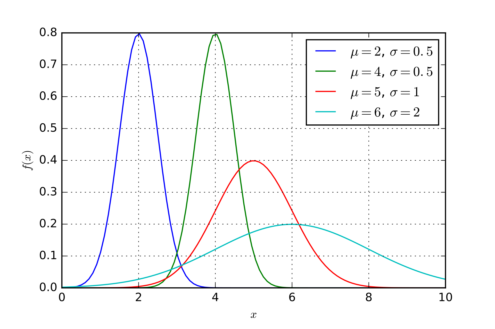

# Основные виды распределений случайных величин

В прошлом уроке мы поговорили о том, что такое случайная величина и какие у нее бывают характеристики. Сейчас мы разберемся с несколькими конкретными распределениями, которые часто встречаются на практике.

## Биномиальное распределение

Представьте, что мы подкидываем нечестную монетку. Вероятность выпадения орла $p$, а вероятность выпадения решки $q=1 - p$. Эту монетку мы подкидываем $n$ раз. Количество выпавших орлов - значение случайной величины. Эта задача эквивалентна любой другой задаче, где есть эксперимент с двумя исходами, который повторяется какое-то количество раз. Например, вероятность брака изделия на заводе или вероятность случайно ответить правильно на вопрос в тесте.

Какова вероятность, что выпадет ровно $k$ орлов?

$P(X=k)=C_n^k p^k q^{n-k}$

Здесь $C_n^k$ - [биномиальный коэффициент](https://ru.wikipedia.org/wiki/%D0%91%D0%B8%D0%BD%D0%BE%D0%BC%D0%B8%D0%B0%D0%BB%D1%8C%D0%BD%D1%8B%D0%B9_%D0%BA%D0%BE%D1%8D%D1%84%D1%84%D0%B8%D1%86%D0%B8%D0%B5%D0%BD%D1%82), для его вычисления существует формула

$$C_n^k = \frac{n!}{(n-k)!k!}$$

Если нам нужно посчитать вероятность того, что количество выпавших орлов будет находиться в промежутка от $k_1$ до $k_2$, то нужно просто сложить вероятности на этом промежутке:

$$P(k_1\leq X \leq k_2) = \sum_{i=k_1}^{k_2} P(X=i)$$

Если же мы хотим посчитать вероятность, что выпадет больше чем $j$ орлов, то достаточно вычислить вероятность выпадения $j$ орлов и вычесть ее из единицы:

$$P(X>j) = 1 - P(X < j) = 1 - \sum_{i=0}^{j}P(X=i)$$

Для биномиального распределения известны матожидание и дисперсия:

$$M[X] = pq$$

$$D[X] = npq$$

Поэтому мы заранее можем предсказать сколько в среднем будет выпадать орлов, если знаем, что случайная величина принадлежит биномиальному распределению.

## Нормальное распределение

Главное распределение во всей теории вероятностей - нормальное распределение. Это непрерывное распределение, функция плотности распределения имеет форму шляпы:



А сама функция выглядит довольно страшно и неприветливо:

$$f(x) = \frac{1}{\sigma \sqrt{2\pi}}e^{-\frac{1}{2}(\frac{x-\mu}{\sigma})^2}$$

Но мы не будем пользоваться этой формулой, так как за нас уже вычислили все необходимые значения и записали их в специальные статистические таблицы, которые реализованы в виде функций в библиотеках.

Итак, что же такое нормальное распределение? Давайте представим, что мы собрали статистику о росте всех людей на Земле. Полученные значения будут очень приближены к нормальному распределению. У распределения есть матожидание $\mu$ и дисперсия $\sigma^2$, и 68% измерений будут лежать в диапазоне $[\mu - \sigma;\mu+ \sigma]$, а в диапазоне "трех сигм" будет лежать 99% наблюдений: $[\mu - 3\sigma; \mu + 3\sigma]$. Обычно нормальное распределение обозначают $\mathcal{N}(\mu, \sigma^2)$

Другие примеры нормального распределения:

- отклонение при стрельбе
- погрешности измерений приборов
- показатель IQ людей

Откуда появилось нормальное распределение и почему оно так важно? Если мы рассмотрим любое распределение (не важно дискретное или непрерывное), то при помощи специальных преобразований мы можем свести его к нормальному. Этот факт носит имя **центральной предельной теоремы (ЦПТ)** и более подробно мы поговорим об этом в следующем уроке. Благодаря этому свойству мы можем доказывать, что прогнозы моделей, которые мы будем строить, на самом деле имеют смысл, а не просто случайно угаданы.

Также мы столкнемся с нормальным распределением при статистической проверке гипотез.

Отдельно выделяют **стандартное нормальное распределение**. Это нормальное распределени с зафиксированными параметрами: $\mathcal{N}(0, 1)$. Все таблицы и функции изначально рассчитаны именно для этого распределения. Но как же быть, если параметры вашего распределения другие? Например $\mathcal{N}(\mu, \sigma^2)$. В таком случае нужно сделать **z-преобразование** над исходным распределением:

$$z = \frac{x - \mu}{\sigma}$$

Другими словами, мы вычитаем матожидание (сдвигаем график влево, чтобы матожидание стало нулевым) и делим на стандартное отклонение (чтобы дисперсия стала 1).

Как узнать вероятность того, что случайная величина примет значение в промежутке $[a, b]$? Для этого нужно посчитать интеграл от функции распределения. Если мы говорим про стандартное нормальное распределение, площадь под графиком поможет посчитать функция Лапласа:

$$\Phi(x) = \int_0^x f(x)dx$$

Соответственно, если мы хотим посчитать площадь от $a$ до $b$, то можно это сделать следующим способом:

$$P(a \leq X \leq b) = \Phi(b) - \Phi(a)$$

Почему такая формула? Когда мы считаем $\Phi(b)$, то мы считаем площадь от 0 до $b$. От этой площади надо отнять "лишнюю" площадь от 0 до $a$ и останется только площадь от $a$ до $b$.

## Пример

Из пункта $C$ ведётся стрельба из орудия вдоль прямой $CK$.

Предполагается, что дальность полёта распределена нормально с математическим ожиданием 1000 м и средним квадратическим отклонением 5 м.

Определить (в процентах) сколько снарядов упадёт с перелётом от 5 до 70м.

```python
import scipy.stats

# Функция Лапласа для стандартного нормального распределения
def normal_integral(x):
    return scipy.stats.norm.cdf(x) - 0.5


# Решение:
a = (1005 - 1000) / 5
b = (1070 - 1000) / 5
answer = normal_integral(b) - normal_integral(a)

round(answer * 100, 2) # 15.87
```

## Квантили

В теории вероятностей и статистике часто используется понятие квантилей, которое далее нам понадобится.

**Квантиль** - это значение, которое случайная величина не превышает с заданной вероятностью. Если вероятность задается в процентах, то квантиль называют **перцентилем**.

Например, фраза "60-й перцентиль роста людей на земле составляет 160 см" означает, что 60% людей ниже 160 см. Обычно квантиль обозначают $x_{\alpha}$, где $\alpha$ - квантиль, и формально для случайной величины $X$ можно записать определение квантиля так:

$$P(X\leq x_{\alpha}) \geq \alpha$$

Или так:

$$P(X \geq x_{\alpha}) \geq 1 - \alpha$$

Достаточно часто используют 25-ый перцентиль (первый или нижний квартиль), 50-ый перцентиль (медиана) и 75-ый перцентиль (третий или верхний квартиль). Также часто отбрасывают выбросы, используя 1-й или 5-й перцентиль и 99-й или 95-й перцентиль.
