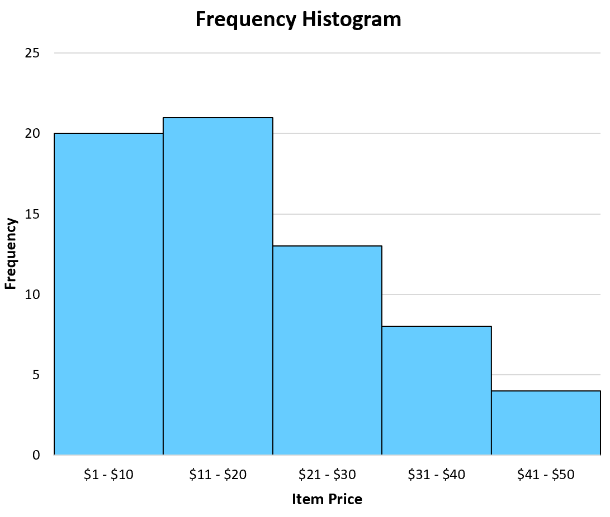

# Основы мат. статистики

Статистику любят спрашивать на собеседованиях и она убедительно выглядит в отчетах.

Также используется "под капотом" многих моделей машинного обучения.

Напрямую со статистикой работают далеко не во всех задачах. Например, если вы хотите разрабатывать нейронные сети, то едва ли вы столкнетесь с чем-то сложнее базовых понятий статистики, но если вы будете заниматься АБ-тестированием, то только со статистикой вы и будете работать.

"Существуют три вида лжи: ложь, наглая ложь и статистика" - Марк Твен

## Что такое статистика

Статистика - это наука о данных и выводах. Можно сказать, что весь Data Science появился из статистики.

Статистика связана с теорией вероятности. Если в теории вероятности мы рассматривали теоретические случайные величины и строили их распределения (то есть вероятности нам были известны), то статистика решает обратную задачу - по данным нужно восстановить вид распределения. Для этого существует целый набор инструментов, такие как доверительные интервалы, анализ различных видов диаграмм и проверка статистических гипотез.

В статистике легко запутаться и сделать неправильные выводы. [Существует множество парадоксов](https://habr.com/ru/company/otus/blog/555980/), связанных со статистикой. Каждый год публикуется множество исследований, использующих методы статистики, а потом публикуются статьи, в которых устраивают разбор ошибок в популярных статьях, поэтому можно сказать, что проблема с непониманием статистики глобальная. Однако если хорошо разобраться с теорией и типичными ошибками, то вероятность ошибки уменьшится.

Чтобы познакомиться со статистикой давайте поставим себя на место ученых, которые разрабатывают новое лекарство от болезни. Как нам понять, что лекарство действительно работает? Как сравнить наше лекарство с другими существующими? По какому признаку отбирать пациентов для тестирования лекарства?

## Основные понятия

Для начала давайте определимся с тем, что мы хотим изучать. Нам нужно протестировать лекарство на людях (все предыдущие тесты были успешно пройдены), и было бы здорово с точки зрения проверки качества собрать в одном помещении всех людей когда-либо болевших, а также тех, кто еще только заболеет, половине людей дать плацебо, а половине лекарство, и посмотреть, кто выздоровет, а кто нет. Такой набор людей мы называем **генеральной совокупностью**. Это набор ВСЕХ объектов исследования. Однако на практике так сделать, конечно, нельзя и мы вынуждены из всей генеральной совокупности брать лишь часть объектов. Эту часть объектов называют **выборкой**.

Выборка должна быть **репрезентативной**. Если в нашей выборке будут только женщины, то мы не узнаем как лекарство действует на мужчин и такую выборку нельзя будет назвать репрезентативной. Если в выборке будут только люди из определенного города, или только определенного возраста - это тоже признаки нерепрезентативной выборки. Также важен размер выборки. Каким лекарством вы бы хотели лечиться - которое было протестировано на 5 тысячах людей или на 30?

Репрезентативной же называют выборку, свойства которой похожи на свойства генеральной совокупности и выводы по которой с легкостью переносятся на генеральную совокупность Репрезентативность выборки - это неформальное понятие.  Любую выборку, не совпадающую с генеральной совокупностью можно при желании назвать нерепрезентативной. От исследователя требуется собрать такую выборку, которая не вызовет вопросов у других экспертов и будет выглядеть адекватно.

После подбора объектов исследования, можно провести эксперимент и измерить результаты. Далее проверяется статистическая гипотеза о том, действительно ли лекарство помогает. О том как проверять гипотезы мы поговорим в следующем модуле.

Ниже еще несколько терминов, которые часто используются в статистике:

- **Связанные выборки** – ситуация, при которой любому объекту из первой выборки соответствует ровно один объект из второй. Можно сказать, что они образуют неразрывную пару (а в более сложных случаях – тройку, четверку и т. д.). Например, пациент до и после приема лекарства.

- **Наблюдение** – измеренный объект.

- **Переменные\признаки** – свойства объектов, которые поддаются измерению.

- **Значение переменной** – степень выраженности того или иного свойства у конкретного объекта.

- **Мода ($mode$)** – наиболее часто встречающееся значение.Чтобы вычислить моду, необходимо найти число, которое встречается наиболее часто.

- **Медиана ($median$)** – середина упорядоченного ряда значений. При нечетном количестве элементов $n, \qquad median(X)=X_{\frac{n+1}{2}}$, при четном количестве элементов - $median(X)=\frac{X_{n/2} + X_{n/2+1}}{2}$. Также надо помнить, что медиана - это 50-й перцентиль, то есть ровно половина наблюдений должна быть меньше этого значения.

- **Среднее арифметическое ($mean$)** – сумма значений, деленная на их количество. $\bar{X}=\frac{1}{n}\sum_{i=1}^n X_i$. Не путать с **математическим ожиданием ($E[X]$)** (формула расчета идентичная), считается для генеральной совокупности.

- **Размах ($R$)** – разность между максимальным и минимальным значениями. $max(X)-min(X)$

- **Межквартильный размах ($IQR$)**- это альтернативная мера разброса, которая слабее
подвержена влиянию крайних значений, чем размах. $IQR=X_{.75}-X_{.25}$

- **Отклонение ($\bar{X}-X$)** – это разность между средним арифметическим и конкретным значением.

- **Дисперсия** – измеряет разброс данных, сумма квадратов отклонений, деленная на их количество. Дисперсии для генеральной совокупности и для выборки вычисляются по разным формулам. Дисперсия генеральной совокупности ($D[X], Var(X),\sigma^2,\sigma_X^2$) $D[X]=E[(X-E[X])^2]$. Для выборки - **выборочная дисперсия** $S_n^2$ имеет аналогичную формулу расчета как у генеральной.

- **Стандартное отклонение** ($\sigma,std$)– корень из дисперсии.

## Основные виды графиков

Обычно когда говорят о статистике первыми в голову приходят два вида графиков - boxplot и гистограмма. Давайте посмотрим как они выглядят и узнаем как их построить при помощи matplotlib.

Начнем с гистограммы. Это график, который показывает распределение случайной величины. Чем выше столбики на графике, тем чаще значения попадают в этот диапазон.



Как строится такой график? Нам нужно сформировать $n$ "карманов" (bins), для этого нужно взять минимальное и максимальное значение и поставить между ними $n-1$ точку. Эти точки и будут разделять карманы между собой. Далее нужно посчитать сколько элементов выборки принадлежит каждому из карманов и нарисовать это на графике.

Построить гистограмму можно несколькими способами: при помощи pandas или matplotlib.

```python
plt.hist(df['data']) # вызываем функцию в matplotlib
df['data'].hist() # вызываем функцию в pandas, которая вызовет функцию в matplotlib
```

Обычно способ через pandas предпочтительнее, потому что на графике сразу появится подпись, но если данные не записаны в датафрейм, то можно использовать и первый способ.
