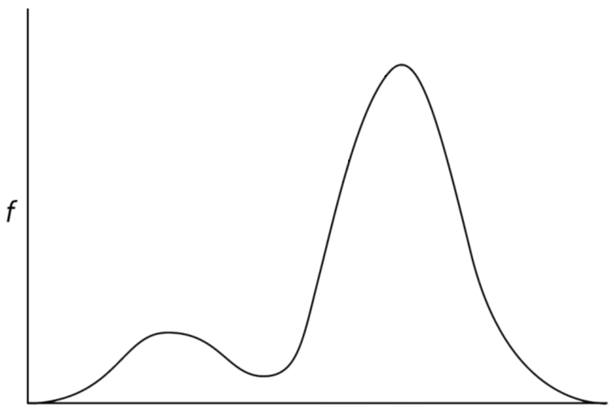

1. Какие параметры являются мерами разброса распределений?

- Дисперсия. **this**
- Медиана.
- Математическое ожидание.
- Мода.
- Среднеквадратическое отклонение. **this**
- Интерквартильный размах. **this**

2. Пусть график плотности распределения случайной величины $X$ выглядит следующим образом:

Выберите верные утверждения о средних такой случайной величины.

- Мода $X$ больше её математического ожидания.  **this**
- Мода $X$ больше её медианы. **this**
- Медиана $X$ меньше её математического ожидания
- Математическое ожидание и медиана $X$ совпадают, а мода не определена.