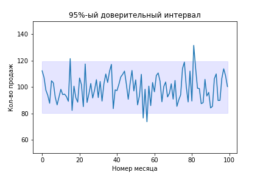
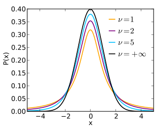

# Урок 1. Доверительные интервалы

## Что это такое и зачем нужно

Давайте представим, что у нас есть магазин, и мы отслеживаем статистику продаж в нем. У нас есть данные о продажах за последние несколько лет и нам хотелось бы понимать сколько продаж будет в следующем месяце, чтобы спланировать сколько товара заказывать у поставщика.

Мы знаем, что среднее количество продаж в месяц - это нормальное распределение и что его матожидание 100 (то есть в месяц в среднем продается 100 единиц товара), а среднеквадратичное отклонение равно 10.

Благодаря доверительным интервалам мы можем вычислить в каких пределах будет находиться величина (или ее матожидание) в будущем.

Но величина может принять любое значение в будущем, поэтому вводят понятие **доверительная вероятность** (confidence level). Это вероятность, с которой значение попадет в наш интервал. Если доверительная вероятность маленькая, то интервал может быть очень узким. То есть, мы не можем гарантировать очень большую точность с высокой вероятностью. И наоборот - если нам важна высокая степень уверенности, то оценка будет очень неопределенной, но значение почти наверняка будет лежать в этом диапазоне.

На практике чаще всего строят 95%-ые и 99%-ые доверительные интервалы.

Доверительный интервал - это способ оценить параметр случайной величины. Например, для оценки матожидания мы можем посчитать среднее по выборке, но тогда мы получим **точечную оценку**, которая может быть неточна. Посчитав же доверительный интервал, мы получим **интервальную** оценку, которая может немного больше сказать о распределении.

Формулировка через параметры распределения (точечная оценку):

- Вес кошки в килограммах - нормально распределенная величина с параметрами mu=5.0, sigma=1.0.

Формулировка через доверительный интервал (интервальная оценка):

- Вес кошки лежит в интервале от 3 до 7 килограмм с мат. ожиданием в 95%.

Второй вариант иногда предпочтительнее.

В статистике доверительные интервалы используются повсюду и дальше мы еще много раз с ними столкнемся. Например, мы можем оценивать доверительный интервал для прогноза модели. Зачастую важно не только знать прогноз модели, но и понимать в каких диапазонах возможна ошибка с заданной вероятностью. Также благодаря доверительным интервалам можно [проверять статистические гипотезы](https://studme.org/205394/ekonomika/intervalnye_otsenki_proverka_gipotez).

## Как оценить доверительный интервал

Для того, чтобы оценить доверительный интервал, надо знать какому распределению принадлежит случайная величина. Ниже будем предполагать, что случайная величина распределена нормально $\mathcal{N}(\mu, \sigma^2)$, и что у нас есть выборка $X$ размера $n$ из этого распределения.

Для начала необходимо определиться с доверительной вероятностью. Обычно выбирают значение $\alpha=0.95$ или $\alpha=0.99$.

Далее необходимо привести распределение к стандартному нормальному. Здесь есть два варианта - мы можем знать настоящую дисперсию или не знать ее. Мы можем узнать настоящую дисперсию если, например, мы провели статистический тест и доказали, что настоящая дисперсия равна значению $\sigma^2$. Во всех остальных случаях мы считаем, что дисперсия неизвестна. Оценка с известной дисперсией более точна, что логично, ведь мы знаем больше информации о распределении.

### Случай известной дисперсии

Для начала приведем распределение к стандартному нормальному, обозначим его $Z$:

$$Z = \frac{X - \mu}{\sigma}$$

Для подсчета интервала нам понадобится $z_\alpha$ - $\alpha$-квантиль стандартного нормального распределения. Это табличное значение.

Теперь мы можем посчитать интервал:

$$-z_{1-\frac{\alpha}{2}}\leq Z \leq z_{1-\frac{\alpha}{2}}$$

Почему формула имеет именно такой вид? Распределение $Z$ симметрично, поэтому если мы хотим найти в каком диапазоне находится, например, 95% значений, то мы должны вычесть 2.5% слева и 2.5% справа. Ровно это мы и делаем - в левой части получим $-z_{0.975}$, а в правой части $z_{0.975}$, или $-1.96$ и $1.96$.

Формула для матожидания исходной величины $X$:

$$
\bar{X} - z_{1 - \frac{\alpha}{2}} \frac{\sigma}{\sqrt{n}}
\leq
\mu
\leq
\bar{X} + z_{1 - \frac{\alpha}{2}} \frac{\sigma}{\sqrt{n}}
$$

Также можно обозначить $u = z_{1 - \frac{\alpha}{2}} \frac{\sigma}{\sqrt{n}}$, и тогда формула упростится:

$$
\bar{X} - u
\leq
\mu
\leq
\bar{X} + u
$$

### Случай неизвестной дисперсии

Алгоритм остается в точности таким же, но есть две детали. Во-первых, нам надо как-то оценивать дисперсию. Для этой цели можно использовать несмещенное выборочное стандартное отклонение $S$. Попробуем привести выборку к стандартному нормальному распределению:

$$T = \frac{\bar{X} - \mu}{S/\sqrt{n}}$$

Из-за того, что мы не знаем настоящую дисперсию мы получим на самом деле не стандартное нормальное распределение, а распределение, очень похожее на него. Такое распределение называется **t-распределением Стьюдента**. Чем больше будет размер выборки, тем ближе это распределение будет к нормальному

У распределения Стьюдента свои квантили (но они близки к квантилям стандартного нормального распределения). Поэтому общая формула остается той же:

$$
\bar{X} - c
\leq
\mu
\leq
\bar{X} + c
$$

только поправка рассчитывается иначе:

$$
c
=
t_{1 - \frac{\alpha}{2}} \frac{S}{\sqrt{n}}
$$

где $t_\alpha$ - $\alpha$-квантиль распределения Стьюдента.
