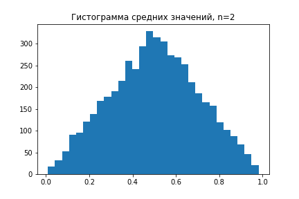
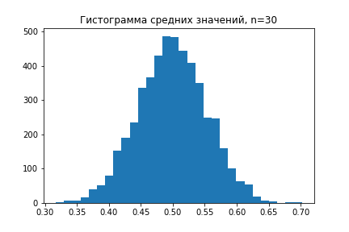

# Основные теоремы статистики

Почему то, что мы придумали в теории вероятности, вообще работает и для статистики с ее выборками и неполной информацией о генеральной совокупности?

Есть две теоремы, которые связывают статистику и теорию вероятности, позволяя делать выводы по данным.

## Закон больших чисел

Говоря простым языком эта теорема о том, что чем больше у нас выборка, тем более точно мы можем сделать по ней выводы.

Переходя к частности, возьмем нормальное распределение с матожиданием 10 и дисперсией 1. Сгенериуем сначала выборку размера 10, затем размера 100 и размера 1000. На каждом шаге посчитаем среднее значение выборки и сравним с матожиданием. С увеличением количества наблюдений ошибка будет уменьшаться.

В Древнем Китае никому нельзя было видеть императора, и в то время существовала шутливая задача - как определить длину носа императора? Для этого нужно как можно больше людей в Китае и у каждого спросить про длину носа, а затем посчитать среднее арифметическое. Чем больше людей будет опрошено, тем "точнее" будет ответ. Конечно, к реальной длине носа китайского императора это не будет иметь отношения, но зато хорошо помогает понять закон больших чисел.

Итак, можно сформулировать закон больших чисел:

$$\bar{X_n} \rightarrow \mu, n \rightarrow \infty$$

## Центральная предельная теорема

В статистике мы активно пользуемся нормальным распределением. Откуда вообще оно берется и почему оно так важно?

Давайте возьмем какое-то распределение максимально не похожее на нормальное. Например, можно взять равномерное распределение на отрезке $[0, 1]$.

Сгенерируем много выборок длины $n=2$, для каждой выборки посчитаем среднее значение и отобразим это на графике

Увеличим $n$ до 30 и проделаем эксперимент заново.

На что же это похоже...? На нормальное распределение! Чем больше будет $n$, тем более будет похоже на нормальное распределение.

Если мы возьмем несколько выборок из любого другого распределения и рассмотрим распределение средних значений, то всегда будем получать распределение, стремящееся к нормальному, при увеличении длин выборок. Эта теорема лежит в основе всего машинного обучения и на ее основе мы можем делать выводы о том, что наши модели вообще могут работать. В мире статистики практически все законы работают для случайных величин, а ЦПТ дает нам инструмент как привести **любое** распределение к нормальному, если у нас будет достаточно данных. Благодаря ЦПТ работает метод бутстрапа для проверки гипотез, а также мы можем судить о том, что ошибка у моделей машинного обучения будет распределена нормально именно из-за этой теоремы.

Важным требованием этой теоремы является независимость случайных величин (выборок длины $n$). Если они будут зависимы, то нормальное распределение может и не получиться.
