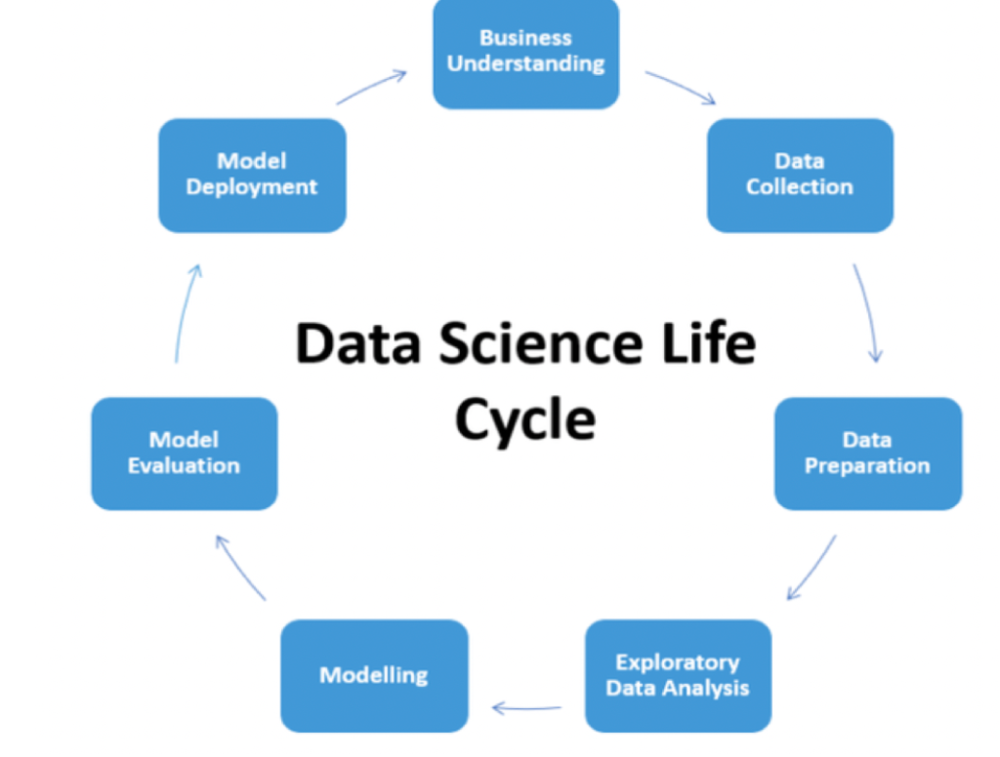

# Кто такие Data Scientist и чем они занимаются

Сейчас часто говорят о цифровизации, искусственном интеллекте и больших данных. Каждый слышал о беспилотных такси и голосовых помощниках, но почти никто не знает как это работает.

Data Scientist-ы разрабатывают специальные самообучающиеся алгоритмы, которые позволяют находить закономерности в больших массивах данных и создавать продукты, меняющие мир.

Для того, чтобы стать Data Scientist-ом нужно неплохо знать математику, уметь программировать на Python, базово знать английский язык и знать как использовать существующие алгоритмы машинного обучения. Помимо Python, некоторые исследователи используют другие языки программирования. Например - R, Matlab, Java. Однако Python используют почти 90% специалистов, поэтому определенно стоит начинать с него.

Для того, чтобы понять как работают Data Scientist-ы, давайте рассмотрим как выглядит жизнейнный цикл data science продукта

Давайте представим, что мы работаем в фирме, которая занимается разработкой ПО. К нам приходит заказчик и просит сделать для него проект.

У заказчика, назовем его Петр Васильевич, есть свой завод по производству робокотиков. На заводе есть несколько цехов, и в каждом из них работники должны находиться в касках по требованиям безопасности. Однако несчастные случаи происходят очень редко и работники зачастую ходят без касок, из-за чего Петр Васильевич постоянно платит штрафы после каждой проверки. Петр Васильевич обратился к вам, чтобы как-то автоматически находить людей без касок и вежливо напоминать им об этом. Например, можно установить несколько камер в каждом цеху и отслеживать людей без касок.

Здесь и начинается жизненный цикл разработки продукта. Назовем этот шаг “Понимание бизнеса”. На этом шаге мы должны понять какие боли есть у заказчика, сформулировать гипотезу, которая могла бы решать бизнес-потребности и посчитать насколько выгодно будет внедрение такой технологии. Например, если Петр Васильевич платит 100 тысяч рублей штрафов в год, а разработка и внедрение технологии будет стоить 100 миллионов рублей, то  лучше уже на этом этапе отказаться от идеи. Также стоит спросить у заказчика каким он видит бизнес-процесс после внедрения технологии, а если у него возникают сложности, то можно продумать это совместно с ним.

Итак, мы поняли, что нужно заказчику. Следующий шаг - сбор данных. Совместно с заказчиком закупили камеры, повесили в цехах, через месяц взяли все видео и отметили на них людей в касках и без. Теперь у нас есть данные, для которых можно разрабатывать алгоритмы.

Далее нужно провести разведочный анализ данных и очистить данные. Может случиться так, что часть видео снималась ночью, когда завод не работал. Или, например, один из собранных робокотиков лег прямо перед камерой и заслонил объектив. Такие данные нам не помогут в решениии задачи, поэтому их надо найти и пометить как нерелевантные.

Итак, у нас есть очищенный набор актуальных данных, можно приступать к разработке. Кстати, собранные данные, для которых разрабатываются модели машинного обучения, обычно называют датасетом. Используя наш датасет - видео и разметку, где находятся люди в касках, а где без - можно построить специальную модель, которая научится автоматически находить людей в касках и без. Существует несколько хороших алгоритмов, которые решают такую задачу с высоким качеством. Обычно такие алгоритмы называют “базовым решением” или “бейзлайном”.

Получив первые результаты, мы бежим к Петру Васильевичу и говорим: “я сделяль”. Естественно, заказчик попросит попробовать программу в боевых условиях. Например, на последней смене, которая прошла на заводе, где как раз один безответственный работник оказался без каски.

Запустили алгоритм, он ничего не нашел, значит нужно дорабатывать. Но как? Можно придумать какие-то признаки, по которым модель будет понимать, что сейчас стоит анализировать тщательнее. Например, внимательнее посмотрев на данные, мы заметили, что большая часть невыявленных нарушений происходит сразу после обеда. Это связано с тем, что в помещении меняется освещение из-за того, что солнце начинает светить в окна. Уменьшив яркость изображения в послеобеденное время, модель начала работать лучше. Такого рода улучшения называются “feature engineering”. Это когда мы в данных нашли какое-то неочевидное свойство, которое добавили в модель и значительно улучшили качество.

Заказчик потестировал нашу модель неделю, нашел еще несколько багов, мы их оперативно исправили. Теперь можно проводить полноценное тестирование в боевых условиях. Отдаем заказчику готовую модель на несколько месяц опытно-промышленной эксплуатации, после которой он либо попросит какие-то доработки модели (например, улучшение качества), либо скажет, что его все устраивает и ему нужен другой проект.

Так или иначе, жизненный цикл начинается с самого начала - с нового понимания бизнеса. Даже если задача старая, какие-то требования могли поменяться.

Итак, мы достигли ситуации win-win. Петр Васильевич может производить робокотиков и не платить штрафы, а мы получили деньги за разработку проекта.

В жизни часто все получается не так идеально и на каждом этапе возникают какие-то серьезные проблемы, которые нужно решать. До конца доходит очень малое количество проектов и к этому нужно быть готовым. Точность моделей зачастую сильно ниже ожидаемой, а бизнес-требования постоянно меняются. Но не стоит унывать, это часть работы и к этому нужно просто привыкнуть. Data Science - это про исследования и науку, а в науке зачастую красивые гипотезы не находят экспериментального подтверждения. Поэтому постоянно генерируются новые гипотезы и проводятся новые эксперементы.

Примерно так выглядит жизненный цикл Data Science продукта. В жизни некоторые этапы опускаются или меняются местами, но общая картина остается такой же.
