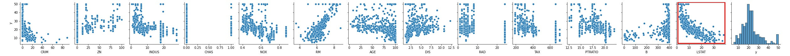
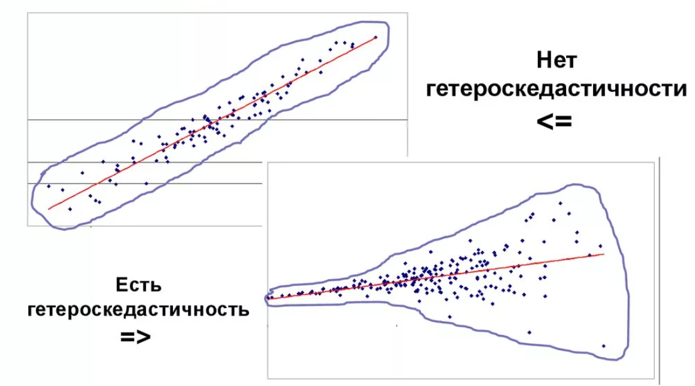

# Задача регрессии

Для начала давайте познакомимся с задачей регрессии.

Суть задачи регрессии состоит в том, чтобы сопоставить входным данным какое-то вещественное число. Сегодня мы поработаем с датасетом о стоимости домов в Бостоне и изучим алгоритм линейной регрессии.

## Линейная регрессия

### Уравнение модели

Алгоритм линейной регрессии позволяет находить линейные зависимости в данных.


Мы уже кратко обсуждали как он работает в предыдущих модулях. Формула линейной регрессии выглядит так:

$$y = kx + b$$

где $x$ - входной вектор, а $y$ - то, что выдает модель (выход модели). Так как в правой части присутствует скалярное произведение между $k$ и $x$, то можно переписать это выражение так:

$$y = \sum_{i=1}^{m} k_i x_i + b$$

где $m$ - количество входных параметров (площадь квартиры, уровень криминальности района, экологическая обстановка в районе).

В такой записи можно избавиться от слагаемого $b$. Давайте зададим вектор $z$, в котором мы просто допишем единицу к $x$, а также зададим вектор $w$, который будет в себе содержать $k$ и $b$:

$$z = \begin{bmatrix}
1 \\
x
\end{bmatrix}
w = \begin{bmatrix}
b \\
k
\end{bmatrix}
$$

Тогда выражение для линейной регрессии упростится и станет таким:

$$y = wz$$

Далее будем записывать уравнение именно в такой форме, только изначально будем предполагать, что вектор $x$ записан в нужном виде. Тогда если нам нужно получить ответ не для одного примера, а сразу для всего датасета, то можно записать в матричной форме:

$$Y = Xw$$

### Функция ошибки

Итак, мы поняли как будем выглядеть уравнение модели. Как найти параметры? Для этого нужно составить функцию ошибки (также употребляют термин loss function - **функция потерь**). Благодаря функции ошибки мы можем в любой момент времени оценить насколько хорошо модель описывает наши данные. Процесс обучения выглядит так - посчитали функцию ошибки, поменяли параметры, опять посчитали функцию ошибки, чтобы понять, в какую сторону она изменилась. Чем меньше значение функции, тем меньше ошибок допускает модель, и тем она лучше работает на наших данных.

Ошибку обычно считают одним из двух способов.

Первый способ - среднеквадратичная ошибка (MSE - mean squared error):

$$MSE = \sum_{i=1}^n \frac{(f(x_i) - y_i)^2}{n}$$

В этом случае функция ошибки будет дифференцируема и мы можем посчитать ее производную, а значит можем найти минимум. Также надо помнить, что итоговая ошибка будет в квадрате. Например, если мы считали величину в рублях, то результат будет в рублях в квадрате. Чтобы перейти обратно к линейным величинам, от MSE берут корень и получают метрику RMSE:

$$RMSE = \sqrt{MSE}$$

Второй способ - средняя абсолютная ошибка (MAE - mean absolute error)

$$MAE = \sum_{i=1}^n \frac{|f(x_i) - y_i|}{n}$$

Здесь вместо квадрата мы поставили модуль, поэтому ошибка будет измеряться в тех же величинах, что и исходная. Однако такая функция будет не дифференцируема, поэтому могут возникнуть проблемы при поиске ее минимума.

В обоих случаях за счет того, что значение функции $f(x)$ и таргета $y$ вещественные числа, функция ошибки получается непрерывной. Это работает для задач регрессии, но уже не сработает для задачи классификации.

После того как мы выбрали нужную функцию, мы можем найти ее минимум и взять параметры $w$, при которых этот минимум достигается.

### Обучение модели

Сейчас внимательно, материал непростой.

Поиск оптимальных коэффициентов для модели линейной регрессии выполняется при помощи **метода наименьших квадратов**, для которого мы можем даже записать аналитическое решение, то есть формулу, по которой можно вычислить коэффициенты.

Запишем MSE в матричном виде:

$$MSE = (y - Xw)^T(y-Xw)$$

Раскроем скобки:

$$MSE = y^Ty - y^TXw - (Xw)^Ty + (Xw)^TXw $$

Теперь чтобы упростить себе работу, давайте преобразуем некоторые слагаемые.

Во-первых, используя свойства транспонирования матриц, давайте упростим эти слагаемые:

$$y^TXw = (Xw)^Ty = w^Tx^Ty$$

Во-вторых, упростим последнее слагаемое (раскроем скобки):

$$(Xw)^TXw = w^T X^T X w$$

Запишем итоговую формулу:

$$MSE = w^TX^TXw - 2wX^Ty + y^Ty$$

Продифференцируем это уравнение по $w$ и приравняем 0:

$$MSE' = (w^TX^TXw)' - (2w^TX^Ty) + (y^Ty)' = 0$$

$$2X^TXw - 2X^Ty + 0 = 0$$

$$X^TXw = X^Ty$$

Отсюда найдем оптимальные коэффициенты $\hat{w}$:

$$\hat{w} = (X^TX)^{-1}X^Ty$$

Матрицу $(X^TX)^{-1}X^T$ называют **псевдо-обратной матрицей**. Для не-квадратных матриц обратные матрицы не определены, но используя такую нехитрую формулу, можно получить матрицу, похожую на обратную (умножение на $X$ даст единичную).

Теперь мы знаем, что обучение модели линейной регрессии - это всего лишь умножение и обращение матриц. Никакой магии.

На практике обращение матриц - это довольно сложная операция (особенно для больших матриц), которая выполняется очень долго и иногда проще использовать стохастический градиентный спуск. Однако сам факт того, что существует аналитическое решение задачи, гарантирует нам то, что градиентный спуск будет хорошо работать.

### Проблема мультиколлинеарности

Обратите внимание, что обратная матрица не существует для матриц, у которых определитель равен 0. А определитель может быть равен 0, если какие-то строки или столбцы матрицы линейно-зависимы, то есть один из столбцов/строк можно выразить через сумму других с какими-то весами. Из этого следует, что если один столбец в матрице иксов можно выразить через другие, то метод будет работать плохо. Эта проблема называется **проблемой мультиколлинеарности**.

Перед тем как запускать линейную регрессию, хорошо бы проверить, может ли какой-то столбец выражаться через сумму других. Зачастую такие связи очевидны. Например, если в таблице есть стоимость товара за единицу и прибыль от этого товара за месяц, то, скорее всего, эти величины будут коллинеарны. В таком случае стоит оставить только одну из величин.

### Особенности линейной регрессии

При использовании линейной регрессии стоит помнить, что это очень простая модель. Если данные нелинейны, то качество модели будет плохим. Также стоит помнить, что модель ничего не знает о вашей предметной области.


Например, если мы прогнозируем стоимость домов и модель выдает отрицательное значение на каких-то параметрах, то нужно учесть это и обработать такой кейс. Например, для таких значений можно установить какую-то стандартную цену или применять другую модель с другими параметрами.

## Поработаем с данными

### Загрузим данные

Для загрузки данных и построения моделей будем использовать библиотеку `sklearn`.

Для начала загрузим данные:

```python
import pandas as pd
import numpy as np
import seaborn as sns
import matplotlib.pyplot as plt

from sklearn.datasets import load_boston

data = load_boston()
```

В переменной `data` теперь лежит словарь с данными. Текстовое описание данных лежит в `data['DESCR']`, а датасет формируется из `data['data']` ($X$) и `data['target']` ($Y$). Также можно получить названия колонок из `data['feature_names']`.

Давайте загрузим данные в датафреймы:

```python
x_df = pd.DataFrame(data['data'], columns=data['feature_names'])
y_df = pd.DataFrame(data['target'], columns=['y'])
```

Также давайте посмотрим на данные:

```python
full_df = pd.concat([x_df, y_df], axis=1)
sns.pairplot(full_df)
```

График pairplot показывает попарные зависимости в данных. Люди, к сожалению, не умеют воспринимать многомерную информацию на графиках, поэтому мы должны смотреть на зависимости между переменными попарно.


На графике очень много информации. Нас интересует последняя строка, так как там показывается зависимость таргета (цены дома) от различных показателей. Давайте посмотрим на нее.



Хорошо видно, что показатель LSTAT почти линейно влияет на таргет. Давайте по нему построим модель линейной регрессии.

### Построим модель

Далее мы хотим построить модель линейной регрессии по всем параметрам. Но чтобы мы могли честно оценить качество модели, давайте обучим модель на 80% данных, а оставшиеся 20% используем для того, чтобы финально оценить качество. Такой подход называют **разделением на обучающую и тестовую выборку**. Для этого можно использовать функцию `train_test_split`. Функция по-умолчанию перемешивает набор данных и в случайном порядке делит датасет в заданном соотношении (можно использовать параметры `train_size` и `test_size`). Из-за случайного перемешивания, могут получаться немного разные результаты (но они будут близки). Чтобы перемешивание происходило одинаково, давайте зададим `random_state`.

```python
from sklearn.model_selection import train_test_split

x_train, x_test, y_train, y_test = train_test_split(x_df, y_df, train_size=0.8, random_state=0)
```

Теперь давайте построим модель линейной регрессии только по одному параметру LSTAT. Для этого будем использовать класс `LinearRegression` из `sklearn`. Для того, чтобы обучить модель, нужно сначала сделать объект модели, а затем обучить модель при помощи метода `fit`. Метод `fit` принимает два аргумента - `x` и `y`. Причем `x` должен быть матрицей (размерность `(n, m)`), а `y` вектором (размерность `(n,)`).

```python
from sklearn.linear_model import LinearRegression

model = LinearRegression()
model.fit(x_train[['LSTAT']], y_train)
```

Обратите внимание, что из `x_train` мы взяли не просто столбец, а саб-датафрейм (через двойные квадратные скобки), так как в качестве первого аргумента принимается только матрица.

Теперь давайте предскажем значение на тестовой выборке и посчитаем ошибку. Будем использовать MSE. Посчитать MSE можно при помощи функции `mean_squared_error`:

```python
from sklearn.metrics import mean_squared_error

y_pred = model.predict(x_test[['LSTAT']])
mean_squared_error(y_pred, y_test)
```

Получилось 46.33. Много это или мало? На первый взгляд непонятно. Обычно в такой ситуации строят несколько моделей и сравнивают какая из них работает лучше. Также можно посмотреть в каких диапазонах изменяется таргет (в идеале построить гистограмму) и сравнить с полученной ошибкой.

Так как в нашей модели всего один параметр, мы можем построить график, на котором точками отобразим зависимость таргета от величины, а линией нарисуем прогнозы модели.

```python
x = np.linspace(0, 35, 100).reshape(-1, 1) # Делаем reshape, чтобы x стал матрицей с одним столбцом
y = model.predict(x)

full_df.loc[x_test.index].plot(kind='scatter', x='LSTAT', y='y')
plt.plot(x, y, color='r')
```


Второй способ графически показать насколько качественен наш прогноз - по оси X на графике отложить предсказания, а по оси Y фактически значения. Чем ближе к прямой $y=x$ будут точки, тем лучше прогноз.

```python
plt.scatter(y_pred, y_test)
x = np.linspace(0, 35, 100)
y = x
plt.plot(x, y, c='r')
```


В целом все выглядит неплохо. Но можем ли мы улучшить модель?

### Используем все признаки

До текущего момента мы использовали всего один параметр. Можем заметить, что настоящая зависимость таргета от LSTAT на самом деле похожа на параболу, поэтому было бы здорово улавливать не только линейные зависимости, но и квадратичные. Как ни странно, уравнение линейной регрессии не поменяется, если мы учтем квадратичную зависимость. Запишем уравнение для одного параметра и его квадрата:

$$y = w_1 + w_2x + w_3 x^2$$

То есть, нам нужно просто добавить еще один параметр (столбец в матрицу иксов), и заново обучить модель

```python
# Обновим x_train, x_test
x_train['LSTAT^2'] = x_train['LSTAT'] ** 2
x_test['LSTAT^2'] = x_test['LSTAT'] ** 2

# Сделаем новую модель
square_model = LinearRegression()
# Обучаемся уже на двух колонках
square_model.fit(x_train[['LSTAT', 'LSTAT^2']], y_train)
```

Давайте посмотрим на качество получившейся модели и построим графики:

```python
# Выведем общую ошибку на тестовой выборке
y_pred = square_model.predict(x_test[['LSTAT', 'LSTAT^2']])
print(mean_squared_error(y_pred, y_test))


x = np.linspace(0, 35, 100).reshape(-1, 1) # Делаем reshape, чтобы x стал матрицей с одним столбцом
x_square = x ** 2
x = np.hstack([x, x_square])
y = square_model.predict(x)

full_df.loc[x_test.index].plot(kind='scatter', x='LSTAT', y='y')
plt.plot(x[:, 0], y, color='r')
```


Точность увеличилась - MSE уже 38.84.

Ну и наконец, давайте построим модель по всем параметрам:

```python
full_model = LinearRegression()
full_model.fit(x_train, y_train)

y_pred = full_model.predict(x_test)
print(mean_squared_error(y_pred, y_test))
```

Здесь точность получилась еще меньше - всего 30.002. А вот график как выше мы уже построить не сможем, так как мы не знаем истинных зависимостей между всеми признаками. Вместо этого давайте построим график, на котором хотим приблизиться к линии $y=x$. График намного лучше, чем тот, что мы строили после прогноза по одному признаку.


## Предположения линейной регрессии

Линейная регрессия работает с несколькими предположениями. Если это предположения не выполняются на данных, то модель не будет работать (качество будет очень низким).

### Weak exogeneity / Слабая экзогенность

Предполагается, что в переменной X нет ошибок(здорово, правда?), т.е. это не случайные переменные. Чтобы с этим бороться вообще говоря [есть разные способы](https://en.wikipedia.org/wiki/Errors-in-variables_models).

### Linearity / Линейность

Это идея вообще говорит о том, что таргет может быть выражен с помощью линейной комбинации признаков


### Constant variance / Гомоскедастичность

Гомоскедастичность (англ. homoscedasticity) — свойство, означающее постоянство условной дисперсии вектора или последовательности случайных величин. Противоположное явление носит название гетероскедастичности. Является обязательным условием применения метода наименьших квадратов.



### Independence of errors / Независимость ошибок

Под независимостью подразумевается чтобы ошибки между собой не коррелируют, т.е. мат ожидание от ошибок равно нулю. Если нет, либо выкидываем модель, либо пытаемся от этого избавляться, в том числе регуляризацией, о которой речь пойдет ниже.

### Lack of perfect multicollinearity / Отсутствие мультиколлинеарности

Имеется в виду в самих признаках Х. Мультиколлинеарность может образоваться например случайным дублированием признака или неслучайной дубликацией информации. Из-за этого вектор коэффициента (бета) не имеет единственного решения, дисперсия финальных результатов возрастает. Модель в целом можно использовать, но в наших же интересах такие переменные убирать.

## Регуляризация и переобучение моделей

Количество параметров в модели напрямую влияет на ее качество. Если данные сложные, а параметров у модели мало, то качество такой модели будет плохим. В тоже время если параметров у модели будет слишком много, то модель "выучит" все данные в тренировочной выборке и на тестовой выборке покажет плохой результат.


Когда качество на тестовой выборке сильно ниже чем на обучающей, это называют **проблемой переобучения**.

Почему так получается и как с этим бороться? На самом деле, проблема переобучения все еще не решена в общем виде и даже плохо формализуется. Однако есть отдельные признаки того, что модель переобучилась и мы можем автоматически штрафовать модель, если такие признаки появляются.

Чаще всего переобучение в линейных моделях связано с тем, что данные начинают описываться большими коэффициентами. Например, если перед каким-то признаком стоит коэффициент 153842, то это плохой знак. Давайте учтем это и в функцию ошибки добавим еще одно слагаемое, которое будет штрафовать модель за слишком большие значения параметров. Это можно сделать по-разному, как и в случае с самой функцией ошибки. Можно сумму квадратов коэффициентов и добавить их к ошибке:

$$L_2 = MSE + \sum w_i^2$$

Такой способ регуляризации называется $L_2$-регуляризация или Lasso.

Также есть $L_1$-регуляризация или Ridge. Разница лишь в том, что мы добавляем не квадраты, а абсолютные значения весов:

$$L_1 = MSE + \sum |w_i|$$

В чем разница между $L_1$ и $L_2$ регуляризацией? С помощью $L_1$ регуляризации можно проводить отбор признаков, потому что признаки, которые не вносят никакого вклада  в решение, будут обнуляться. В тоже время в $L_2$-регуляризации веса у признаков не обнулятся, но им могут быть присвоены довольно маленькие значения.

Также мы можем добавить и $L_1$ и $L_2$ регуляризацию, такой подход будет называться ElasticNet.


Теперь если мы будем минимизировать такую ошибку, то мы найдем не самые оптимальные коэффициенты под наши данные, но зато повысим обобщающую способность модели.

Использовать регуляризацию в коде можно точно также как и обычную линейную регрессию, нужно только импортировать нужные классы:

```python
from sklearn.linear_model import Ridge, Lasso

# пример использования Ridge
ridge = Ridge()
ridge.fit(x, y)

# пример использования Lasso
lasso = Lasso()
lasso.fit(x, y)
```
