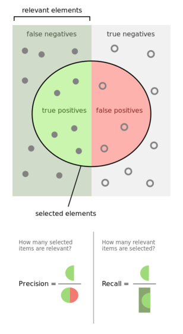

# Задача классификации

В прошлом уроке мы познакомились с задачей регрессии и узнали много технических деталей про обучение моделей. В этом уроке мы познакомимся с линейной моделью классификации - логистической регрессией. Для простоты будем рассматривать случай бинарной классификации (то есть выборку нужно разделить на две части), но все выводы будут справедливы и для многоклассовой классификации.

## Логистическая регрессия

Идея, которая стоит за моделью, очень простая. Давайте построим линию, которая будет разделять выборку на две части. Все точки, находящиеся по левую сторону от прямой будут принадлежать первому классу, а по правую сторону - второму классу.

Как это записать? Очень просто - сторона будет отличаться знаком выхода модели.

$$f(x) = sign(\sum w_i x_i) = sign(wx)$$

Функция sign возвращает 1, если значение аргумента положительное и -1, если отрицательное. Соответственно, $f(x)$ будет выдавать -1 и 1, в зависимости от того, какому классу будет принадлежать $x$ по мнению модели.

Если мы захотим посчитать расстояние от объекта $x$ до такой прямой, то мы можем это сделать по такой формуле: $\frac{wx}{||w||}$.

А теперь давайте зададим такое понятие как **отступ** $M$ оно будет показывать, верный ли ответ дает классификатор, а если нет, то насколько ответ неверен. Итак, отступ для $i$-го объекта выборки будет выглядеть так:

$$M_i = y_i * wx_i$$

Если $M_i$ больше 0, то классификатор дает верный ответ, если меньше, то он ошибается. Это следует из того, что если произведение и $y_i$ одного знака, то отступ будет положительным, а если разных знаков, то отрицательным.

Как посчитать общее качество классификатора? Например, можно просто посчитать на скольких примерах из выборки классификатор ошибся:

$$J = \sum{[M_i < 0]}$$

Теперь хочется как-то запутстить на этом градиентный спуск, но все не так просто. Дело в том, что эта функция не будет непрерырвной и тем более не будет иметь производную во всех точках, следовательно просто так запутстить метод оптимизации не получиться. Обычно вместо это функции используют другую функцию $L$, очень похожую на эту, но непрерывную и имеющую производную.

$$[M_i < 0] < L(M_i)$$

На роль таких функций могут подойти, например, такие функции:

- $L(M) = ln(1 + e^{-M})$ - логистическая функция
- $L(M) = e^{-M}$ - экспоненциальная функция
- $L(M) = max(0, 1-M)$ - кусочно-линейная функция

Можете подумать над тем, почему такие функции подойдут для оценки сверху исходной функции.

## Обучение модели

Давайте посмотрим как обучить модель и найти оптимальные параметры.

Составим функцию потерь:

$$J = \sum_{i=1}^n ln(1+e^{-y_i * wx_i})$$

Эту функцию необходимо минимизировать:

$$\hat{w} = argmin{J}$$

Это можно сделать при помощи градиентного спуска, например.

Получив оптимальные параметры $\hat{w}$, можно посчитать прогноз модели по вектору $x$:

$$sign(wx)$$

Либо можно получить вероятность того, что объект будет принадлежать классу $y$, если использовать функцию сигмоиды $\sigma(z) = \frac{1}{1+e^{-z}}$:

$$P(y|x) = \sigma(ywx) = \frac{1}{1 + e^{-ywx}}$$

Например, если мы рассматриваем классы ${0, 1}$ и мы хотим посчитать вероятность того, что $x$ принадлежит классу 1, то выражение упростится:

$$P(1|x) = \sigma(wx) = \frac{1}{1 + e^{-wx}}$$

Отсюда легко найти вероятность для класса 0:

$$P(0|x) = 1 - P(1|x)$$

Тогда вероятность для произвольного $y$:

$$P(y|x) = P(1|x)(1 - P(1|x))$$

Также можно заметить, что ответы логистической регрессии из себя представляют биномиальное распределение с параметрами $p=P(1|x), q=P(0|x)$, а $n$ - размер выборки.

Это можно использовать, чтобы по-другому оценить параметры модели (но они получатся теми же). Можно использовать **метод максимального правдоподобия**.

Основная суть метода состоит в том, чтобы подобрать такие параметры $w$, при которых была бы максимальной функция правдоподобия $L$, которая показывает вероятность того, что мы правильно подобрали параметры какого-то распределения.

В нашем случае функция правдоподобия будет представлять из себя произведение вероятностей получить класс $y_i$ для примера $x_i$:

$$L(w) = \prod_{i=1}^n P(y=y_i|x=x_i)$$

Все, что нужно для посчета такой функции, нам известно. Теперь нужно найти параметры $w$, при которых будет достигаться максимум такой функции. Искать производную от произведения довольно сложно, поэтому давайте вместо этого будем искать максимум логарифма функции правдоподобия.

$$log(L(w)) = \sum_{i=1}^n log(P(y=y_i|x=x_i))$$

Такой переход валиден, так как логарифм - монотонно-возрастающая функция и на точку максимума этот переход не повлияет

Далее можно посчитать производную по $w$ от логарифма функции правдоподобия и найти решение задачи. Либо можно запустить градиентный спуск и на такой функции и найти ее максимум.

Обратите внимание, что до этого мы искали минимумы функций, а в этом случае нам понадобился максимум функции.

## Решим задачу

Поработаем с датасетом, в котором представлены картинки с рукописными цифрами. Задача - научиться классифицировать какая цифра написана на картинке. Загрузим датасет:

```python
from sklearn.datasets import load_digits
data = load_digits()
x = data.data
y = data.target

# Нормализуем данные, чтобы все отработало корректно. Чуть позже обсудим что это и зачем нужно
x = (x - x.mean()) / x.std()

# Можно посмотреть на картинку
plt.matshow(x[1].reshape(8, 8))

# Разделим на train и test
x_train, x_test, y_train, y_test = train_test_split(x, y, train_size=0.8)
```

На практике, конечно, нам не нужно постоянно думать о том, какая функция ошибки используется и как ее оптимизировать. Вместо этого мы просто импортируем класс `LogisticRegression` и используем его точно также как и линейную регрессию:

```python
from sklearn.linear_model import LogisticRegression

model = LogisticRegression()
model.fit(x, y)
```

## Оценка качества

Как посчитать качество модели классификации? Самое простое что можно придумать - посчитать процент правильно угаданных примеров из тестовой выборки. Эта метрика называется Accuracy и она хорошо работает, когда у нас два класса и они сбалансированны, то есть в них примерно одинаковое количество примеров. Если же выборки несбалансированны, то можно получить неожиданный результат. Давайте представим, что в выборке было 10 примеров класса 0 и 100 примеров класса 1, алгоритм всем примерам поставил 1. Результат можно записать в таблицу ниже. В строках класс, который поставил алгоритм, а в столбцах класс, который был на самом деле. На главной диагонали будут верно угаданные примеры, а в остальных ячейках - ошибки. Такая матрица называется **матрица ошибок (confusion matrix)**.

| | 0 | 1 |
|-| - | - |
|0| 0 | 0 |
|1|10| 100|

Если посчитать accuracy, то получим заветные 90%, хотя по факту мы вообще ничего не угадали для класса 0. В случае несбалансированности классов для бинарной классификации также рассматривают метрики precision и recall.

Для того, чтобы было проще оперировать ячейками в таблице, давайте дадим им свои названия:

- TP (True Positive) - если объект класса 1 и модель дала ему класс 1
- FP (False Positive) - если объект класс 0 и модель дала ему класс 1
- FN (False Negative) - если объект класса 1 и модель дала ему класс 0
- TN (True Negative) - если объект класс 0 и модель дала ему класс 0

Таким образом мы можем посчитать частоту ошибок FP или FN и сравнить с количеством корректно определенных сэмплов.



**Precision** (точность) - метрика, которая рассчитывается как процент правильно угаданных TP классов. В нашем примере precision не определена, так как мы вообще ни один пример не записали в первую строку. Это также плохой сигнал.

**Recall** (полнота) - метрика, которая показывает процент правильно угаданных TP классов, по отношение ко всем positive результатам, которые должны быть в этом классе.

Эти метрики уже устойчивы для несбалансированных классов, но их нужно оценивать в совокупности. Поэтому полезно всегда строить confusion matrix.

Также есть F1-score (F1-мера), который учитывает в себе precision и recall.

**добавить про ROC-AUC**

В целом оценка качества проводится примерно также, как и для задачи регрессии:

- Делим выборку на train и test
- Обучаемся на train
- Считаем нужные метрики на test выборке

## Оценка качества для многоклассовой классификации

Когда классов больше чем 2, оценка качества значительно усложняется. Метрика accuracy перестает работать так хорошо. Конечно, если все классы идеально сбалансированны, то ей можно продолжать пользоваться, но обычно такого не бывает.

Поэтому обычно используют все те же метрики, но их считают для каждого класса. Например, в случае с распознаванием рукописных цифр, можно посчитать precision для каждой цифры и найти на какой цифре классификатор работает хуже всего.

В случае нескольких классов без confusion matrix не обойтись.
