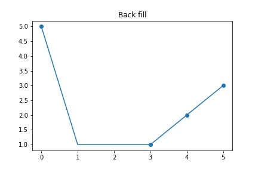

# Предобработка данных

Данные, с которыми мы работает, бывают нескольких типов:

- Числовые
- Категориальные
- Строковые

С каждым из типов нужно работать определенным образом. О том как работать со строковым типом данных мы поговорим в модуле по обработке естественного языка, а пока давайте разберемся с числовыми и категориальными признаками.

## Числовые признаки

У каждой числовой величины есть свой диапазон значений. Нам было бы удобнее, если бы все величины изменялись в одном диапазоне. Для этого мы можем использовать несколько подходов.

Во-первых, если две величины имеют одно распределение, то можно вычесть среднее значение и разделить на среднеквадратичное отклонение:

$$z = \frac{x - \mu}{\sigma}$$

После такого преобразования значения будут находиться около нуля. В sklearn такое преобразование называется [`StandardScaler`](https://scikit-learn.org/stable/modules/generated/sklearn.preprocessing.StandardScaler.html)


Если же нам хочется привести все к одному диапазону значений, например, от 0 до 1, то мы можем использовать [`MinMaxScaler`](https://scikit-learn.org/stable/modules/generated/sklearn.preprocessing.MinMaxScaler.html). Формула у него такая:

$$z = \frac{x - x_{min}}{x_{max} - x_{min}}$$


## Категориальные признаки

Категориальные признаки отличаются от числовых тем, что в них всего несколько уникальных значений. Например, это может быть цвет фрукта, или модель машины. Для того, чтобы использовать такой признак в модели машинного обучения, нам нужно как-то привести такой признак к числовому, так как модели работают с матрицами из чисел.

Также стоит сказать, что выделяют два вида категориальных признаков - упорядоченные и неупорядоченные. К упорядоченным можно отнести, например, грейд работника (руководитель > подчиненный), а к неупорядоченным можно отнести цвета фруктов (мы не можем очевидным образом сравнить красное и зеленое яблоко). В рамках конкретной задачи какие-то неупорядоченные категориальные признаки могут стать упорядоченными. Например, мы можем упорядочить модели автомобилей по "старшинству", даже если они принадлежат разным брендам (Hyundai Solaris < BMW 5 серии).

Итак, как же привести категориальные признаки к числам? Самый простой способ это сделать - сопоставить каждому классу какое-то натуральное число. Этот подход хорошо сработает для упорядоченных категориальных признаков и не очень хорошо для неупорядоченных (потому что мы их неявно упорядочили в случайном порядке).

Второй способ - one-hot-encoding. Просто всего показать на примере как это работает. Возьмем такую таблицу:

```python
df = pd.DataFrame({
    'fruit': ['apple', 'apple', 'kiwi'],
    'color': ['red', 'green', 'green']
})
```

|fruit|color|
|-----|-----|
|apple|red  |
|apple|green|
|kiwi|green|

После применения One-hot-encoding она превратится в такую:

```python
pd.get_dummies(df)
```

| | fruit_apple | fruit_kiwi | color_green | color_red |
|-| ----------- | ---------- | ----------- | --------- |
|0| 1 | 0 | 0 | 1 |
|1| 1 | 0 | 1 | 0 |
|2| 0 | 1 | 1 | 0 |

Столбцы `color` и `fruit` заменились на несколько столбцов, каждый из которых состоит из 0 и 1.

Такой подход позволяет кодировать произвольные категории, однако если уникальных значений будет слишком много, то таблица разрастется в ширину.

## Обработка пропусков

Иногда в данных могут встречаться пропуски и хорошо бы уметь их как-то обрабатывать. Самый простой способ обработать пропуски - выкинуть примеры с пропусками, и если пропусков не очень много (до 30% данных), то так поступить будет проще всего. Сделать это можно при помощи функции [`dropna()`](https://pandas.pydata.org/docs/reference/api/pandas.DataFrame.dropna.html).

Если пропусков много в конкретном столбце, то можно его не рассматривать, так как он малоинформативен.

Если же пропусков слишком много, то их нужно заполнять. Если это числовой признак, то можно заполнить пропуски средним, либо медианным значением. Если это категориальный признак, то можно заполнить наиболее частым значением (если это будет логично для вашей задачи, конечно).

Если вы работаете с данными, которые изменяются во времени (например, продажи в магазине или температура воздуха), то есть еще несколько способов заполнить пропуски. Давайте сразу посмотрим на примере:

```python
series = pd.Series([5, None, None, 1, 2, 3])
```


1. ffill (forward-fill) - заполняем пропущенные значения последний известным.

```python
series.ffill()
```


2. bfill (back-fill) - заполняем пропущенные значения следующим известным значением. В основном используется, чтобы заполнить пропуски в начале датасета. В середине датасета лучше использовать ffill. Давайте представим, что у нас есть наблюдения по температуре за один месяц. С 10 по 15 число данные пропущены. Если мы заполним эти числа значением с 9 числа, то это будет адекватно, так как на тот момент мы не могли знать, какая температура будет потом. Однако если мы возьмем bfill в этом случае и заполним пропуски значением 16 числа, то мы "заглянем в будущее" и модель переобучится на этих значениях.

```python
series.bfill()
```



3. interpolate - соединяем линией две соседние заполненные точки, и равномерно заполняем незаполненные точки. Используя пример выше, мы бы взяли значение температуры 9 числа и провели линию в 16 число, а все промежуточные значения записали бы в датасет.

```python
series.interpolate()
```


**Важно:** запуск этих функций не изменяет исходный датафрейм. Если хотите запомнить результат, то положите его в новую переменную, например так:

```python
interpolated_series = series.interpolate()
```
