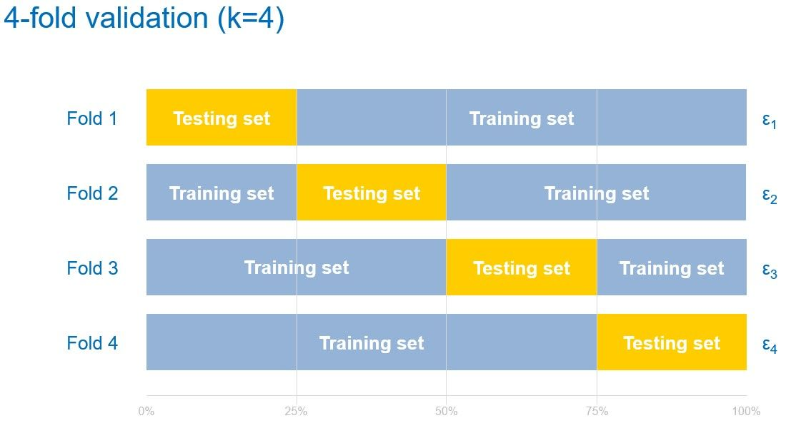

# Валидация результатов

В прошлый раз при работе с данными мы делили их на обучающую и тестовую выборку, чтобы корректно оценить качество модели. Если этого не сделать и оценить качество модели на тех же примерах, на которых она обучалась, то мы получим смещенную оценку качества. Модели машинного обучения "запоминают" примеры, на которых обучаются и могут выдавать правильный ответ, неправильно обобщив данные. Это называется проблемой переообучения. Основная задача при валидации - распознать переобучившиеся модели (или просто некачественные модели).

## Обучающая, валидационная и тестовая выборка

Как мы уже говорили, выборки делят на обучающую и тестовую в каком-то соотношении (обычно это 80/20). Но также иногда выделяют валидационную выборку. Это выборка, на которой модель может сама валидироваться во время обучения.

Давайте рассмотрим такой пример - мы хотим написать умный алгоритм, который будет автоматически подбирать оптимальную модель из списка $M_1, ..., M_n$. Это должно работать так - мы разобьем тренировочную выборку (которую нам передадут для обучения) в соотношении 80/20 и будем обучать алгоритм на 80% обучающих данных, а проверять точность на 20% валидационных данных, и в итоге модель, которая даст лучший результат на отложенной выборке, станет основной. В тоже время пользователь такой модели может даже не догадываться о том, что обучающая выборка, которую он передаст, будет как-то разбиваться, поэтому он со своей стороны также поделит выборку в каком-то сооотношении и после обучения также проверит насколько хорошей получилась модель.

Разбиение на обучающую, валидационную и тестовую выборку позволяет отслеживать качество модели изнутри самой  модели. В тоже время методологически было бы неправильно не проверить потом качество на отложенной выборке, которую алгоритм совсем не видел. Вдруг алгоритм написан с ошибкой и подглядел в валидационную выборку, обучившись на ней?

Разбивают на эти выборки обычно в соотношении 70/15/15, но это не догма, и можно выбирать свое разбиение, в зависимости от количества данных.

## Кросс-валидация

При разбиении на обучающую и тестовую выборку мы случайным образом перемешиваем датасет. Может ли оказаться так, что в тестовую выборку попадут слишком удачные примеры и алгоритм угадает их все? Конечно, может. Точно также может оказаться обратная ситуация - в тестовую выборку попадут данные, абсолютно не похожие на тренировочную выборку, и алгоритм не угадает ни один пример. Важно понимать, что это проблема не в алгоритме, что он не нашел закономерность, а в данных, в части которых эта неочевидная закономерность содержится.

Как же тогда по-другому разбивать данные, чтобы не попадать в такую ситуацию? Обычно для этого используют кросс-валидацию. Общая идея такая - давайте разделим исходную выборку, скажем, на 5 частей (обычно эти части называют **фолдами**). Затем будем по очереди обучаться на 4 фолдах, а валидироваться на оставшемся 5-ом, поочередно меняя пятый фолд. Итого мы получим 5 оценок для модели (для каждого фолда своя оценка). Если все 5 оценок близки, то можно просто посчитать среднее и это будет адекватная оценка качества модели (если метрика выбрана корректно, конечно). Если же одна или несколько оценок значительно отличается от остальных, значит в данных есть какой-то дизбаланс и нужно детально изучить почему так получилось.

Также мы можем изменять параметры кросс-валидации, изменяя количество фолдов и способ разбиения. Можно перемешивать данные, можно оставить в исходном порядке.

В чем плюсы и минусы такого подхода? Если данных много, а модели обучаются долго, то кросс-валидация будет очень долго работать. Однако если время позволяет, то лучше всегда проводить кросс-валидацию. Кросс-валидация дает более точную оценку качества моделей, чем разбиение на обучающую и тестовую выборку.
