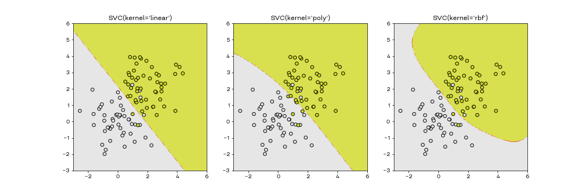
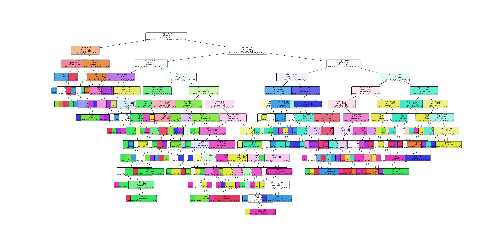
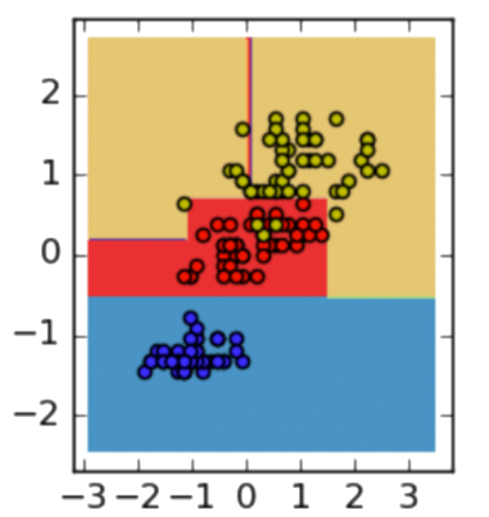

# Модели классификации

Давайте рассмотрим еще несколько моделей машинного обучения для задачи классификации

## kNN

Как понять к какому классу принадлежит точка, если известно к какому классу принадлежат другие точки в пространстве? Можно просто найти ближайших соседей этой точки и посмотреть соседей какого класса больше. В этом и заключается суть метода kNN (k ближайших соседей).

Давайте посмотрим как это реализовывается в Python. Для примеров будем использовать датасет с цифрами, на котором мы запускали логистическую регрессию.

```python
from sklearn.neighbors import KNeighborsClassifier
from sklearn.metrics import accuracy_score, confusion_matrix

model = KNeighborsClassifier()
model.fit(x_train, y_train)

y_pred = model.predict(x_test)

print(accuracy_score(y_test, y_pred)) # 0.975
print(confusion_matrix(y_test, y_pred)) # единичные ошибки в нескольких классах
```

Как видим, качество сравнимо с логистической регрессией. Запустим кросс-валидацию с этим алгоритмом:

```python
from sklearn.model_selection import cross_val_score

cross_val_score(model, x_train, y_train)
# array([0.98611111, 0.99305556, 0.9825784 , 0.97560976, 0.98606272])
```

На кросс-валидации по тренировочной выборке результат немного выше, но в целом сравним.

kNN хорошо работает, если данные нормализованы и колонок не очень много. Если колонок будет много, то мы столкнемся с [проклятием размерности](http://www.machinelearning.ru/wiki/index.php?title=%D0%9F%D1%80%D0%BE%D0%BA%D0%BB%D1%8F%D1%82%D0%B8%D0%B5_%D1%80%D0%B0%D0%B7%D0%BC%D0%B5%D1%80%D0%BD%D0%BE%D1%81%D1%82%D0%B8). Чем больше признаков в данных, тем больше необходимо данных, чтобы построить качественную модель, и причем необходимо количество данных растет экспоненциально.

Также стоит отметить, что kNN не требуется обучение как таковое, так как у метода нет никаких параметров (кроме количества соседей и метрики, по которой считаем расстояние).

## [Наивный байесовский классификатор](https://habr.com/ru/post/120194/)

НБК - это простой, но довольно полезный алгоритм классификации, который полностью построен на теореме Байеса.

Пусть у нас есть элемент $x$, который может принадлежать одному из классов $c \in C$. Тогда нам нужно при какой метке класса вероятность принадлежности будет максимальная:

$$c_{opt} = argmax_{c} P(c|x)$$

Используя теорему Байеса вероятность можно переписать так:

$$P(c|x) = \frac {P(x|c)P(c)} {P(x)}$$

Вектор $x$ состоит из признаков $x_1, \dots, x_n$, поэтому формулу можно записать так:

$$P(c|x_1 \dots x_n) = \frac {P(x_1 \dots x_n | c) P(c)} {P(x_1 \dots x_n)}$$

Значение в знаменателе нас не интересует, так как это константа, а нам нужно найти максимум.

Выражение выглядит довольно сложно, поэтому сделаем предположение, что признаки между собой независимы (например, возраст и пол пассажира на титанике, или значение в первом и втором пикселе на картинке). Тогда можно переписать числитель так:

$$P(x_1 \dots x_n | c) P(c) = P(c) P(x_1|c) P(x_2 | c) \dots P(x_n| c) = P(c) \prod_{i} P(x_i|c)$$

Запишем исходную задачу, используя эти формулы:

$$c_{opt} = argmax_{c} = argmax_{c} P(c) \prod_{i} P(x_i|c)$$

Все эти значения мы можем посчитать:

- $P(c)$ - вероятность встретить класс в выборке
- $P(x_i|c)$ - вероятность, что встретим значение $x_i$ при классе $c$

Подсчет этих значений и есть обучение классификатора.

Алгоритм требует немного данных для работы, довольно быстро работает (градиентных спусков нет, хранить в памяти тоже почти ничего не нужно) и часто обходит в точности другие, более сложные, алгоритмы (деревья решений и логистическую регрессию, например).

Также немаловажный плюс - можно задать априорные вероятности классов $P(c)$, если у нас скошенная выборка, либо мы знаем об ошибке в сборе данных.

Однако есть недостаток - алгоритм предполагает, что признаки независимы, а это не так в случае со словами в тексте, например.

Проверим работу НБК на датасете с цифрами. Для бинарной классификации используется класс `GaussianNB`, а для многоклассовой (как в нашем случае) `MultinomialNB`. Для корректной работы алгоритма необходимо, чтобы все значения в матрицах были положительными, поэтому давайте использовать MinMaxScaler.

```python
from sklearn.naive_bayes import GaussianNB # Для бинарной классификации, не наш случай
from sklearn.naive_bayes import MultinomialNB # Для многоклассовой классификации, наш случай

# Загрузим данные
data = load_digits()
x = data.data
y = data.target
x = (x - x.min()) / (x.max() - x.min()) # MinMaxScaler
x_train, x_test, y_train, y_test = train_test_split(x, y, train_size=0.8, random_state=0)

# Обучим модель
model = MultinomialNB()
model.fit(x_train, y_train)

y_pred = model.predict(x_test)

print(accuracy_score(y_test, y_pred)) # 0.9083333333333333
print(confusion_matrix(y_test, y_pred)) # несколько ошибок в цифрах 1, 2, 7, 8 и 9
```

Точность получилась ниже, чем на всех остальных алгоритмах. Почему так вышло? Как мы помним, НБК работает с предположением, что признаки независимы. Верно ли это для изображений? Можем ли мы сказать, что цвета пикселей не связаны между собой? Нет, не можем, так как картинка получается только когда соседние пиксели имеют похожий цвет, а значит, признаки зависимы и использовать эту модель здесь не совсем некорректно. С другой стороны, 90% качества для многоклассового классификатора - это неплохо (особенно если знать в каких классах он путается). Для других данных алгоритм мог отработать лучше остальных моделей.

## Support Vector Machine (SVM)

В базовой версии этот алгоритм очень похож на логистическую регрессию - мы строим разделяющую прямую, которая разделяет плоскость на две части.

Классифицирующая функция выглядит так: $F(x) = sign((w, x) + b)$. То есть, возвращает $+1$ или $-1$, в зависимости от того, какому классу принадлежит объект $x$.

Часто мы можем построить несколько прямых, поэтому мы хотим найти прямую с максимальным расстоянием до выборки.


Можно показать, что расстояние до выборки равно $\frac{1}{||w||}$. Вместо задачи максимизации обычно берут задачу минимизации и минимизируют $||w||^2$, что является эквивалентной задачей.

Формально это можно записать так:

$argmin ||w||^2$

$y_i ((w, x_i) + b) \geq 1$

С последним уравнением стоит разобраться. Здесь нам интересны знаки $y_i$ и $(w, x_i) + b$. Если эти выражения будут иметь одинаковые знаки (либо оба плюса, либо оба минуса), то мы правильно решили задачу классификации. Если знаки отличаются, то результат получится отрицательным, и задача решена неверно.

В sklearn этот метод называется `SVC` - support vector classifier. Будем использовать StandardScaler.

```python
from sklearn.svm import SVC

model = SVC(kernel='linear')
model.fit(x_train, y_train)

y_pred = model.predict(x_test)

print(accuracy_score(y_test, y_pred)) # 0.9805555555555555
print(confusion_matrix(y_test, y_pred)) # единичные ошибки
```

В нашем случае выборка получилась практически линейно-разделимой. Но можем ли мы как-то улучшить результат? Можно попробовать использовать другие ядра - `rbf` и `poly`. С каким ядром качество станет лучше?

Математически это означает, что в функции $F(x) = sign((w, \phi (x)) + b)$ вводится новая функция $\phi(x)$, которая преобразует исходные данные к более простому для модели виду.

В случае с линейным ядром, эта функция равна $\phi(x) = x$.

### Виды ядер

Есть три основных вида ядер: линейное, полиномиальное и RBF.

**Линейное ядро.**
Это самый простой тип ядра, обычно одномерный по своей природе. Это оказывается лучшей функцией, когда есть много признаков. Линейное ядро в основном предпочтительнее для задач классификации текста, поскольку большинство таких задач классификации можно разделить линейно.
Линейные функции ядра работают быстрее, чем другие функции.

**Полиномиальное ядро.**
Это более обобщенное представление линейного ядра. Обычно работает немного точнее линейного ядра, но и считается дольше.

**RBF(радиальная базисная функция) ядро.**
Это одна из наиболее предпочтительных и используемых функций ядра в svm. Обычно его выбирают для нелинейных данных. Это помогает сделать правильное разделение, когда нет предварительных знаний о данных.



## Дерево решений

Решающие деревья - класс моделей, которые очень похожи на то, как человек принимает решения.

Решающее дерево состоит из узлов (веток), в которых данные классифицируются и листьев, в которых выводится результат классификации


Понять как это работает можно на примере игры в "данетки"


Секрет успеха в том, чтобы задавать сначала общие вопросы, а потом уже более конкретные.

Решающее дерево строится на основе этого секрета - все вопросы, на которые дается ответ это узлы дерева.

### Использование модели

Как и в случае с остальными моделями, можно использовать готовое решение - класс `DecisionTreeClassifier` для классификации.

Также деревья решений обобщаются на задачу регрессии, и в таком случае используют `DecisionTreeRegressor`.

### Практика

Давайте возьмем набор данных xor

Обучим на нем решающее дерево и посмотрим что получится

```python
from sklearn.tree import DecisionTreeClassifier

model = DecisionTreeClassifier()
model.fit(x_train, y_train)

y_pred = model.predict(x_test)

print(accuracy_score(y_test, y_pred)) # 0.8638888888888889
print(confusion_matrix(y_test, y_pred)) # классификатор часто путает 8 со всеми остальными цифрами
```

Точность сильно ниже, чем у остальных моделей. Почему так произошло? Давайте посмотрим на точность на обучающей выборке

```python
accuracy_score(y_train, model.predict(x_train)) # 1.0
```

На обучающей выборке классификатор выучил все примеры. Значит, алгоритм переобучился. Для того, чтобы понять почему так произошло, нужно понять как строится решающее дерево. Но сначала давайте посмотрим на дерево, которое у нас получилось

```python
from sklearn.tree import plot_tree

plt.figure(figsize=(40,20))  
plot_tree(model, feature_names = x_test.columns, 
             filled=True, fontsize=9, rounded = True)
plt.show()
```



Выглядит очень громоздко и еще больше похоже на то, что алгоритм переобучился (параметров больше, чем нужно).

## Как это работает?

Для простоты рассмотрим задачу бинарной классификации.

### Условия в узлах

Решающее дерево состоит из узлов, в которых проверяется какое-то условие.

На практике чаще всего берут условие $x_j < t$, то есть сравнивают значение какого-то признака с порогом.

Также это означает, что мы разбиваем пространство признаков на зоны при помощи прямых линий.



### Разбиение выборки

Формально, будем разбивать выборку $X$ на две подвыборки - $L$ и $R$ с условиями $x_j < t$ и $x_j >= t$

Насколько хорошо мы разбили выборку можно измерить при помощи специального функционала качества $Q(X, j, t)$, который обсудим позже.

Будем разбивать подвыборки до тех пор, пока не выполнится критерий останова. Типичные критерии останова:

- остался один элемент в выборке
- все элементы принадлежат одному классу
- достигли максимальной установленной глубины

Итак, мы построили дерево и в последнем листе у нас лежат какие-то элементы выборок (не обязательно все принадлежат одному классу). Возьмем за ответ самый популярный класс в листе.

### Функционал качества

Функционал качества определяет насколько мы хорошо разбили выборку в каждом узле.

Обычно его записывают так:

$Q(X, j, t) = \frac{|L|}{|X|} H(L) + \frac{|R|}{|X|} H(R)$

где $H(X)$ - это критерий информативности, который оценивает однородность распределения целевой переменной.

Для задачи классификации $H(X)$ можно взять таким:

$H(X) = \sum p_k (1 - p_k)$

Этот критерий информативности называется [критерием Джини](https://habr.com/ru/company/ods/blog/350440/).

Также иногда используют энтропийный критерий

$H(X) = -\sum p_k log p_k$

### Обучение модели

Обучение происходит за счет подбора оптимальных параметров $j$ и $t$ на каждом шаге разбиения дерева.

$j$ подбирается перебором, $t$ - бинарным поиском

Если не задать ограничения на глубину дерева или количество объектов в листе, дерево будет строиться до тех пор, пока не найдет идеальное разделение для каждого объекта!

Из структуры дерева решений следует несколько интересных свойств:

- выученная функция является кусочно-постоянной, из-за чего производная равна нулю везде, где задана. Следовательно, о градиентных методах при поиске оптимального решения можно забыть;
- дерево решений (в отличие от, например, линейной модели) не сможет экстраполировать зависимости за границы области значений обучающей выборки;
- дерево решений способно идеально приблизить обучающую выборку и ничего не выучить (то есть такой классификатор будет обладать низкой обобщающей способностью): для этого достаточно построить такое дерево, в каждый лист которого будет попадать только один объект. Следовательно, при обучении нам надо не просто приближать обучающую выборку как можно лучше, но и стремиться оставлять дерево как можно более простым, чтобы результат обладал хорошей обобщающей способностью. Ровно это нам и нужно было учесть. Если поставить минимальное количество примеров в листе `min_samples_leaf=3`, то на тренировочной выборке качество упадет, а на тестовой не изменится. Качество алгоритма лучше не станет, но зато мы сможем более корректно его оценить.

### Плюсы и минусы алгоритма

Плюсы:

- Обычно результат алгоритма интерпретируем. Мы можем легко объяснить почему модель дала именно такой ответ и даже вручную поправить какие-то условия, если необходимо.
- Алгоритм не похож на логистическую регрессию, дает совсем другой результат.

Минусы:

- Обычно качество ниже, чем у других алгоритмов
- Медленно работает (чем больше глубина, тем медленнее)
- Легко переобучается
- Сложно оптимизировать
- Много параметров, сложно подбирать
- Плохо работает на большом количестве признаков (не подходит для анализа текстов, задач биоинформатики, картинок и видео)

Кажется, плюсов намного меньше, чем минусов. Однако для большинства бизнес-задач алгоритмов типа логистической регрессии и дерева решений вполне достаточно, а интерпретируемость гораздо важнее, поэтому используют их. Но если нужна высокая точность, то чаще всего строят много-много разных деревьев решений, которые коллективно принимают решение. Этот алгоритм называется случайный лес (Random Forest) и о нем мы поговорим в следующем уроке.

## Итог

Для решения задачи классификации существует множество алгоритмов, которые используют принципиально разные подходы. Какой алгоритм будет лучше работать на ваших конкретных данных сложно сказать. Для фильтрации спама, скорее всего, лучше подойдет НБК, для небольшого датасета табличных данных лучше использовать дерево решений или логистическую регрессию, а для сложных по своей структуре данных SVM. Однако какая будет точность и получится ли ее улучшить - сложный вопрос, на который нельзя ответить до запуска кода.
