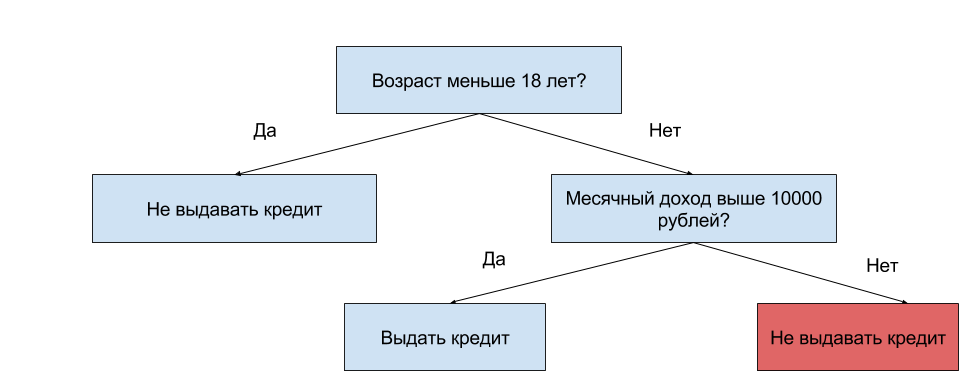

1. Что такое "количество объектов в вершине" дерева решений?

- Количество объектов, для которых выполнено условие, записанное в этой вершине.
- Количество объектов, которые попадут в эту вершину при старте из корня дерева и движении согласно записанным в вершинах условиях. **this**
- Это бессмысленный набор слов.

2. Рассмотрим решающее дерево для решения задачи кредитного скоринга, которое основано на двух признаках: возрасте и месячном доходе.

Пусть дана следующая выборка из пяти объектов (первый признак — возраст, второй — месячный доход):

[20, 8000]

[15, 15000]

[28, 9500]

[24, 30000]

[30, 20000]

Сколько из них попадёт в лист, подсвеченный красным?

**Ответ:** 2

3. Как в общем устроен процесс построения решающего дерева?

- Жадно — начинаем с одной вершины, разбиваем её на две, после чего рекурсивно повторяем процедуру для новых дочерних вершин. **this**
- Жадно — начинаем с дерева, у которого в каждом листе находится по одному объекту, и удаляем из него вершины, пока улучшается качество.
- Полным перебором — вычисляем качество каждого возможного дерева, выбираем лучшее.
- Аналитически — можно в явном виде выписать формулы, задающие структуру оптимального дерева.

4. Мы решаем задачу классификации с помощью решающего дерева. Ниже приведены разные варианты распределения классов в вершине ([c1, c2, c3] означает, что в вершине c1 объектов первого класса, c2 объектов второго класса и c3 объектов третьего класса). Какой из них должен получить меньшее значение критерия информативности?

- [45, 45, 10]
- [95, 3, 2]    **this**
- [33, 34, 33]

5. Какие параметры есть у метода kk ближайших соседей? ***

- Число деревьев
- Число соседей $k$ **this**
- Функция активации
- Функция весов объектов    **this**

6. Чем отличаются ответы метода kk ближайших соседей в случае классификации и регрессии?

- В случае классификации для нового объекта берется наиболее частый ответ среди ответов на kk его ближайших соседей в обучающей выборке, а в случае регрессии — средний ответ.

- Ничем. В обоих случаях для нового объекта берется наиболее частый ответ среди ответов на kk его ближайших соседей в обучающей выборке.

- Ничем. В обоих случаях для нового объекта берется средний ответ среди ответов на kk его ближайших соседей в обучающей выборке.

7. Как выглядит решающее правило для байесовского классификатора?

- $a(x) = \operatorname*{argmax}_y P(y)$
- $a(x) = \operatorname*{argmax}_y P(x|y)$
- $a(x) = \operatorname*{argmax}_y P(x|y)P(y)$  **this**
- $a(x) = \operatorname*{argmax}_y P(x)$

8. Пусть у нас есть $k$ классов, и априорные вероятности для всех них равны $P(y) = \dfrac{1}{k}$P. Как тогда выглядит решающее правило байесовского классификатора?

- Оно выбирает случайный класс.
- Оно выбирает первый класс.
- $a(x) = \operatorname*{argmax}_y P(x|y)$ **this**
- $a(x) = \operatorname*{argmax}_y P(y)$