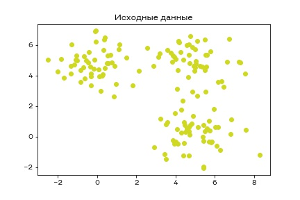
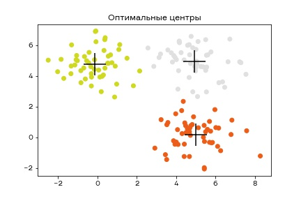
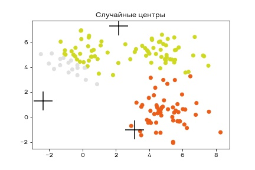
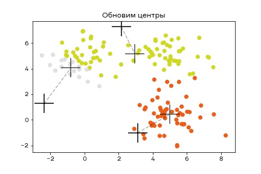
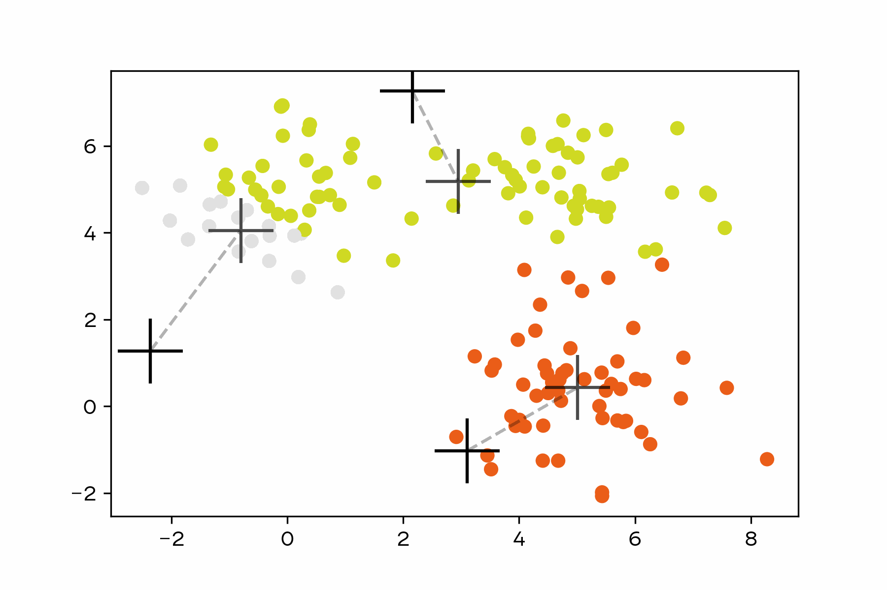
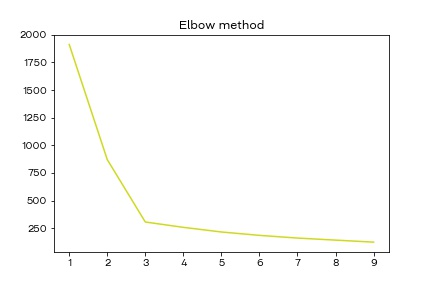
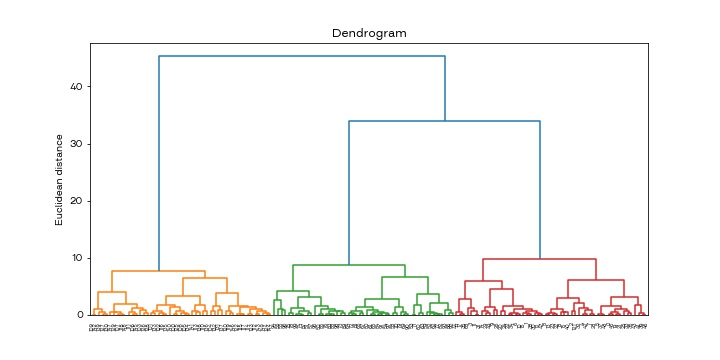

# Задача обучения без учителя

В прошлых модулях мы говорили о задаче обучения с учителем, когда нам дана выборка $X$ и ответы для нее $Y$, и задача состояла в том, чтобы построить функцию, которая по входящему $x$ найдет $y$. Иногда задача ставится иначе - нужно найти структуру в данных в том или ином виде. В частности, в таких случаях говорят о задачах кластеризации, понижения размерности, поиск аномалий или, например, генерации изображений и текстов.

Начнем с самой простой задачи - кластеризации.

## Алгоритм KMeans

Формальная постановка задачи звучит так - дан датасет $X$, нужно разбить его на какое-то количество классов, максимально непохожих друг на друга.

Давайте для примера посмотрим на вот такой датасет:



Здесь четко видно 3 облака точек, и мы бы хотели сделать алгоритм, который их четко разделит на 3 группы. Эта задача чем-то похожа на задачу классификации.

Давайте попробуем решить задачу так - вручную зададим количество кластеров (в нашем случае 3), и будем считать, что у каждого кластера есть свой центр. Точка будет принадлежать к кластеру, к центру которого она ближе всего находится. Для нашего простого случая на словах этот метод подходит. Если мы вручную разместим центры, то получим красивое разбиение на кластеры:



Однако в реальности мы не знаем где должны будут располагаться центры, поэтому нам нужен алгоритм для поиска оптимального положения центров. Давайте для начала разместим центры в случайных точках и посмотрим к какому кластеру какая точка будет относиться.



Теперь давайте для всех точек кластера найдем центр масс (среднее положение) и скажем, что это новое положение центра кластера.



А теперь давайте будем повторять это до тех пор, пока будут какие-то изменения в разбиении. Если мы увидим, что при каком-то шаге все точки остались в своих кластерах, то закончим алгоритм.



Такой метод называется KMeans. Это самый простой метод кластеризации, но для большинства задач его более чем достаточно. При помощи sklearn его можно реализовать так:

```python
from sklearn.cluster import KMeans

model = KMeans(3)
labels = model.fit_predict(X)
```

Давайте обсудим какие есть особенности у этого алгоритма. Во-первых, мы должны вручную задавать количество кластеров. Если мы не знаем сколько должно получиться кластеров, то это может стать проблемой. Как подобрать оптимальное количество кластеров? Для этого используют Elbow method (метод локтя).

### Elbow method

Давайте запустим на нашей выборке алгоритм для разного количество кластеров от 2 до 10. Также давайте посчитаем сумму дисперсий кластеров для каждого количество кластеров. Отобразим на графике зависимость сумм дисперсий от количества кластеров. Логично, что чем больше будет кластеров, тем меньше будет дисперсия, так как среднее расстояние до центра кластера внутри каждого кластера будет все меньше и меньше. Однако можно заметить, что дисперсия особенно быстро падает до определенного значения, а после него падает уже понемногу.



Этот график похож на руку, согнутую в локте, из-за чего метод и получил свое название. Точка, которая наиболее соответствует "локтю", и будет оптимальным количеством кластеров.

Помимо этого метода есть метод Силуэта, который немного сложнее, но обычно работает лучше.

### Silhouette method

В методе локтя есть одна проблема - не всегда понятно какое же количество кластеров будет оптимальным и чаще всего нам приходится выбирать из нескольких вариантов. Как можно упростить себе работу и точнее сказать оптимальное количество кластеров?

Давайте посчитаем внутрикластерное расстояние и назовем его $a$. Это среднее расстояние от точки до остальных точек этого кластера. Затем возьмем ближайший кластер и посчитаем среднее расстояние до всех его точек, назовем это расстояние $b$. Так как мы не знаем заранее какой кластер ближайший, нам придется посчитать расстояние до всех точек всех  кластеров, и из них найти наименьшее.


Теперь мы знаем для конкретной точки параметры $a$ и $b$. Давайте определим коэффициент Силуэта так:

$$Sil = \frac{b - a}{max(a,b)}$$

Теперь коэффициент будет лежать в диапазоне от -1 до 1 для каждой точки и будет показывать насколько точка "хорошо" принадлежит кластеру. Если коэффициент близок к 1, то точка находится внутри кластера, если ближе к 0 или даже к -1, то это либо точка из другого кластера, либо выброс, либо точка на границе кластеров.

Для того, чтобы оценить оптимальное количество кластеров, можно посчитать среднее значение Силуэта для всех точек для разного количества кластеров и получить такую картину:


Чем больше среднее значение, тем лучше данные разбиты на кластеры.

### Другие особенности алгоритма

При использовании KMeans важно нормализовать данные. Если этого не сделать, то алгоритм разделит все по величине, которая больше остальных по абсолютному значению, так как она будет вносить основной вклад в расстояние между центром и точками.

Также если размерность больше 3, то важно строить pairplot и на нем отмечать цветами кластеры.

Оценивать качество в случае задачи кластеризации не так просто, поэтому обычно исходят из бизнес-задачи и строят метрику на ее основе. Например, если мы хотим кластеризовать покупателей интернет-магазина, чтобы предлагать им разную рекламу, то метрикой качества будет количество кликов на рекламу. Увы, такую метрику можно посчитать только запустив АБ-тест, поэтому чтобы не запустить АБ-тест с заранее плохой моделью, нужно будет вручную просмотреть по графикам как модель кластеризует точки данных. Еще один вариант - разметить вручную номера кластеров какой-то части датасета, и использовать ее как тестовую выборку для алгоритма.

## DBSCAN

Давайте рассмотрим другой алгоритм кластеризации - DBSCAN. У него совершенно другой способ работы. Этот алгоритм считается одним из самых продвинутых алгоритмов кластеризации, проверенный временем. Он позволяет находить кластеры любого размера и формы, причем сам определяет количество кластеров и автоматически находит выбросы.

У алгоритма есть два параметра, которые необходимо подбирать вручную - `eps` и `min_samples`. Чтобы понять за что они отвечают, нужно разобраться как работает алгоритм. Изначально алгоритм выбирает случайную точку и ищет ближайших соседей в радиусе `eps`. Если соседей меньше, чем `min_samples`, то перед нами либо граница кластера, либо выброс. Если соседей больше или равно `min_samples`, то мы помечаем точку как принадлежащую кластеру и переходим к следующей. Если соседом точки из кластера оказалась точка, которую мы потенциально записали в выбросы, то эта точка становится границей. Меняя параметры `eps` и `min_samples` можно довольно значительно изменить кластеризацию, поэтому нужно очень внимательно отнестись к их выбору.

Примеры работы DBSCAN на разных выборках:


Перед применением DBSCAN также нужно нормализовать данные и подумать над тем, как будут подбираться параметры. Самое простое - выбрать количество кластеров, как в случае с KMeans, а потом подбирать параметры, чтобы в результате получалось нужное количество кластеров. В зависимости от вашей задачи можно придумать и другие способы, которые будут хорошо подходить под вашу предметную область. Здесь можно применить креативность и придумать какую-то интересную метрику!

```python
from sklearn.cluster import DBSCAN

model = DBSCAN(min_samples=7)
labels = model.fit_predict(X)
```

## Иерархическая кластеризация

Задача иерархической кластеризации немного отличается от обычной задачи кластеризации, так как здесь нам важно не только само разбиение на кластеры, но и то, как эти кластеры формируются. Задача состоит в том, чтобы найти максимально близкие друг к другу точки, объединить их в один кластер, а потом объединить с другими близлежащими кластерами или точками.


Формально алгоритм можно записать так:

- Изначально считаем, что каждая точка - отдельный кластер, таким образом разбивая все объекты на кластеры

- Находим два наиболее похожих кластера, объединяем их в один

- Продолжаем п.2 до тех пор, пока не получим нужное количество кластеров.

Критерием останова (п.3) помимо количества кластеров может быть расстояние между кластерами. Тогда алгоритм сам найдет оптимальное количество кластеров. Также очень важен выбор функции "похожести". Это может быть обычное евклидово расстояние, а может быть какая-то специальная функция. Зачастую используют функцию Ward-а, которая минимизируем дисперсию, объединяя данные в кластеры. Подробнее можно почитать [тут](https://jbhender.github.io/Stats506/F18/GP/Group10.html)

По итогу должна получиться дендрограмма - древовидный график, который показывает в каком порядке и какие точки соединялись.



Иерархическая кластеризация может применяться при анализе соцсетей, в биоинформатике и анализе текстов.
