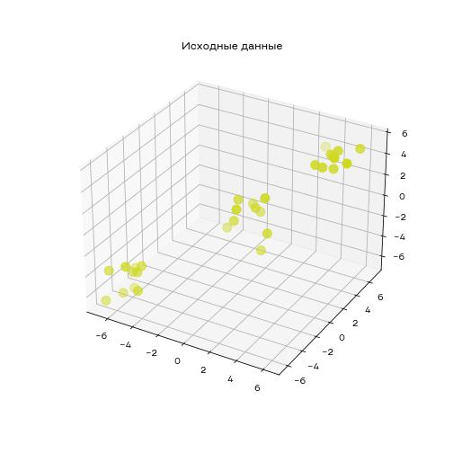

# Задача понижения размерности

В задачах обработки текстов и биоинформатики часто размерность пространства становится очень большой и может превышать даже количество примеров. Обучать модели машинного обучения на таких данных сложно и неэффективно. Благодаря алгоритмам понижения размерности мы можем отобразить многомерные данные в пространство меньшей размерности, потеряв минимум информации. Самым известным алгоритмом понижения размерности является **метод главных компонент** (PCA - Principal Component Analysis)

## Метод главных компонент

Суть метода заключается в том, чтобы выбрать такую плоскость, на которую можно спроецировать данные, потеряв минимум информации.

На вход алгоритму поступает датасет из $n$ точек и с $k$ признаками и количество размерностей у сжатого датасета $m$, а на выходе алгоритм выдает датасет с $m$ признаками.


Для того, чтобы найти такую плоскость, потребуется продвинутый математический аппарат. [Здесь](https://habr.com/ru/post/304214/) есть неплохое описание того, как это в действительности работает. Мы же посмотрим как использовать этот алгоритм в `sklearn`.

Для начала давайте сгенерируем данные

```python
np.random.seed(0)
centers = np.array([[0, 0, 0], [5, 5, 5], [-5, -5, -5]])

data = np.array([[], [], []]).T
for x, y, z in centers:
    x_p = np.random.normal(x, size=10)
    y_p = np.random.normal(y, size=10)
    z_p = np.random.normal(z, size=10)
    new_row = np.array([x_p, y_p, z_p]).T
    data = np.vstack([data, new_row])
```

Данные будут выглядеть так:



Теперь давайте применим PCA:

```python
pca_2d = PCA(2)
pca_data = pca_2d.fit_transform(data)
```


Алгоритм умеет оценивать какой процент информации потеряется при сжатии, это называется **необъясненная дисперсия**. Разделим необъясненную дисперсию на всю дисперсию в датасете и получим **процент необъясненной дисперсии**. В двумерном случае мы видим, что данные расположились вдоль вертикальных прямых, а основная часть объясненной дисперсии лежит в первой координате. Давайте спроецируем данные в одномерное пространство и отобразим значения на гистограмме:

```python
pca_1d = PCA(1)
pca_data = pca_1d.fit_transform(data)
```


Как видим, данные все еще располагаются у тех же значений, но теперь мы используем всего одну ось для того, чтобы описать данные. Из-за этого мы потеряли всего 2% данных.

Если мы не знаем какая размерность нужна у нового датасета, то мы можем указать **процент объясненной дисперсии** (100% - процент необъясненной дисперсии) и алгоритм сам подберет количество координат. Например, мы хотим оставить 80% информации в данных, тогда мы вызовем метод с параметров 0.8. Ниже пример для наших данных:

```python
pca = PCA(0.96) # 96% информации - 1 координата
print(pca.fit_transform(data).shape) # (30, 1)

pca = PCA(0.98) # 98% информации - 2 координаты
print(pca.fit_transform(data).shape) # (30, 2)

pca = PCA(0.99) # 99% информации - 3 координаты
print(pca.fit_transform(data).shape) # (30, 3)
```
