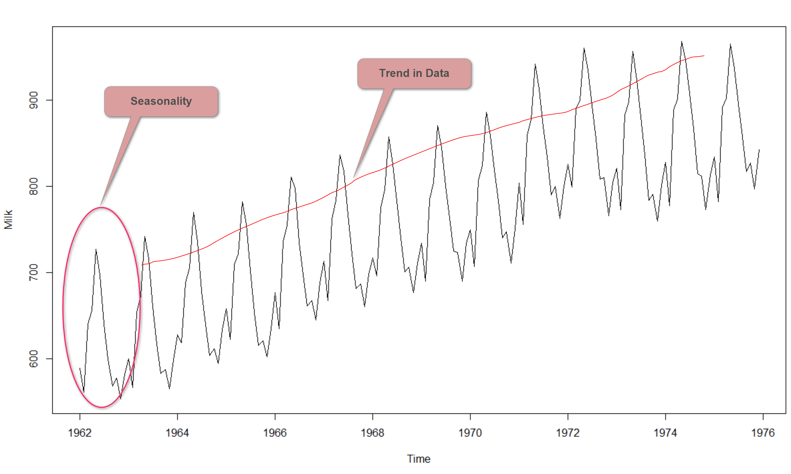

# Задача прогнозирования временных рядов

## Определение

Временным рядом $X$ называют серию наблюдений $X_t$, в которой разница во времени между измерениями постоянна $\Delta t = const$. Например, мы можем проводить измерения раз в день, в месяц, в секунду.

$$X=\{X_t|t > 0\}$$

Если измерения проводятся с разной частотой, то тогда мы имеем дело не с временным рядом, а со стохастическим процессом. Обычно в таком случае данные приводят к временному ряду (делают ресемплинг по нужной частоте).

### Пример ресемплинга

На бирже каждую секунду совершается несколько десятков сделок, поэтому в исходном формате данных datetime указан с точностью до миллисекунд. В таком виде эти данные представляют стохастический процесс. Если взять среднее значение цены за все сделки внутри каждой секунды, то мы получим временной ряд (разница между наблюдениями - 1 секунда). Аналогично мы можем взять частоту, например, 15 минут или 1 день, если нужно получить более долгосрочный прогноз.

## Примеры временных рядов

- Измерения температуры и различных погодных условий (давление, влажность и пр.)
- Количество продаж магазина
- Различные финансово-экономические показатели (уровень инфляции, стоимость акций на бирже, цена на нефть/газ)
- Уровень загруженности дорог
- Измерения медицинских показателей (ЭКГ, ЭЭГ)
- Видео (кадры будут точками временного ряда)
- Звук

## Визуализация временных рядов

### Время-значения

Самый простой и понятный способ.


### Свечной график

Для аналитики биржевых торгов принято строить свечные графики. Для построения графика данные группируются по заданному тику (1 секунду, 5 секунд, 1 минута, 1 день и т.д.) и для каждого тика рисуется "свеча". Свеча характеризуется 4 показателями:

- Open - цена на начало промежутка
- High - максимальная цена в промежутке
- Close - цена на конец промежутка
- Low - минимальная цена в промежутке

Если цена за промежуток выросла (Close > Open), то свечу рисуют зеленой. Если упала (Open > Close), то красной.

На картинке свечной график с тиком в 1 день.


## Задачи, связанные с временными рядами

### Прогнозирование

Мы хотим построить модель, которая будет по заданному ряду $X_t$ прогнозировать значения $X_{t+1}, X_{t+2}, \dots, X_{t+k}$. Число $k$ называется горизонтом прогнозирования.

Например, если нам известна история продаж магазина за последние 2 года с частотой в 1 день, то мы можем поставить задачу прогнозирования числа продаж на следующие две недели (14 дней). В таком случае $k=14$.

### Классификация

Допустим, у нас есть информация по ЭКГ людей с разметкой о том, кто болен страшной болезнью, а кто здоров.

Тогда мы можем поставить задачу классификации. По заданному временному ряду необходимо понять принадлежность классу.

Отличие от обычной классификации состоит в том, что количество наблюдений не зафиксировано, а также, что наблюдения зависимы друг от друга.

## Основные понятия

Обычно временные ряды моделируют следующим образом:

$X = T + C + S + e$,

где $T$ - тренд, $C$ - цикличность, $S$ - сезонность, $e$ - случайная нормально распределенная ошибка.

### Тренд

Общая тенденция ряда. Обычно моделируется прямой линией или полиномом небольшой степени. Например, при прогнозе цены на потребительские товары, тренд может появиться из-за инфляции.

Грамотный прогноз тренда - ключ к успеху.

### Сезонность

Повторяющаяся закономерность во временном ряде. Длина этой закономерности называется лагом сезонности.

Например, погода имеет сезонность с лагом 365 дней.



### Цикличность

Иногда в данных могут быть циклы нефиксированной длины и амплитуды. Их принято моделировать отдельно.

Например, COVID-19 внес свои коррективы во многие временные ряды. Его можно моделировать при помощи цикла.

Цикличность обычно оценивается экспертно и зачастую заранее довольно сложно ее спрогнозировать.

### Случайная ошибка

Прогноз любой модели всегда будем иметь ошибку. Нам важно, чтобы эта ошибка была нормально распределена. Тогда это будет означать, что мы действительно описали процесс и наша модель имеет ценность.

## Стационарность временных рядов

### Зачем нужно понятие стационарности?

Если ряд стационарен, то мы можем легко его прогнозировать моделью ARMA. Если ряд нестационарен, то большинство моделей будут давать плохой прогноз на таком ряде (большинство моделей предполагают стационарность).

Стационарные ряды довольно редко встречаются на практике, поэтому часто нужно приводить ряд к стационарному виду, чтобы модель работала корректно.

### Понятие стационарности временного ряда

Обычно вводят два понятия - слабая и строгая стационарность временного ряда.

Временной ряд называется слабо стационарным (стационарным в широком смысле), если его матожидание, дисперсия и ковариация не зависят от времени

$E[x(t)]=a$
$D[x(t)]=\sigma ^2%$
$cov[x(t), x(t+\tau)]=\gamma(\tau)$

Временной ряд называется строго стационарным, если распределение вероятностей значений ряда из какого-то окна не поменяется, если мы сдвинем окно.

На практике мы используем понятие слабой стационарности, так как оно более общее и под него подходит больше временных рядов.


### Первая разность временного ряда

Далее нам понадобится понятие разности временного ряда.

Первая разность временного ряда - временной ряд, полученный путем вычитания каждого элемента из предыдущего:

$$\Delta y_{t} = y_{t} - y_{t-1}$$

Если мы посчитаем первую разность первой разности временного ряда, то получим вторую разность. Аналогично можно получить разности более высоких порядков.

Также употребляют термин "дифференцирование временного ряда", имея ввиду поиск первой разности.

### Единичные корни

Временной ряд имеет единичный корень, или порядок интегрированности один, если его первые разности образуют стационарный ряд.

Рассмотрим уравнение

$$y_{t} = a * y_{t-1} + \varepsilon_{t}$$

$y_{t}$ - временной ряд, $\varepsilon_{t}$ - случайная ошибка, $a$ - коэффициент, который мы будем оценивать.

Если $a=1$, то процесс имеет единичный корень. В этом случае ряд нестационарен, но его первая разность будет стационарной.

Если $|a|<1$, то процесс стационарен.

Случаи, когда $|a| > 1$ обычно не рассматриваются, потому что тогда ряд будет иметь взрывной характер и уходить в бесконечность.

### Как проверить ряд на стационарность?

Обычно проверяют при помощи статистических тестов. Например, есть тест [Дики-Фуллера](https://ru.wikipedia.org/wiki/%D0%A2%D0%B5%D1%81%D1%82_%D0%94%D0%B8%D0%BA%D0%B8_%E2%80%94_%D0%A4%D1%83%D0%BB%D0%BB%D0%B5%D1%80%D0%B0) и тест [KPSS](http://www.machinelearning.ru/wiki/index.php?title=%D0%9A%D1%80%D0%B8%D1%82%D0%B5%D1%80%D0%B8%D0%B9_KPSS).

---

Тест Дики-Фуллера проверяет наличие единичных корней во временном ряде. Это эквивалентно проверке на стационарность.

Гипотеза $H_0$ - есть единичный корень (ряд нестационарен).

Гипотеза $H_1$ - единичного корня нет (ряд стационарен).

---
Тест KPSS. Помимо обычной проверки на стационарность, проверяет на тренд-стационарность (учитывает, что в данных может быть линейный тренд).

Гипотеза $H_0$ - ряд стационарен.

Гипотеза $H_1$ - ряд нестационарен.

Однако даже если тест сказал, что ряд стационарен, то это не всегда так. Иногда тесты дают ложно-положительный результат (как и ложно-отрицательный), и стоит всегда дополнительно оценивать "на глаз". Подробнее про мощность тестов [можно почитать тут](https://habr.com/ru/post/530688/)

### Что делать, если ряд нестационарный?

Приводить его к стационарному. Есть два основных способа - дифференцирование и преобразование Бокса-Кокса.

Преобразование Бокса-Кокса выглядит так:

$$ y_i^{\lambda} = \begin{cases}\frac{y_i^\lambda-1}{\lambda},&\text{if } \lambda \neq 0,\\ \log{(y_i)},& \text{if } \lambda = 0.\end{cases}$$

Параметр [лямбда выбирается из минимизации логарифма правдоподобия](https://topuch.ru/vibor-formi-uravneniya-regressii/index10.html).

Очень часто вместо преобразования Бокса-Кокса просто берут логарифм.

Перед применением преобразования нужно убедиться, что все элементы ряда положительные. Если это не так, то надо добавить какую-то константу к ряду. Константу лучше брать с запасом (чтобы после логарифмирования также оставались положительные элементы).

### Декомпозиция временного ряда

Иногда полезно применить [сезонную декомпозицию ряда](https://coderzcolumn.com/tutorials/data-science/how-to-remove-trend-and-seasonality-from-time-series-data-using-python-pandas#5), чтобы посмотреть на тренд, сезонность и остаток. В основе декомпозици лежит МНК - моделируется сезонность, оценивается тренд и все остальное попадает в остаток (должен быть нормально распределен).

Если тренд выглядит простым, то его можно прогнозировать отдельно и вычитать из ряда, чтобы сделать ряд стационарным. Однако если тренд сложный, то этот метод почти бесполезен.

## Модель ARIMA

ARIMA - модель для прогнозирования временных рядов (стационарных и некоторых нестационарных).

Далее часто будет использоваться понятие [стационарности](/ru/sandbox/ds-interview/time-series/stationarity).

### Модель ARMA

Модель ARMA лежит в основе ARIMA, поэтому сначала разберемся с ней.

$ARMA(p, q)$ состоит из двух моделей - $AR(p)$ и $MA(q)$

### Модель авторегрессии (AR)

Чисто технически, это линейная регрессия, адаптированная под временные ряды. В случае с линейной регрессией мы взвешиваем фичи объекта и предсказываем таргет. В авторегрессии мы взвешиваем последние объекты из какого-то окна и даем по ним прогноз.

Модель обозначается $AR(p)$.

Основываясь на предыдущих $p$ значениях мы можем прогнозировать следующие значения.

$$X_t=c + \sum_{i=1}^{p} a_i X_{t-i} + \varepsilon_t$$

$a_i$ - параметры модели, $\varepsilon_t$ - белый шум. Белый шум здесь нужен, чтобы мы могли формально поставить знак "равно" между левой  и правой частью.

### [Модель скользящего среднего](https://ru.wikipedia.org/wiki/%D0%9C%D0%BE%D0%B4%D0%B5%D0%BB%D1%8C_%D1%81%D0%BA%D0%BE%D0%BB%D1%8C%D0%B7%D1%8F%D1%89%D0%B5%D0%B3%D0%BE_%D1%81%D1%80%D0%B5%D0%B4%D0%BD%D0%B5%D0%B3%D0%BE)

Эту модель используют для моделирования случайных ошибок временного ряда:

$$X_{t}=\sum_{j=0}^{q} b_j \varepsilon_{t-j}$$

где $\varepsilon_t$ -  белый шум, $b_j$ - параметры модели.

Напрямую эту формулу мы можем использовать только для генерации временного ряда. Для прогнозирования вместо $\varepsilon_t$ подставляют остатки модели, предполагая, что они нормально распределены.

Поиск параметров $b_j$ модели $MA$ - нетривиальная задача, так как мы не можем использовать обычный МНК (т.к. остатки не выражаются аналитически через значения ряда), поэтому используют метод максимального правдоподобия. Подробнее [тут](https://ru.wikipedia.org/wiki/%D0%9C%D0%BE%D0%B4%D0%B5%D0%BB%D1%8C_%D1%81%D0%BA%D0%BE%D0%BB%D1%8C%D0%B7%D1%8F%D1%89%D0%B5%D0%B3%D0%BE_%D1%81%D1%80%D0%B5%D0%B4%D0%BD%D0%B5%D0%B3%D0%BE#%D0%9C%D0%B5%D1%82%D0%BE%D0%B4%D1%8B_%D0%BE%D1%86%D0%B5%D0%BD%D0%BA%D0%B8)

### Складываем AR и MA

Складываем модели AR(p) и MA(q), получаем модель ARMA(p, q):

$$X_t=c + \varepsilon_t + \sum_{i=1}^{p} \alpha_i X_{t-i} + \sum_{i=1}^{q} \beta_{i} \varepsilon_{t-i}$$

Обращаю внимание, что суммы складываются без всяких коэффициентов. Модель AR дает основной прогноз, а модель MA корректирует его.

Обычно гиперпараметры $p$ и $q$ подбираются, основываясь на ACF и PACF (см. ниже). Параметр $p$ отвечает за связь текущего элемента с $p$ предшествующими. Про параметр $q$ ничего не нашел :(

## Основная идея ARIMA

Модель $MA(\infty)$ может в точности описать любой стационарный временной ряд ([теорема Вольда](https://ru.wikipedia.org/wiki/%D0%A2%D0%B5%D0%BE%D1%80%D0%B5%D0%BC%D0%B0_%D0%92%D0%BE%D0%BB%D0%B4%D0%B0)).

Используя $MA(q)$ можно с заданной точностью спрогнозировать стационарный временной ряд.

Мы можем использовать модель $ARMA(p,q)$ с разумными $p$ и $q$, чтобы прогнозировать стационарные временные ряды. Разумные - значит, что их можно посчитать на компьютере (на практике - меньше 10).

На практике ряды редко бывают стационарными, поэтому мы хотим приводить их к стационарным. Один из способов сделать это - продифференцировать ряд. Количество дифференцирований ряда - параметр $d$ в модели $ARIMA(p, d, q)$.

Таким образом, если ряд можно привести к стационарному при помощи дифференцирования, то можно использовать модель $ARIMA$.

## Качество ARIMA

Для того, чтобы понять насколько полученная модель хорошо обобщает данные, используют критерий Акаике ([AIC](/education/ds-interview/classic-learning/metrics#aic-%D0%B8-bic)). Чем он меньше, тем лучше модель, при этом абсолютное значение критерия не несет никакого смысла (может быть отрицательным).

Необходимость в использовании AIC появляется из-за того, что для оценки параметров регрессии мы используем максимальное правдоподобие. Этот же метод мы не можем применить для оценки гиперпараметров, так как чем больше будет p и q, тем больше будет правдоподобие (больше коэффициентов -> точнее модель, но ее сложнее считать). Поэтому используют AIC, чтобы штрафовать модель за количество параметров. Вместо AIC можно использовать BIC.

Мы просто перебираем по сетке значения параметров (p, d, q), пока не получим наименьший AIC. Обычно эти параметры не очень большие. Дифференцировать больше двух раз обычно не имеет смысла. Начальные параметры стоит выбирать, исходня из ACF (график автокорреляции), PACF (график частной автокорреляции).

Также важно проверять остатки модели на нормальность.

## ACF & PACF

[ACF (autocorrelation function)](http://www.machinelearning.ru/wiki/index.php?title=%D0%90%D0%B2%D1%82%D0%BE%D0%BA%D0%BE%D1%80%D1%80%D0%B5%D0%BB%D1%8F%D1%86%D0%B8%D0%BE%D0%BD%D0%BD%D0%B0%D1%8F_%D1%84%D1%83%D0%BD%D0%BA%D1%86%D0%B8%D1%8F) (автокорреляционная функция) представляет собой последовательность коэффициентов корреляции между исходным рядом, и его копией, сдвинутой на заданное число интервалов ряда:

$$R(t, s) = \frac{E[X_t - \mu_t]E[X_{t-s} - \mu_{t-s}]}{\sigma_t \sigma_{t-s}}, $$

где $s$ - размер временного лага, а $\mu_t$ - среднее значение ряда.

Значения ACF всегда будут лежать в диапазоне [-1, 1] (так как это обычная корреляция).

ACF с лагом 0 всегда будет иметь значение 1 (так как ряд коррелирует сам с собой).

ACF помогает определять структуру ряда. Если есть максимум при лаге, например, 5, то это говорит о том, что есть сезонность с лагом 5. Если максимум ACF достигается при лаге 1, то, значит, в ряде есть тренд.

Идеальная картина - когда все значения ACF маленькие и нет ярковыраженных максимумов (все значения лежат внутри доверительного интервала или очень близко к границе). Это значит, что в ряде нет трендов и сезонностей, а значит можно использовать ARIMA. Также это может означать, что в ряде нелинейные связи, которые не получится отследить обычной корреляцией.

На картинке ниже с лагом 0 корреляция 1.0 (что логично), а остальные значения довольно маленькие. К сожалению, не отрисованы доверительные интервалы, поэтому наверняка сказать не можем.


[PACF (partial autocorrelation function)](http://www.machinelearning.ru/wiki/index.php?title=%D0%A7%D0%B0%D1%81%D1%82%D0%B8%D1%87%D0%BD%D0%B0%D1%8F_%D0%B0%D0%B2%D1%82%D0%BE%D0%BA%D0%BE%D1%80%D1%80%D0%B5%D0%BB%D1%8F%D1%86%D0%B8%D1%8F) (частная автокорреляционная функция) показывает зависимость между исходным рядом и его копией, смещенной на заданный лаг, не учитывая промежуточные влияния членов ряда.

Если у нас есть ряд из трех значений $x_1, x_2, x_3$, то с помощью ACF мы можем посмотреть как $x_1$ повлияет на $x_2$, и как $x_2$ повлияет на $x_3$. А с помощью PACF мы можем сразу посмотреть как $x_1$ влияет на $x_3$ без участия $x_2$.

На графике нужно найти первый лаг, который находится внутри доверительного интервала. Это будет начальной оценкой параметра.


Формула:

$pacf(k) = corr(y_{t+k} - y_{t+k}^{k-1}, y_t - y_t^{k-1})$

Здесь $y_{t}^{k-1}$ автокорреляция по предыдущим $k-1$ членам (мы хотим убрать линейное влияние этих членов, поэтому вычитаем их).

На практике PACF считается через решение простых систем уравнений.

PACF и ACF помогают нам находить стартовые коэффициенты для ARIMA. Параметр $q$ находится через ACF (смотрим на последний коэффициент, который выходит за границу доверительного интервала). Параметр $p$ находится через PACF (аналогично).

Получив начальные оценки параметров $p$ и $q$, мы можем начать перебор по сетке этих параметров по критерию Акаике.

Интересный факт - в переводе названия PACF есть разногласия - кто-то переводит как "частная", а кто-то как "частичная". Я бы придерживался перевода "частная", по аналогии с частной производной (partial derivative).

## Когда модель не будет работать

Если ряд не получается свести к стационарному при помощи дифференцирования, то модель не будет работать.
Проверяем на стационарность либо критерием KPSS, либо тестом Дики-Фуллера. В любой авто-ариме эта проверка делается автоматически и модель выдаст ошибку или warning, если ряд нестационарный.

Также очень важно смотреть на остатки модели. Если они будут ненормально распределены, то значит модель использует не всю информацию из данных. Про это сформулирована [теорема Гаусса-Маркова](https://ru.wikipedia.org/wiki/%D0%A2%D0%B5%D0%BE%D1%80%D0%B5%D0%BC%D0%B0_%D0%93%D0%B0%D1%83%D1%81%D1%81%D0%B0_%E2%80%94_%D0%9C%D0%B0%D1%80%D0%BA%D0%BE%D0%B2%D0%B0).

## Вариации ARIMA

### SARIMA

Модель учитывает сезонность. Добавляются параметры (P, D, Q) и s. Параметры аналогичны обычным, только применяются с лагом в s.

Рекомендуют сначала использовать сезонное дифференцирование, а потом обычное.

### ARIMAX

Если нам нужно учитывать внешние факторы (время года, выходные, праздники и тд), то мы можем использовать эту модель. Помимо основного ряда мы можем передать экзогенные факторы, которые будут линейно учитываться в прогнозе.

Допустим, мы прогнозируем продажи билетов в кинотеатры, и видим, что в выходные и праздники билетов продается немного больше. Тогда мы можем ввести временной ряд `exog`, и в нем поставить 1 напротив выходных дней и праздников и 0 напротив остальных дней. Далее этот ряд можно передать в модель ARIMAX наравне с основным.

Важно, что данные по внешним факторам у нас должны быть за весь промежуток, на который мы хотим прогнозировать (так как на их основе мы и построим прогноз).

## Автоарима

Стандартная [ARIMA](https://www.statsmodels.org/devel/generated/statsmodels.tsa.arima.model.ARIMA.html) из `statsmodels` позволяет обучить ариму с заданными параметрами:

```python
import pandas as pd

# в старой версии statsmodels лежит в tsa.arima_model
from statsmodels.tsa.arima.model import ARIMA

series = read_csv('data.csv', index_col=0, parse_dates=True)
model = ARIMA(series, order=(1,1,0))
model_fit = model.fit()

# предсказываем 10 точек
predict = model_fit.forecast(10)
# выведем aic
print(model_fit.aic)
```

Чтобы определить оптимальные параметры нужно осуществлять перебор, сравнивая по AIC. Чтобы не писать этот код самостоятельно, можно использовать алгоритм автоаримы, например, из библиотеки [`pmdarima`](http://alkaline-ml.com/pmdarima/). Изначально автоарима была реализована в R, а затем перенесена в python. Алгоритм получает стартовые значения $p, d, q$ и начинает перебирать, опираясь на них. Есть возможность учеть сезонность, тогда нужно указать лаг (параметр `m`) и сезонные параметры $P, D, Q$. Также автоарима позволяет просто проводить кросс-валидацию, обновлять веса в онлайне (получив на вход несколько наблюдений), строить графики и многое другое. В доке очень хорошо все расписано с красивыми картинками.

[Пример использования](http://alkaline-ml.com/pmdarima/auto_examples/example_simple_fit.html#sphx-glr-auto-examples-example-simple-fit-py)

## Кросс-валидация

Классическая кросс-валидация предполагает, что порядок в данных не важен и поэтому можно разбивать данные в случайном порядке на фолды, на которых мы можем обучать и валидировать модель.

В случае с временными рядами это предположение не выполняется и мы обязаны обучать и валидировать модель в том порядке, в котором представлены данные.


Допустим, у нас есть 100 точек данных и нужно прогнозировать на одну точку вперед. Тогда изначально мы можем обучиться на первых 30 точках, предсказать одну точку (31-ю), запомнить это предсказание, чтобы позже сравнить с фактом. Далее обновляем веса модели на 31-ой точке и прогнозируем 32-ую. Таким образом можно продолжать до тех пор, пока не закончатся данные.

Можно модифицировать этот метод в качестве треин выборки брать фиксированное количество точек (например, на каждом шаге по 30 точек). Если в данных есть выбросы, то мы сможем их проигнорировать, спустя какое-то время.

В конце у нас будет вектор предсказанных значений (с 31-ой по 100-ую точку) и вектор реальных значений. Мы можем использовать любую метрику из задачи регрессии для оценки результата. Чаще всего используют MAE, MSE, RMSE, MAPE. По этим метрикам не проводят оптимизацию, а просто смотрят на результаты модели. Модель внутри себя может использовать любую оптимизацию (основанную на AIC, например).

У такого подхода есть недостаток, про который необходимо помнить. Если временной ряд недостаточно длинный, то предсказания в начале (на маленькой треин выборке) будут хуже, чем ближе к концу (когда треин выборка почти равна всему датасету). Обычно в таких случаях начальную треин выборку выбирают так, чтобы там было достаточно данных для построения адекватной модели. Иначе можно говорить о том, что у нас недостаточно данных для построения модели.

В случае с временными рядами мы стараемся найти периодические закономерности в данных и если все такие периоды присутствуют в треин выборке, то все ок. Иными словами, если данных достаточно для описания процесса, то увеличение количества данных не улучшат модель.

## Прогнозирование временных рядов как задача регрессии

Если недостаточно классических моделей временных рядов для прогнозирования, то можно сформулировать задачу прогнозирования временных рядов как задачу регрессии и использовать любую регрессионную модель (леса, бустинги и тд). Для того, чтобы это сделать, нужно определить, что будет $X$, а что будет $Y$ для задачи регрессии.

Есть несколько способов это сделать.

### Время как $X$

Мы можем взять порядковый номер элемента в качестве $X$, а значения ряда как $Y$. Это может сработать, если мы хотим оценить тренд временного ряда, используя модели типа линейной или полиномиальной регрессии.

Такой подход не будет работать с любыми алгоритмами, которые используют деревья решений. Допустим, у нас было 20 наблюдений, мы обучили решающее дерево на этих данных. Дерево переобучится, в его узлах будут вопросы про конкретные точки данных: "если t<10 и t>5, то ответ 105". Когда мы попросим предсказать будущие точки, то дерево посмотрит в узел с наибольшим t: "если t>19 то ответ 101" и на все точки в будущем будет выдавать один и тот же ответ (среднее значение последних нескольких точек).

### Предсказываем по последним $k$ значениям

Если мы хотим использовать бустинги, леса и нейросети, то задачу можно поставить так. На вход поступают последние $k$ наблюдений временного ряда, модель должна определить следующее одно значение.

Допустим, $k=3$. Тогда исходную выборку (одномерный вектор)

`[x1, x2, x3, x4, x5]`

Можно преобразовать в датасет (в последней колонке таргет):

| 1  | 2  |  3 |  y |
|----|----|----|----|
| x1 | x2 | x3 | x4 |
| x2 | x3 | x4 | x5 |
| x3 | x4 | x5 | x6 |

Далее гиперпараметр $k$ можно подобрать так, чтобы модель могла учесть все сезонности и циклы, которые есть в данных.

Несмотря на то, что не мы используем модель ARMA, все равно стоит проверять ряд на стационарность. Деревья решений плохо справляются, например, с линейным трендом.

Пусть у нас есть первые 100 значений ряда, который задается формулой $y = t$. Обучим решающее дерево при $k=3$.

```python
n = 100
k = 3

x = np.arange(n)

# Формируем датасет
X = []
y = []
for i in range(k, n - k):
    X.append(x[i:i + k])
    y.append(x[i+k])

X = np.array(X)
y = np.array(y)

# Обучаем дерево
model = DecisionTreeRegressor()
model.fit(X, y)
```

На данных, которые были в обучающей выборке, ответ будет правильным.

А теперь посмотрим что предскажет модель на данных, которые она не видела

```python
>>> model.predict([[101, 102, 103]])

array([99.])

>>> model.predict([[105, 106, 107]])

array([99.])

>>> model.predict([[-3, -2, -1]]) # Выйдем за нижнюю границу

array([6.]) # 6 - наименьшее число в таргете в треин выборке
```

Как итог - деревья не умеют выходить за рамки тех значений, которые уже были в ряде. Если бы ряд был стационарным, мы бы не столкнулись с такой проблемой, так как матожидание и дисперсия постоянные, поэтому стоит проверять на стационарность даже когда мы не используем ARMA.

## Преобразования и сглаживания ряда

Допустим, мы попробовали разные модели на исходном временном ряде и ничего не помогло. Что делать? Нужно как-то преобразовать ряд, чтобы модели было проще найти закономерности.

## Фильтры

Можно использовать медианный фильтр и скользящую среднююю, если данные сильно зашумлены. Также можно использовать высокочастотный фильтр Фурье.

Иногда используют более продвинутые фильтры. Например, [фильтр Калмана](https://ru.wikipedia.org/wiki/%D0%A4%D0%B8%D0%BB%D1%8C%D1%82%D1%80_%D0%9A%D0%B0%D0%BB%D0%BC%D0%B0%D0%BD%D0%B0) [и другие рекурсивные фильтры](https://ru.wikipedia.org/wiki/%D0%A4%D0%B8%D0%BB%D1%8C%D1%82%D1%80_%D1%81_%D0%B1%D0%B5%D1%81%D0%BA%D0%BE%D0%BD%D0%B5%D1%87%D0%BD%D0%BE%D0%B9_%D0%B8%D0%BC%D0%BF%D1%83%D0%BB%D1%8C%D1%81%D0%BD%D0%BE%D0%B9_%D1%85%D0%B0%D1%80%D0%B0%D0%BA%D1%82%D0%B5%D1%80%D0%B8%D1%81%D1%82%D0%B8%D0%BA%D0%BE%D0%B9)

## Ссылки

- [ACF](https://wiki.loginom.ru/articles/acf.html)
- [Стекинг на временных рядах](https://www.mdpi.com/1996-1073/11/6/1605)
- [Как использовать нейросети для прогнозирования многомерных временных рядов](https://www.tensorflow.org/tutorials/structured_data/time_series)
