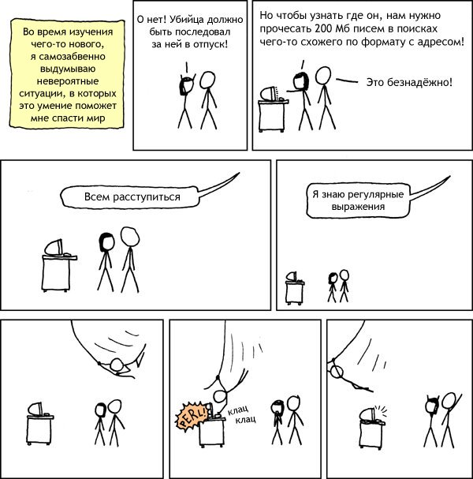

# Общий принцип обработки естественного языка

Задачи, связанные с анализом текстов, встречаются повсюду - машинный перевод, умные чат-боты, классификация текстов, веб-поиск. Весь класс задач называют **обработкой естественного языка** или **natural language processing (NLP)**.

Обработка естественного языка отличается от обработки обычных табличных данных. Когда мы разбирали типы данных, то говорили, что данные разделяют на числовые и категориальные. Текстовая информация принципиально отличается от других типов данных.

Что такое текст? Это набор слов, знаки препинания и спецсимволы типа `\n` и `\t`. Самое полезное на первый взгляд - это слова, поэтому первое, что мы сделаем - это уберем пунктуацию, и приведем все слова к нижнему регистру.

Как убрать знаки препинания? Если мы знаем какие именно знаки препинания могут встретиться в тексте, то мы можем использовать функцию `replace()`:

```python
text = "текст, текст."
text = text.replace(",", "").replace(".", "")
```

Однако если знаков препинания станет больше, то уже будет неудобно писать код в таком стиле. Поэтому обычно знаки препинания убирают при помощи регулярных выражений. Давайте сначала разберемся с тем, что это такое, а потом вернемся к обработке текстов.

## Регулярные выражения



Иногда нам нужно искать в тексте какие-то повторяющиеся кусочки. Например, как на картинке, нужно найти адрес в тексте, либо может быть нужно найти все телефонные номера, е-мейлы и т.д. Можно написать простой код из нескольких циклов, который будет искать нужную информацию, но иногда написать регулярное выражение быстрее, проще и эффективнее.

Итак, регулярное выражение - это строка, в которой задается шаблон поиска каких-то подстрок. Например, если мы хотим найти только английские буквы в тексте, то мы напишем такое регулярное выражение: `[a-z]+`. В квадратных скобках мы можем указать те значения, которые мы ищем, но если бы мы указали `[a-z]`, то каждая буква нашлась бы по отдельности. Если мы хотим искать непрерывную последовательность букв (например, слова), то нам нужно зациклить этот процесс. Для этого можно добавить в конце `+`.

[Вот здесь можно попрактиковаться с регулярными выражениями](https://regex101.com/)

Регулярные выражения можно использовать в Python при помощи модуля `re`. Две самые полезные функции - `search` и `sub`:

```python
import re

text = "some, text! ()"

is_found_text = re.search(r"[a-z]", text) # ищем латинскую букву в строке
if is_found_text:
    ...

clear_text = re.sub("[,!()]", "", text) # убираем ненужные символы
```

В нашем случае нужно убрать все символы, которые не относятся к буквам и пробелам. Давайте для начала научимся выбирать буквы и пробелы. Буквы можно распознать при помощи `\w` (тоже самое, что `[a-zA-Z0-9_]`), а пробелы при помощи `\s` (тоже самое, что `[\r\n\t\f\v  ]`). Если нам нужны и буквы и пробелы, то можно написать выражение `[\w\s]`, которое вернет весь текст, кроме пунктуации. Значит, нам нужно взять все символы, которые не входят в это выражение и убрать их. Чтобы сделать логическое отрицание, можно использовать `^`, то есть получим выражение `[^\w\s]`. А затем нужно найти все такие вхождения в строке и заменить их на пустую строку. Сделаем это при помощи Python:

```python
import re

text = "Знаки препинания важны для русского языка, но мешают исследователям данных."
text = text.lower() # приведем к нижнему регистру
text = re.sub(r'[^\w\s]', '', text) # уберем пунктуацию

print(text) # знаки препинания важны для русского языка но мешают исследователям данных
```

Задачи, которые можно решать при помощи регулярных выражений, бесчисленны, но их рассмотрение выходит за пределы нашего курса. Почитать больше про регулярные выражения можно [здесь](https://habr.com/ru/post/349860/).

Дальше в уроке будем пользоваться вот такой функцией для предобработки целого документа:

```python
def remove_punctuation(sentence):
    lower_sentence = sentence.lower()
    return re.sub(r'[^\w\s]', '', lower_sentence)
```

На вход строка принимает предложение (на самом деле произвольную строку), приводит ее к нижнему регистру и убирает знаки препинания.

## Векторизация текстов

Итак, мы научились приводить тексты к одному виду. Компьютер умеет хорошо работать с числами, поэтому давайте превратим текст в вектор.

Давайте рассмотрим задачу классификации документов. Пусть у нас есть датасет, в котором $n$ текстов (документов) и для них известны категории. Например, есть новостные статьи и их темы. Нужно построить модель, которая по заданному тексту определит его тему.

Давайте будем решать задачу так. Для каждого документа посчитаем сколько раз в него входит каждое из слов в датасете и будем использовать такие векторы как вектор $X$ в задаче классификации. Например, далее мы можем использовать логистическую регрессию или наивный байесовский классификатор.

Например, пусть у нас есть датасет из 3 текстов:

- 'Это первый документ.'
- 'Это второй документ среди всех документов.'
- 'А вот и третий.'
- 'Вот и кончились документы.'

Построим вот такую матрицу:

-/- | вот | всех | второй | документ | документов | документы | кончились | первый | среди | третий | это
|-|-|-|-|-|-|-|-|-|-|-|-|
Это первый документ. | 0 | 0 | 0 | 1 | 0 | 0 | 0 | 1 | 0 | 0 | 1
Это второй документ среди всех документов. | 0 | 1 | 1 | 1 | 1 | 0 | 0 | 0 | 1 | 0 | 1
А вот и третий. | 1 | 0 | 0 | 0 | 0 | 0 | 0 | 0 | 0 | 1 | 0
Вот и кончились документы. | 1 | 0 | 0 | 0 | 0 | 1 | 1 | 0 | 0 | 0 | 0

Каждой строке соответствует один документ, а каждому столбцу одно слово (токен). Такой подход к векторизации текстов называется **Bag of Word (BOW)**.

В чем минус такого подхода? Если внимательно посмотреть на таблицу, то можно заметить, что есть много слов, которые повторяются из-за разных окончаний - "документ", "документов", "документы". Чтобы избежать такого поведения, нужно как-то предобработать текст до того как запускать BOW. Для этого можно либо попробовать привести слово к начальной форме (этот подход называется **лемматизация**), либо можно обрезать окончание (этот подход называется **стемминг**).

## Стемминг

Стемминг позволяет избавляться от слов-дубликатов за счет обрезания окончаний. Такие методы работают не очень точно, но зато быстро. Если данных очень много, то стоит использовать этот метод.

Самый известный стеммер для русского языка - [стеммер Портера](https://gist.github.com/Kein1945/9111512). Он работает на регулярных выражениях, определяя часть речи и откидывая окончание.

Обратите внимание, что стеммер применяется к каждому отдельному слову. Перед применением нужно документ разбить на слова, затем к каждому слову применить стеммер и склеить все обратно.

Вот так будет выглядеть пример после применения стемминга:

-/- |вот | всех | втор | документ | конч | перв | сред | трет | эт
|-|-|-|-|-|-|-|-|-|-|
эт перв документ | 0 | 0 | 0 | 1 | 0 | 1 | 0 | 0 | 1
эт втор документ сред всех документ | 0 | 1 | 1 | 2 | 0 | 0 | 1 | 0 | 1
а вот и трет | 1 | 0 | 0 | 0 | 0 | 0 | 0 | 1 | 0
вот и конч документ | 1 | 0 | 0 | 1 | 1 | 0 | 0 | 0 | 0

Давайте напишем функцию для стемминга целого документа. Для этого разобьем документ на слова и к каждому слову применить стеммер Портера (не забыл скопировать код по ссылке выше), а затем соединим предобработанные слова в одно предложение:

```python
def stem_sentence(sentence):
    stemmed_words = []
    for word in sentence.split():
        # Убедитесь, что скопировали и запустили код с классом Porter, чтобы все заработало
        stemmed_words.append(Porter.stem(word))
    return ' '.join(stemmed_words)
```

Теперь вспоминаем, что сначала мы бы хотели привести текст к нижнему регистру и убрать пунктуацию, а затем применить стемминг. Можно написать функцию, которая будет совмещать в себе эти две операции, чтобы избежать дублирования кода в будущем:

```python
def preprocess_sentence_stem(sentence):
    return stem_sentence(remove_punctuation(sentence))
```

Тогда можно применить стемминг ко всей коллекции документов вот так:

```python
documents = [
    'Это первый документ.',
    'Это второй документ среди всех документов.',
    'А вот и третий.',
    'Вот и кончились документы.'
]

for text in documents:
    print(preprocess_sentence_stem(text))
```

Вместо вывода на экран, можно сохранять предобработанные предложения в новый список и затем использовать методы векторизации текста, например BOW.

## Лемматизация

Лемматизация позволяет приводить слово к начальной форме. Существует множество различных лемматизаторов для разных языков, их разрабатывают специалисты по математической лингвистике и детально разбираться с тем как это работает обычно не нужно. Главное - знать какие есть лемматизаторы для английского и русского языка и как их использовать.

Лемматизаторы для русского языка:

- [pymorphy2](https://pymorphy2.readthedocs.io/en/stable/) - считается одним из самых успешных и стабильных лемматизаторов
- [natasha](https://github.com/natasha/natasha) - библиотека позволяет много чего делать помимо лемматизации, но уже какое-то время не обновлялась
- [pymystem3](https://pypi.org/project/pymystem3/) - библиотека от Яндекса, также давно не обновлялась

Для английского языка можем использовать лемматизаток из библиотеки `nltk`.

Давайте будем использовать pymorphy2. Команда для установки:

`pip install pymorphy2`

Попробуем применить библиотеку:

```python
import pymorphy2

lemmatizer = pymorphy2.MorphAnalyzer()
lemmatizer.parse('документы')
# [Parse(word='документы', tag=OpencorporaTag('NOUN,inan,masc plur,accs'), normal_form='документ', score=0.576923, methods_stack=((DictionaryAnalyzer(), 'документы', 34, 9),)),
# Parse(word='документы', tag=OpencorporaTag('NOUN,inan,masc plur,nomn'), normal_form='документ', score=0.423076, methods_stack=((DictionaryAnalyzer(), 'документы', 34, 6),))]
```

Давайте разбираться, что это такое. Каждому слову pymorphy сопоставляет тег - развернутую и очень подробную часть речи. По-правильному говорят, что тег состоит из граммем. **Граммема** - это какая-то характеристика слова, например "деепричастие", "множественное число", "дательный падеж". Тег может состоять из множества граммем, полный список [можно посмотреть тут](https://pymorphy2.readthedocs.io/en/stable/user/grammemes.html).

 Одно и тоже слово может употребляться в разных контекстах и значениях, поэтому тег может меняться в зависимости от контекста, однако в каждом конкретном случае мы однозначно можем сказать какой тег должен быть у слова. Для того, чтобы оценить, насколько точно тег описывает слово, ввели оценку score = P(tag|word). Как посчитали score? Разработчики библиотеки взяли большой массив данных о русском языке, и посмотрели в каких контекстах чаще всего используется слово, и исходя из этого посчитали score. После вызова метода `parse` мы получаем результаты, отсортированные по оценке, поэтому чаще всего правильным вариантом будет первый в выдаче (авторы заявляют, что в 79% случаев первый результат будет верным).

Вернемся к нашему примеру. Тег в обоих случаях нам говорит о том, что перед нами существительное мужского рода во множественном числе. В первом случае говорится, что перед нами винительный падеж, во втором случае - именительный. В русском языке разница между этими падежами зачастую не видна, поэтому нормальная форма у обоих вариантов одинаковая.

[В документации pymorphy неплохо расписано какие еще есть возможности у библиотеки.](https://pymorphy2.readthedocs.io/en/stable/user/guide.html)

Вернемся к нашим документам. Давайте напишем функцию, которая будет применять лемматизацию к предложению.

```python
lemmatizer = pymorphy2.MorphAnalyzer()
def lemmatize_sentence(sentence):
    lemmatized_words = []
    for word in sentence.split():
        # берем вариант с наибольшим score и приводим в нормальную форму
        lemmatized_word = lemmatizer.parse(word)[0].normal_form
        lemmatized_words.append(lemmatized_word)
    return ' '.join(lemmatized_words)
```

И напишем функцию для предобработки с помощью лемматизации:

```python
def preprocess_sentence_lemmatize(sentence):
    return lemmatize_sentence(remove_punctuation(sentence))
```

## Стоп-слова

Предлоги, артикли и союзы не несут полезной информации о документе и при этом встречаются почти в каждом документе. Модель может переобучиться на стоп-словах и работать неправильно. Для большинства языков списки таких стоп-слов давно известны и нам нужно лишь убирать их из наших документов.

Для русского языка стоп-слова можно найти в библиотеке `nltk`. Для того, чтобы все заработало, нужно установить библиотеку и скачать словари для русского языка.

Установка:

`pip install nltk`

Скачаем словари:

```python
import nltk
nltk.download("stopwords")
```

Подгрузим стоп-слова:

```python
from nltk.corpus import stopwords
russian_stopwords = stopwords.words("russian")
print(russian_stopwords) # ['и', 'в', 'во', 'не', ...]
```

Теперь давайте напишем функцию для того, чтобы убирать стоп-слова из документа

```python
def remove_stopwords(sentence):
    filtered_words = []
    for word in sentence.split():
        if word not in russian_stopwords:
            filtered_words.append(word)
    return ' '.join(filtered_words)
```

А теперь давайте обновим функции полной предобработки для стемминга и лемматизации, добавив в них фильтрацию стоп-слов:

```python
def preprocess_sentence_lemmatize(sentence):
    return lemmatize_sentence(remove_stopwords(remove_punctuation(sentence)))

def preprocess_sentence_stem(sentence):
    return stem_sentence(remove_stopwords(remove_punctuation(sentence)))
```

Теперь если запустить, например, предобработку с лемматизацией на нашем примере, то получим такие результаты:

- 'Это первый документ.' - 'это первый документ'
- 'Это второй документ среди всех документов.' - 'это второй документ среди документ'
- 'А вот и третий.' - 'третий'
- 'Вот и кончились документы.' - 'кончиться документ'

Такой датасет будет намного чище исходного.

## Что еще можно делать с текстом

При анализе реального текста мы сталкиваемся с множеством проблем. Чаще всего текстовые данные мы берем от пользователей, а людям свойственно допускать опечатки, совершать грамматические ошибки, ставить смайлики, использовать сленг, использовать сарказм и иронию и т.д. В обработке текста существует очень много нюансов, для решения которых нет единственно верного подхода. Давайте рассмотрим несколько кейсов и посмотрим как быть в такой ситуации. [Примеры кода можно посмотреть тут](https://itchef.ru/articles/287785/)

### Опечатки

Люди совершают опечатки. Даже в этом курсе вы наверняка нашли несколько штук. Если вы, как человек, смогли догадаться, какое слово должно быть на месте ошибочного, то компьютер этого не поймет и посчитает, что это какое-то новое очень редкое слово. Если опечатка произошла в предлоге или союзе, то мы просто не отфильтруем это слово на этапе удаления стоп-слов, и это не так страшно, однако и с этим можно бороться, удаляя из документов очень редкие слова, которые встречаются всего несколько раз, так как эти слова просто будут шумом и никакой полезной информации не будут нести.

Что же делать, если опечатка была в важном слове? Или, например, опечатка очень распространена и по популярности почти сравнялась с исходным словом? Если таких слов несколько, то проще всего будет руками задать правила, которые исправляют эти опечатки. Если же опечаток в датасете очень много и искать их все вручную сложно, то можно взять специальную нейронную сеть, которая исправляет опечатки, либо использовать альтернативные подходы. [Вот неплохая статья](https://habr.com/ru/post/346618/), где описаны несколько принципов исправления опечаток. Грамматические ошибки исправляются примерно также.

### Обработка смайликов

Для начала давайте вспомним, что смайлики бывают разные - текстовые, эмодзи, стикеры и т. д. Вообще, эмодзи - это очень большая проблема для разработчиков, так как под разные платформы существуют различные стандарты для их отображения, из-за чего некоторые эмодзи отображаются только на айфонах, например. Также был случай, что [с помощью смайликов можно было превратить айфон в "кирпич"](https://lenta.ru/news/2017/01/18/bug/).

Как же обрабатывать смайлики? Если данных не очень много, то эмодзи также будет немного, поэтому их можно удалить (а текстовые смайлики удалятся вместе с пунктуацией). Если же данных достаточно много и вы сражаетесь за каждый процент точности, то можно, например, заменить смайлик словом, которое оно означает. Существует специальные библиотеки, которые умеют это делать.

Также не стоит забывать про стикеры. Их можно также заменять на слова, либо сначала на эмодзи, а потом на слова. Также стоит помнить, что стикеры могут существовать как сами по себе (например, как ответ на сообщение), так и могут быть частью другого сообщения, так как они отправляются отдельным сообщением.

### Обработка ссылок

Очень часто в текстах встречаются ссылки на сторонние ресурсы. Опять же, если таких ссылок мало, то проще всего просто удалить их. Однако если ссылок много и каждый процент точности важен, то нужно попытаться открыть ссылку и что-то взять со странички, чтобы добавить к исходному сообщению.

Например, где-то в Twitter идет дискуссия и один из пользователей пишет аргумент, ссылаясь на википедию. Можно пройти по ссылке и взять заголовок страницы (тег `<title>` в HTML), заменив ссылку на него. После этого модели в дальнейшем будет понятно на что ссылался автор и точность должна вырасти.

Второй тип ссылок - картинки и видео. С видео сложно работать, так как оно много весит и его сложно обрабатывать, поэтому можно взять название (которое далеко не всегда информативное), а вот с картинками еще можно что-то придумать

### Обработка прикрепленных изображений

Если вместе с текстом зачастую прикрепляется какое-то изображение, то можно также работать и с ним. Подробнее про обработку изображений мы будем говорить в следующем модуле, однако несколько подходов, связанных с текстами, обсудим здесь.

Картинки, прикрепляемые к тексту, могут быть очень разными. Если мы анализируем отзывы на маркетплейсе, то это будут фотографии товара. Если анализируем комментарии в социальных сетях, то это могут быть мемы или фотографии известных людей. В зависимости от задачи нужно придумывать свой подход. Например, если мы хотим определить тональность отзыва (положительный/отрицательный/нейтральный), то мы можем обучить отдельную модель на изображениях, и отдельную на текстах, а затем построить стекинг на этих моделях. Если речь идет о соцсетях, то полезно попытаться вытащить текст с картинки, обычно картинка является продолжением мысли из текста.

### Обработка сленга и мата

В общем-то, обработка этих слов не отличается кардинально от обработки каких-либо других слов. Мат может быть сигналом крайне-отрицательной тональности текста (либо крайне-положительной, зависит от контекста), а сленг чаще всего имеет литературные аналоги, которыми его можно заменить.

Проблемы начинаются, когда мы хотим генерировать текст на основе данных, собираемых из Интернета. Если бы Алиса вдруг начала ругаться матом, то вряд ли бы ей так активно пользовались.

Обычно перед тем как обучать генеративный алгоритм, данные внимательно изучаются и фильтруются. Можно построить отдельную модель, которая будет искать "плохие" слова, которые не попадут в обучающую выборку, либо расширить список стоп-слов, включив в него обсценную лексику. Если этого не сделать, можно [сильно испортить репутацию компании](https://vc.ru/flood/71460-za-pervyy-den-raboty-pomoshchnik-oleg-ot-tinkoff-banka-nauchilsya-rugatsya).
