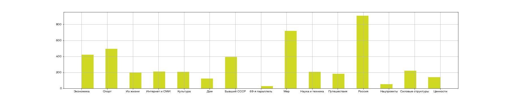
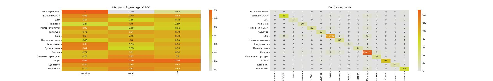
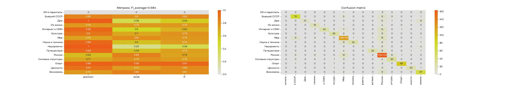

# Способы векторизации текстов

Чтобы погрузиться в способы векторизации текстов и их классификации, давайте будем работать с [датасетом о новостях.](https://www.kaggle.com/datasets/vfomenko/russian-news-2020)

## Предобработка данных

Прежде чем мы начнем векторизовывать текст и решать задачу классификации, давайте немного посмотрим на данные и проведем простую предобработку.

Скачаем датасет, прочитаем данные, отберем нужные колонки и уберем пропуски

```python
df = pd.read_csv('news.csv')
df = df[['source', 'title', 'text', 'rubric']]
df = df.dropna()
```

- source - где была опубликована новость
- title - заголовок
- text - содержание статьи
- rubric - рубрика

Поставим себе задачу определять рубрику новости по ее тексту. Для начала построим гистограмму классов.



Классы несбалансированны, поэтому нужно будет подумать над метрикой.

Давайте предобработаем документы при помощи функций из прошлого урока. Данных немного, поэтому будем использовать лемматизацию. Это займет какое-то время.

```python
df['preprocessed_text'] = df.text.apply(lambda x: preprocess_sentence_lemmatize(x))
```

Кстати, если хочется отслеживать прогресс выполнения операций над данными, то можно использовать библиотеку `tqdm`. Она предоставляем множество различных прогрес-баров, и имеет интеграцию с jupyter ноутбуками и pandas. [Вот тут](https://stackoverflow.com/questions/18603270/progress-indicator-during-pandas-operations) неплохо описано как можно отобразить прогресс по методу `apply`. Нужно всего лишь импортировать библиотеку и вместо `apply` использовать `progress_apply`:

```python
df['preprocessed_text'] = df.text.progress_apply(lambda x: preprocess_sentence_lemmatize(x))
```

Теперь давайте укажем, что интересующая нас колонка rubric категориальная, чтобы с ней было проще работать:

```python
df['rubric'] = pd.Categorical(df.rubric)
```

И, наконец, поделим данные на тренировочную и тестовую выборки:

```python
train, test = train_test_split(df, random_state=0, train_size=0.8)
x_train = train.preprocessed_text
y_train = train.rubric
x_test = test.preprocessed_text
y_test = test.rubric
x_train.shape, y_train.shape, x_test.shape, y_test.shape
```

Теперь мы готовы векторизовать текст и решать задачу классификации.

## Bag of word

Далее мы будем использовать один и тот же алгоритм работы с моделями:

1. Выбрать способ векторизации, провести векторизацию текста
2. Выбрать модель классификации и обучиться
3. Оценить результаты

Чтобы было проще с этим работать, давайте использовать Pipeline. Pipeline (конвейер) - это инструмент, который позволяет создавать цепочку преобразований над данными перед тем как передать их в модель на обучение. Главный плюс в том, что мы будем просто вызывать `fit` и `predict`, не задумываясь о том, что нам нужно не забывать делать преобразования и обратные преобразования. Конвейер все сделает за нас, нам нужно только задать очередность операций.

В прошлом уроке мы познакомились со способом векторизации BOW. Давайте посмотрим как им пользоваться при помощи Python. В библиотеке scikit-learn он называется `CountVectorizer`. Давайте используем его и потом построим логистическую регрессию.

```python
pipeline = Pipeline([
    ('CountVectorizer', CountVectorizer()),
    ('LogisticRegression', LogisticRegression(max_iter=1000))
])

pipeline.fit(x_train, y_train)
```

Модель обучилась, теперь нужно как-то оценить качество модели. Давайте построим два графика. На одном отобразим матрицу ошибок, на которой сразу будет видно если какой-то класс будет плохо определяться. На втором графике отобразим метрики precision, recall и f1-меру для каждого из классов. Как итоговую метрику, по которой будем принимать решение, возьмем среднюю f1-меру, посчитанную по всем классам. Давайте напишем функцию, которая строит графики и считает метрики

```python
def plot_result(model, x_test, y_test):
    y_pred = pipeline.predict(x_test)
    # Считаем метрики
    mat = confusion_matrix(y_test, y_pred)
    df_matrix = pd.DataFrame(mat, index=df.rubric.cat.categories, columns=df.rubric.cat.categories)
    result = {
        'precision': precision_score(y_test, y_pred, average=None),
        'recall': recall_score(y_test, y_pred, average=None),
        'f1': f1_score(y_test, y_pred, average=None),
    }
    result = pd.DataFrame(result, index=df.rubric.cat.categories)
    
    # Строим табличку с метриками
    fig, ax = plt.subplots(1, 2, figsize=(30, 5))
    ax[0].set_title(f'Метрики, f1_average={f1_score(y_test, y_pred, average="macro"):.3f}')
    sns.heatmap(result, annot=True, ax=ax[0])
    
    # Строим матрицу ошибок
    ax[1].set_title('Confusion matrix')
    sns.heatmap(df_matrix, annot=True, ax=ax[1])
```

Теперь мы готовы посмотреть на точность модели:

```python
plot_result(pipeline, x_test, y_test)
```



Можно заметить, что первый класс не совершает ошибок первого рода, но зато совершает много ошибок второго рода. Также, например, категорию "Интернет и СМИ" алгоритм тоже плохо различает.

## TF-IDF

Проблема BOW заключается в том, что некоторые общеупотребительные слова могут встречаться во всех документах и модель будет переобучаться на них. Частично эта проблема решается на уровне фильтрации стоп-слов, но некоторые слова могут не быть стоп-словами, но встречаться почти в каждом документе и не нести никакой смысловой нагрузки.

Давайте будем штрафовать слово, если оно находится сразу во многих документах. Так, слово, которое встретилось всего в 5 документах будет нести больше смысла, чем слово, которое встретилось в 100 документах. Такой подход назвали **TF-IDF (term frequency - inverse document frequency)**.

TF-IDF считается так:

$$TFIDF = TF*IDF$$

- TF - term frequency - сколько раз слово встретилось в документе, как мы и считали в BOW
- IDF - inverse document frequency - $\frac{1}{d}$, где $d$ - количество документов, в которых встретилось это слово

TF-IDF позволяет сформировать такой вектор документа, в котором у каждого слова будет свой вес. Далее, например, модель логистической регрессии может каждому слову проставить свой вес и принять к какому классу будет принадлежать весь документ.

Давайте построим конвейер для TF-IDF

```python
pipeline = Pipeline([
    ('CountVectorizer', CountVectorizer()),
    ('TfidfTransformer', TfidfTransformer()),
    ('LogisticRegression', LogisticRegression(max_iter=1000))
])

pipeline.fit(x_train, y_train)
plot_result(pipeline, x_test, y_test)
```



Точность упала и это нормально. На другом датасете точность могла вырасти.

## Word2Vec

Оба метода, упомянутых выше, позволяли сделать вектор, который бы отражал суть какого-то документа. Однако мы не можем с их помощью найти похожие отдельные слова или сравнить "непохожесть" слов. Для того, чтобы решать такую задачу, существует метод Word2Vec.

Суть метода состоит в том, чтобы отобразить каждый токен в пространстве фиксированной размерности. Например, давайте представим, что у нас есть коллекция из миллиона документов, и мы хотим каждое слово отразить в виде вектора в 50-мерном пространстве. Для поиска близких по смыслу слов можно использовать косинусное расстояние.

Косинусное расстояние - это косинус угла между векторами:

$$cos(A, B) = \frac{(A, B)}{|A||B|}$$

Что для нас это означает? Мы можем находить как слова соотносятся между собой.

Например, если мы возьмем обученный Word2Vec и найдем векторы слов "король", "мужчина" и "женщина", то посчитав "женщина" + "мужчина - король" и найдя ближайшую точку, мы найдем "королева".


Звучит как магия! Но именно так и работает Word2Vec. Алгоритм определяет значения слов на основе контекста. Контекст - это слова, которые окружают нужно нам слово. Обычно для того, чтобы как-то повлиять на обучение Word2Vec используют ширину окна, то есть на сколько слов слева и справа от текущего нужно обращать внимание алгоритму. Чем шире окно, тем больше контекста сможет запомнить модель, но в тоже время при широком окне будет попадать много шума.

[Подробнее про Word2Vec можно почитать здесь](https://habr.com/ru/post/446530/)

Давайте посмотрим как это работает на практике. Для работы с этим алгоритмом нам потребуется библиотека `gensim`. Устанавливается так:

`pip install gensim`

Для того, чтобы построить модель word2vec нужно сформировать список из предложений. Разобьем каждый документ на слова.

```python
sentences = []
for sentence in df.preprocessed_text:
    sentences.append(sentence.split())
```

А теперь запустим word2vec:

```python
from gensim.models import Word2Vec

word2vec = Word2Vec(sentences=sentences, vector_size=100, window=5, min_count=1,)

word2vec.wv.most_similar(['интернет'])
# [('форма', 0.9428954124450684),
#  ('приложение', 0.9328800439834595),
#  ('существующий', 0.9318660497665405),
#  ('учиться', 0.9302136301994324),
#  ('почва', 0.9265796542167664),
#  ('оптимизм', 0.9217283129692078),
#  ('отдыхать', 0.9205290675163269),
#  ('попадать', 0.9198291301727295),
#  ('кожа', 0.9183829426765442),
#  ('туалет', 0.9172804951667786)]
```

В первых 10 результатах обычно можно найти слова, которые связаны по смыслу с исходным. Если бы данных было больше, то модель была бы точнее. Существуют предобученные модели, которые можно использовать в своих исследованиях.
