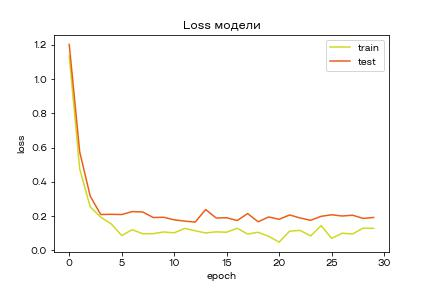

# Нейронные сети

Нейронные сети - очень широкая тема. В курсе представлен краткий обзор основных подходов и инструментов, которые чаще всего используются на практике.

Будем использовать Keras с бэкендом на tensorflow.

[Тут](https://keras.io/examples/) есть очень много примеров для разных задач.

Также в keras/tf есть возможность самому написать алгоритм обучение и получения предсказания для сети. Этот материал выходит за рамки нашего курса, но при желании можно ознакомиться, например, [здесь](https://keras.io/guides/customizing_what_happens_in_fit/).

В тексте урока будет рассмотрена вся необходимая теория, а на видео разберемся с практической частью. Скорее всего, после первого прочтения материала будет много непонятно, поэтому рекомендуем после просмотра видео вернуться к теоретической части, чтобы лучше понять что к чему.

## Основы

Единица вычисления в нейросети - нейрон. Нейрон - это функция, которая принимает число (вектор) и возвращает какое-то другое число.

Нейрон принимает на вход вектор, считает взвешенную сумму элементов, применяет функцию активации (например, сигмоидальную, как в логистической регресси) и отдает результат следующему нейрону.

Нейроны обычно организуют в слои. Пример на картинке ниже

### Входной слой

На рисунке нейроны фиолетового цвета представляют собой входные данные. Они могут быть простыми скалярными величинами или более сложными – векторами или многомерными матрицами.

Первый набор активаций (а) равен входным значениям. «Активация» — это значение нейрона после применения функции активации. Подробнее смотрите ниже.

### Скрытые слои

Конечные значения в скрытых нейронах (на рисунке зеленого цвета) вычисляются с использованием zl – взвешенных входов в слое I и aI активаций в слое L. Для слоев 2 и 3 уравнения будут следующими:

Для l = 2:

Для l = 3:

W2 и W3 – это веса на слоях 2 и 3, а b2 и b3 – смещения на этих слоях.

Активации a2 и a3 вычисляются с помощью функции активации f. Например, эта функция f является нелинейной (как сигмоид, ReLU и гиперболический тангенс) и позволяет сети изучать сложные паттерны в данных. Мы не будем подробно останавливаться на том, как работают функции активации, но, если вам интересно, я настоятельно рекомендую прочитать эту замечательную [статью](https://medium.com/the-theory-of-everything/understanding-activation-functions-in-neural-networks-9491262884e0).

Присмотревшись внимательно, вы увидите, что все x, z2, a2, z3, a3, W1, W2, b1 и b2 не имеют нижних индексов, представленных на рисунке четырехслойной нейронной сети. Дело в том, что мы объединили все значения параметров в матрицы, сгруппированные по слоям. Это стандартный способ работы с нейронными сетями, и он довольно комфортный. Однако я пройдусь по уравнениям, чтобы не возникло путаницы.

Давайте возьмем слой 2 и его параметры в качестве примера. Те же самые операции можно применить к любому слою нейронной сети.
W1 – это матрица весов размерности (n, m), где n – это количество выходных нейронов (нейронов на следующем слое), а m – число входных нейронов (нейронов в предыдущем слое). В нашем случае n = 2 и m = 4.

Здесь первое число в нижнем индексе любого из весов соответствует индексу нейрона в следующем слое (в нашем случае – это второй скрытый слой), а второе число соответствует индексу нейрона в предыдущем слое (в нашем случае – это входной слой).

x – входной вектор размерностью (m, 1), где m – число входных нейронов. В нашем случае m = 4.

b1 – это вектор смещения размерности (n, 1), где n – число нейронов на текущем слое. В нашем случае n = 2.

Следуя уравнению для z2 мы можем использовать приведенные выше определения W1, x и b1 для получения уравнения z2:

Теперь внимательно посмотрите на иллюстрацию нейронной сети выше:

Как видите, z2 можно выразить через z12 и z22, где z12 и z22 – суммы произведений каждого входного значения xi на соответствующий вес Wij1.

Это приводит к тому же самому уравнению для z2 и доказывает, что матричные представления z2, a2, z3 и a3 – верны.

### Выходной слой

Последняя часть нейронной сети – это выходной слой, который выдает прогнозируемое значение. В нашем простом примере он представлен в виде одного нейрона, окрашенного в синий цвет и рассчитываемого следующим образом:

И снова мы используем матричное представление для упрощения уравнения. Можно использовать вышеприведенные методы, чтобы понять лежащую в их основе логику.

### Прямое распространение и оценка

Приведенные выше уравнения формируют прямое распространение по нейронной сети. Вот краткий обзор:

(1) – входной слой
(2) – значение нейрона на первом скрытом слое
(3) – значение активации на первом скрытом слое
(4) – значение нейрона на втором скрытом слое
(5) – значение активации на втором скрытом уровне
(6) – выходной слой

Заключительным шагом в прямом проходе является оценка прогнозируемого выходного значения s относительно ожидаемого выходного значения y.

Выходные данные y являются частью обучающего набора данных (x, y), где x – входные данные (как мы помним из предыдущего раздела).

Оценка между s и y происходит через функцию потерь. Она может быть простой как среднеквадратичная ошибка или более сложной как перекрестная энтропия.

Мы назовем эту функцию потерь С и обозначим ее следующим образом:

Где cost может равняться среднеквадратичной ошибке, перекрестной энтропии или любой другой функции потерь.

Основываясь на значении С, модель «знает», насколько нужно скорректировать ее параметры, чтобы приблизиться к ожидаемому выходному значению y. Это происходит с помощью метода обратного распространения ошибки.

### Обратное распространение ошибки и вычисление градиентов

Опираясь на статью 1989 года, метод обратного распространения ошибки:

Постоянно настраивает веса соединений в сети, чтобы минимизировать меру разности между фактическим выходным вектором сети и желаемым выходным вектором.
и
…дает возможность создавать полезные новые функции, что отличает обратное распространение от более ранних и простых методов…

Другими словами, обратное распространение направлено на минимизацию функции потерь путем корректировки весов и смещений сети. Степень корректировки определяется градиентами функции потерь по отношению к этим параметрам.

Возникает один вопрос: Зачем вычислять градиенты?

Чтобы ответить на этот вопрос, нам сначала нужно пересмотреть некоторые понятия вычислений:

Градиентом функции С(x1, x2, …, xm) в точке x называется вектор частных производных С по x.

Производная функции С отражает чувствительность к изменению значения функции (выходного значения) относительно изменения ее аргумента х (входного значения). Другими словами, производная говорит нам в каком направлении движется С.

Градиент показывает, насколько необходимо изменить параметр x (в положительную или отрицательную сторону), чтобы минимизировать С.

Вычисление этих градиентов происходит с помощью метода, называемого цепным правилом. По сути, это обычное правило вычисления производной сложной функции.
Для одного веса (wjk)l градиент равен:

(1) Цепное правило
(2) По определению m – количество нейронов на l – 1 слое
(3) Вычисление производной
(4) Окончательное значение
Аналогичный набор уравнений можно применить к (bj)l:

(1) Цепное правило
(2) Вычисление производной
(3) Окончательное значение
Общая часть в обоих уравнениях часто называется «локальным градиентом» и выражается следующим образом:

«Локальный градиент» можно легко определить с помощью правила цепи. Этот процесс я не буду сейчас расписывать.

Градиенты позволяют оптимизировать параметры модели:

Пока не будет достигнут критерий остановки выполняется следующее:

Алгоритм оптимизации весов и смещений (также называемый градиентным спуском)

- Начальные значения w и b выбираются случайным образом.
- Эпсилон (e) – это скорость обучения. Он определяет влияние градиента.
- w и b – матричные представления весов и смещений.
- Производная C по w или b может быть вычислена с использованием частных производных С по отдельным весам или смещениям.
- Условие завершение выполняется, как только функция потерь минимизируется.

Заключительную часть этого раздела я хочу посвятить простому примеру, в котором мы рассчитаем градиент С относительно одного веса (w22)2.

Давайте увеличим масштаб нижней части вышеупомянутой нейронной сети:

Визуальное представление обратного распространения в нейронной сети

Вес (w22)2 соединяет (a2)2 и (z2)2, поэтому вычисление градиента требует применения цепного правила на (z2)3 и (a2)3:

Вычисление конечного значения производной С по (a2)3 требует знания функции С. Поскольку С зависит от (a2)3, вычисление производной должно быть простым.

Я надеюсь, что этот пример сумел пролить немного света на математику, стоящую за вычислением градиентов. Если захотите узнать больше, я настоятельно рекомендую вам посмотреть Стэндфордскую серию статей по NLP, где Ричард Сочер дает 4 замечательных объяснения [обратного распространения.](https://www.youtube.com/watch?v=isPiE-DBagM&list=PL3FW7Lu3i5Jsnh1rnUwq_TcylNr7EkRe6)

## Связь с линейной и логистической регрессией

Как вы могли заметить, нейрон по своей сути очень похож на логистическую регрессию. Мы точно также считаем взвешенную сумму, а потом применяем сигмоиду (функцию активации). Если мы не применим функцию активации, то получим линейную регрессию.

В некотором смысле перцептрон - это обобщение линейных моделей. Из-за того, что мы добавляем функцию активации, в модели появляется нелинейность, благодаря которой мы можем описывать более сложные данные, которые бы никогда не описали линейной моделью.

## Интересное свойство нейросетей

Нейросеть - это всего лишь математическая функция. Сложно настраиваемая и очень большая, но всего лишь функция. Возникает вопрос - насколько сложные закономерности можно отследить при помощи нейросетей? Была доказана теорема, что при помощи нейросетей можно аппроксимировать любую функцию с заданной точностью, имея достаточно количество данных. Для нас это значит, что если у нас достаточно данных, то мы можем получить любую точность на тестовой выборке. Сложность лишь в том, что "достаточно данных" бывает очень редко.

## Гиперпараметры нейросетей

На практике если бы мы запускали обратное распространение ошибки на всей тренировочной выборке, то нам было бы нужно загружать весь датасет в оперативную память. Если датасет весит несколько гигабайт, то это еще можно сделать, но если вес датасета измеряется террабайтами (что бывает очень часто), то это будет очень дорого и неэффективно. Как же быть? Ответ прост - использовать градиентный спуск с mini-batch.

Когда мы знакомились с градиентным спуском, то говорили о том, что SGD позволяет обновлять веса модели всего по одному примеру из выборки, но мы можем выбирать не один пример, а сразу несколько, и тогда веса будут настраиваться быстрее. При обучении нейросетей выбор оптимального размера батча - залог успеха. Хорошей практикой считается выбор батча размера 128 или 256, но все зависит от задачи. Если мы возьмем слишком маленький батч, то мы сделаем очень много итераций перед тем как пройдем по всем данным. А если возьмем большой размер батча, то он, опять же, не поместится за раз в память. Также мы можем параллельно запускать метод оптимизации по нескольким батчам, но тут есть свои ограничения, накладываемые железом, на котором мы запускаем обучение нейросети. Обычно пробуют запускать обучение на нескольких размерах батчей, смотрят где лучше и оставляют это количество.

Допустим, в тренировочной выборке было 1000 примеров. Размер батча мы взяли 100, значит весь датасет поделится на 10 кусочков по 100 примеров. Обучим нейросеть на всей выборке. Один такой проход по всей выборке называется **эпохой**. За одну эпоху нейросеть не успеет изучить данные достаточно хорошо, поэтому мы можем продолжать обучать ее, формируя новые батчи такого же размера после каждой эпохи. После каждой эпохи мы можем посчитать ошибку на тренировочной выборку (обычно ее называют loss - функция потерь), а также ошибку на тестовой выборке. Если мы построим график, на котором по оси Х отложим количество эпох, а по оси Y отложим значение loss и нарисуем кривую для тренировочной и для тестовой выборки, то заметим, что, как правило, после каждой эпохи ошибка в каждом случае будет падать.

**поправить картинку**

После каких-то эпох значение ошибки может незначительно возрастать, это нормально. Главное, чтобы общий тренд был на понижение. Также можно видеть, что ошибка на тренировочной выборке немного ниже, чем на тестовой. Это нормально, так как на модель видит тренировочную выборку и подстраивает свои веса именно под нее, в то время как в тестовой выборке могут быть немного другие данные и на них модель будет сильнее ошибаться. Однако если разница между этими двумя ошибками начинает увеличиваться после какой-то эпохи, то это может говорить о переобучении модели. В таком случае нужно остановить обучение.

## Борьба с переобучением

Когда мы разбирались с линейной регрессией, мы говорили о регуляризации, которая помогает бороться с переобучением. Для нейросетей такой подход не подойдет, вместо него используют Dropout-слой. Причины переобучения в общем случае нам все еще неизвестны, поэтому давайте просто представим из-за чего чаще всего может переобучаться модель и как это можно победить.

Чаще всего нейронная сеть переобучается из-за того, что какие-то нейроны становятся намного важнее остальных и модель начинает ориентироваться только на них. Это может произойти случайно - после нескольких итераций коэффициенты внутри почти всех нейронов станут нулевыми, а внутри одного отличны от нуля и модель будет ориентироваться только на этот нейрон. Давайте при обучении с некоторой вероятностью отключать какие-то нейроны на нужном слое. Например, в слое 10 нейронов, мы ставим dropout с вероятностью 0.5, а значит в среднем 5 случайных нейронов отключатся (коэффициенты будут нулевыми), а значит решение придется принимать остальным нейронам. Тогда при обратном распространении ошибки мы заметим, что нейроны с маленьким вкладом на самом деле вносят маленький вклад и часто выдают случайный ответ, и мы будет менять значения их коэффициентов, пока они не начнут выдавать адекватный результат.

Еще раз, при помощи dropout-слоя мы можем "отключать" нейроны при обучении с некоторой вероятностью. Это позволит с каким-то шансом поймать нейроны, которые перетягивают одеяло на свою сторону. Если запустить обучение на достаточном количестве эпох, то таких нейронов точно не будет. Добавление dropout слоя не гарантирует, что мы избежим проблемы переобучения, но позволяет в некоторых случаях его избежать.
