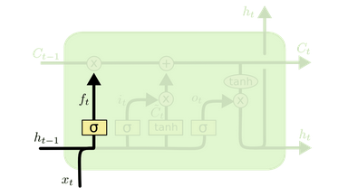
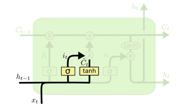
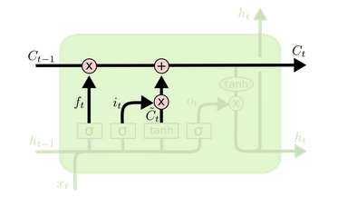
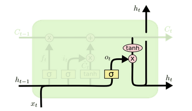
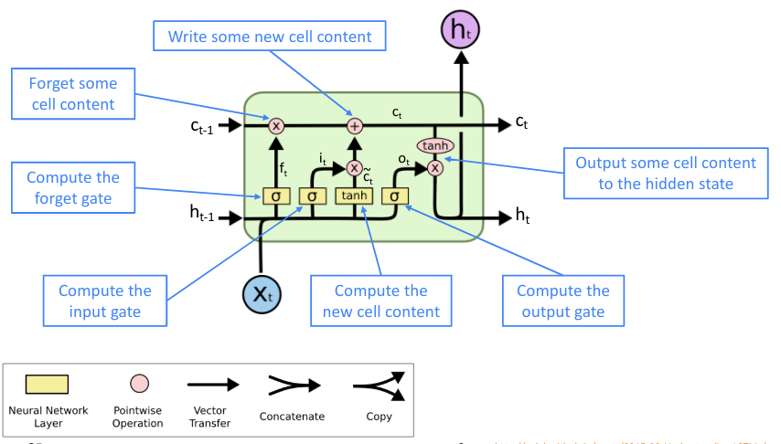

# Рекурентные нейросети

Мы уже знаем как решать задачи, связанные с изображениями и с обычными табличными данными, при помощи нейросетей. У всех рассмотренных нейросетей не было одного важного свойства - памяти. Если в сверточную нейросеть подряд передать несколько связанных картинок (например, кадры в видео), то она не сможет понять, что они связаны и для каждого изображения будет строить свой независимый прогноз. Для того, чтобы улучшить качество, мы можем добавить в нейросеть краткосрочную память. Рекурентные нейросети позволяют это сделать.

Чаще всего RNN используют для работы с текстами, так как нам важна связь между словами в предложении и их порядок, а также для работы с временными рядами, так как мы хотим запоминать сезонность и цикличность.

## RNN

Давайте подумаем над задачей прогнозирования слов. Нам дается первая часть предложения, и нам нужно сгенерировать следующее слово. Нейросеть должна вспомнить какие слова чаще всего появлялись после указанных слов в обучающем датасете и выдать наиболее вероятное слово. Затем мы можем предсказанное слово добавить в конец предложения и запустить нейросеть на дополненном предложении еще раз.

Суть в том, что блок `A` остается одним и тем же, но передавая в него все больше контекста, мы будем получать разный результат.

Рассмотрим другую похожую задачу - классификация документов. На вход подается документ из t слов. Сначала мы прогоним нейросеть на первом слове $x_0$, результат запомним в $h_0$ и передадим дальше. На втором шаге мы соединим $h_0$ и $x_1$, передадим это в тот же самый блок $A$, и получим новое значение $h_1$, и так далее.

Затем вектор h мы можем использовать в линейном слое для построения прогноза. Обычно вектор h называют **скрытым состояним** (hidden state) и это и является памятью модели.

Как считается RNN? На самом деле, тут никакой магии. Есть три типа векторов с коэффициентами в этой модели. Первый тип коэффициентов умножается на вектор скрытого состояния (по умолчанию нулевой), назовем его $w_{h}$. Второй тип коэффициентов для вновь поступающего $x$, его назовем $w_x$. Мы можем умножить коэффициенты на их векторы как в обычном линейном слое и сложить, а затем применить функцию активации (сигмоиду или гиперболический тангенс). Это будет новым вектором состояния:

$$h_{t} = \sigma(w_{h}h_{t-1} + w_{x}x_{t})$$

Затем нужно посчитать выход модели, для этого есть последний вид коэфициентов, назовем его $w_y$.

$$y_{t} = \sigma(w_y h_t)$$

## Проблема затухающего градиента

Как обучать такую модель? Опять же, разница с предыдущими нейросетями небольшая. Можно использовать обычное обратное распространение ошибки, но можно столкнуться с одной серьезной проблемой. Из-за того, что одни и те же параметры используются на каждом шаге градиентного спуска, мы можем случайно увеличить или уменьшить градиент в несколько раз. Это называют **проблемой взрывающегося градиента** и проблемой **затухающего градиента**.

Почему так происходит? На самом деле, многое зависит от функции активации. Если мы возьмем сигмоиду или гиперболический тангенс, то в точках, далеких от 0, производная будет очень маленькой, а соответственно, вся функция к нулю будет стремиться очень медленно, и тогда мы получим затухающий градиент. Если же вообще отказаться от функции активации, то получим взрывающийся градиент.

Обычно с этим можно бороться при помощи техники, которая называется gradient clipping (отсекание градиента). В этом случае если длина вектора градиента увеличивается на заранее заданное число, то мы уменьшаем весь вектор.

## Архитектура LSTM

Раньше все пользовались обычными рекурентными нейросетями, но из-за проблемы с градиентами у этих нейросетей были большие ограничения на использование, но в 2012 году все изменилось, потому что появилась архитектура сети LSTM, которая, по заявлению авторов, решает проблему затухания градиента. Благодаря LSTM мы можем анализировать текст, видео и временные ряды практически не задумываясь над взрывающимися и затухающими градиентами.

Помимо уже знакомого нам вектора контекста, который авторы LSTM называют *краткосрочной (short-term, hidden state)* памятью, они также вводят понятие *долгосрочной (long-term, cell state)* памяти, которая также подстраивается под контекст последовательности по мере обучения, однако при этом позволяет на каждой итерации более тонко менять свое состояние в зависимости от поступившего входного вектора: "забывать" неактуальную информацию или записывать новую, при этом оценивая степень её важности. Это осуществляется при помощи механизма *шлюзов (gates)*. Шлюз — это вектор, являющийся результатом применения линейного слоя с сигмоидной активацией, который затем поэлементно умножается на вектор памяти. Далее приведен пошаговый разбор работы LSTM в порядке работы шлюзов.
  
### Forget gate

  
$$ f^t = \sigma(W_f \cdot [h^{t-1}, x^t] + b_f) $$
  
На первом этапе вычисляется шлюз "забвения". Он отвечает за удаление устаревшей информации из долгосрочной памяти $C$, используя краткосрочную память и входной вектор. Каждый элемент шлюза является числом в диапазоне от 0 до 1, где 0 соответствует полному "забвению", а 1 - полному сохранению в памяти. В качестве иллюстрации можно привести пример с языковой моделью, которая пытается подобрать корректное местоимение в зависимости от рода подлежащего. При переключении на нового субъекта-подлежащего, мы должны забыть род старого.
  
### Input gate

 $$ i^t = \sigma(W_i \cdot [h^{t-1}, x^t] + b_i) $$
 $$ \widetilde{C^t} = tanh(W_C \cdot [h^{t-1}, x^t] + b_C) $$
  
Следующий шлюз определяет новую информацию, которая будет добавлена на данной итерации. Это делается в два этапа. Сначала линейный слой с сигмоидой решает, какие именно элементы долгосрочной памяти будут обновлены, затем линейный слой с активацией $tanh$ на основе текущего контекста и инпута создает вектор с новой информацией. Т. е. мы не просто генерируем новую информацию на шаге $t$, но и определеяем, что из неё хотим добавить в долгосрочную память. Продолжая пример с языковой моделью, на этом шаге мы добавляем информацию о роде нового подлежащего.

### Обновление памяти

$$C^t = f^t*C^{t-1} + i^t*\widetilde{C^t}$$

Получив в результате работы шлюзов векторы, соразмерные вектору долгосрочной памяти, мы можем произвести собственно её обновление. Для этого производится поэлементное умножение вектора памяти, переданного с предыдущей итерации на вектор "забывания" $f_t$, и к результату добавляется также поэлементное произведение $\widetilde{C_t} * i_t$, т. е. взвешенная новая  информация, где вес отражает желание сети обновлять конкретный элемент.
  
### Output gate

  
 $$ o^t = \sigma(W_o \cdot [h^{t-1}, x^t] + b_o) $$
 $$ h^t = o^t * tanh(C^t) $$
Последний шлюз определяет содержимое выхода сети. Снова линейный слой с сигмоидной активацией используется как фильтр информации из входного вектора и краткосрочной памяти и затем поэлементно умножается на результат $tanh$-активации от уже обновленного вектора долгосрочной памяти. Результат этих операций одновременно используется и как обновленная краткосрочная память, и как итоговый выход. В терминах языковой модели этот этап можно проиллюстрировать как передачу информации о числе и роде подлежащего, которое поступило к нам во входном векторе $x_t$, чтобы на следующем шаге $t+1$ правильно подобрать спряжение глагола-сказуемого.
  
### Итоговая схема работы

  
Таким образом, работа LSTM на очередной итерации $t$ раскладывается на следующие смысловые части:

1. Определить удаляемую информацию из долгосрочной памяти, вычислив **forget_gate** $f^t$;
2. Определить информацию-"кандидата" из нового инпута (вычислив $\widetilde{C^t}$), которая потенциально может быть добавлена в долгосрочную память, и решить что из неё действительно стоит добавлять (вычислив $i^t$);
3. Обновить долгосрочную память $C$;
4. На основе уже обновленной долгосрочной памяти, старого вектора контекста и вектора инпута вычислить новый вектор контекста.
  
Или, в виде уравнений:
  
$$ f^t = \sigma(W_f \cdot [h^{t-1}, x^t] + b_f) $$
$$ i^t = \sigma(W_i \cdot [h^{t-1}, x^t] + b_i) $$

$$ \widetilde{C^t} = tanh(W_C \cdot [h^{t-1}, x^t] + b_C) $$
$$C^t = f^t*C^{t-1} + i^t*\widetilde{C^t}$$
$$ o^t = \sigma(W_o \cdot [h^{t-1}, x^t] + b_o) $$
$$ h^t = o^t * tanh(C^t) $$

LSTM способна находить зависимости между отдаленными элементами последовательности, ведь, например, для любого компонента долгосрочной памяти есть возможность зафиксировать значение *forget gate* на 1 и *input gate* на 0, а это приведет к постоянному хранению этого компонента. Также благодаря долгосрочной памяти в LSTM есть альтернативный путь прохождения градиента, который состоит только из операций сложения и поэлементного умножения, что делает затухание градиента существенно менее вероятным (но не решает проблему полностью).

## Ограничения рекурентных нейросетей

Самая большая проблема рекурентных нейросетей - скорость. Из-за того, что обучение проходит последовательно и его никак нельзя распараллелить, то большое количество видеокарт не слишком поможет. Также, как уже было сказано, все рекурентные нейросети предрасположены к взрывающимся и затухающим градиентам и обучить модель бывает не всегда просто. Также модель может легко переобучиться, и отследить это бывает сложно.

Если помнить про эти проблемы, то с помощью рекурентных нейросетей можно решать широкий класс задач.
