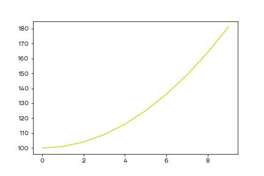
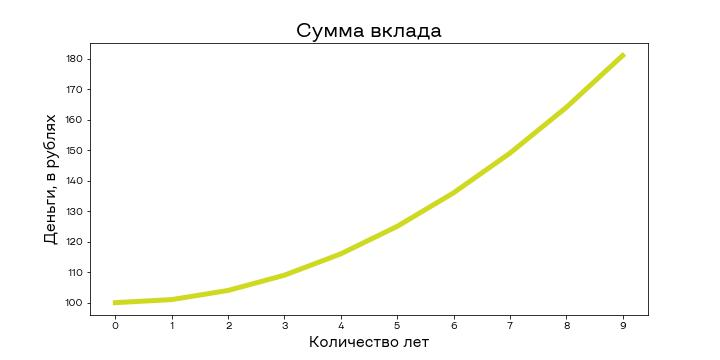

# Как презентовать исследования

По окончанию исследования вам будет необходимо предоставить отчет о проделанной работе. О том как это обычно происходит и как сделать это максимально безболезненно, мы с вами поговорим в этом уроке.

## Виды отчетов

Обычно отчеты бывают двух видов - устные (с презентацией) и письменные (в виде документа).

Устные отчеты могут требоваться заказчиком как в ходе проекта, например после каждой закрытой задачи, так и в конце проекта, чтобы отчитаться о проделанной работе и рассказать о результатах. Обычно в презентацию вставляют графики и основные выводы, которые были сделаны по данным.

Письменный отчет предполагает техническое описание всех подходов, которые были использованы в исследовании. Здесь могут фигурировать те же графики, но к ним прилагается подробный алгоритм получение (без кода, код хранится рядом в репозитории).

Чтобы отчеты было проще генерировать, можно использовать инструменты, которые мы обсуждали в прошлых уроках этого модуля. Если похожие отчеты нужно предоставлять регулярно, то лучше полностью автоматизировать их генерацию, это уменьшит вероятность ошибки.

## Структура письменного отчета

В зависимости от компании и принятых регламентов, структура отчета может отличаться. Где-то достаточно оформить ноутбуки, а где-то необходимо написать подробный отчет со всеми техническими деталями. Так или иначе, следует внести следующие пункты в отчет:

1. Описание бизнес-задачи. Нужно описать какую проблему будет решать исследование и какие данные для этого будут использоваться
2. Математическая постановка задачи. Если это стандартная задача классификации или регрессии, то можно ограничиться одним абзацем. Здесь же описать какие метрики будут использоваться для оценки задачи.
3. Описание данных. Нужно описать сколько и каких данных было предоставлено для решения задачи, приложить гистограммы распределения, прокомментировать наличие выбросов.
4. Описание используемых моделей. Кратко описать каждый из методов (если это стандартные алгоритмы, то можно опустить описание).
5. Валидация моделей. Рассказать в каких пропорциях выборка делилась на тренировочную и тестовую, проводилась ли кросс-валидация и какие были получены результаты.
6. Выводы. Описать полученные результаты и какие выводы по ним можно сделать. Здесь же можно выделить лучшую модель и дать рекомендации по дальнейшему сбору данных.
7. Технический раздел о том где хранится исходный код и как его запустить.

Если придерживаться такой структуры, то все части исследования будут покрыты и при желании любой человек сможет погрузиться в проблематику проекта.

Также в отчете стоит описывать трудности, с которыми вы столкнулись. Например, если вы разрабатывали систему распознавания лиц и долгое время пытались настроить один алгоритм, но в итоге он показал плохое качества и вы взялись за другой, то стоит про это написать, чтобы люди, которые в будущем будут продолжать исследование не теряли время на то, что уже было сделано и не принесло результат. Важно помнить, что отрицательный результат - это тоже результат и что далеко не все гипотезы подтверждаются. Цель отчета - честно описать какие методы применялись и какие результаты они принесли. Если точность моделей оказалась слишком низкой, то это чаще всего из-за того, что данных оказалось слишком мало, либо в них нет никакой закономерности. Ваша задача, как исследователя, проанализировать данные и понять можно ли здесь применять модели машинного обучения и если да, то найти лучшую из них по выбранному критерию качества.

## Оформление графиков

Когда мы экспериментируем в jupyter-е, то мы быстро строим наглядные (или не очень) графики, на которых отображаем информацию, необходимую нам на данный момент времени. После получения нужного результата, важно посмотреть критическим взглядом на все полученные картинки и спросить себя - поймет ли сторонний человек, что изображено на графике? Подписаны ли оси координат? Достаточно ли хорошо различимы цвета? Также можно попробовать вставить картинку в Word и проверить, будет ли видно текст, возможно стоит сделать шрифт побольше. Давайте посмотрим на несколько примеров графиков, чтобы научиться отличать хорошие графики от плохих.

Плохой график:

График получше:

Полезные ссылки:

- [11 правил визуализации данных](https://habr.com/ru/company/netologyru/blog/341364/)

- [Как строить красивые графики на Python с Seaborn](https://habr.com/ru/company/otus/blog/540526/)

- [Чем можно вдохновляться при построении графиков](https://www.reddit.com/r/dataisbeautiful/)

- [Что можно сделать при помощи Plotly](https://tproger.ru/translations/python-data-vizualization/)

- [Шпаргалка по Plotly](https://habr.com/ru/post/502958/)
