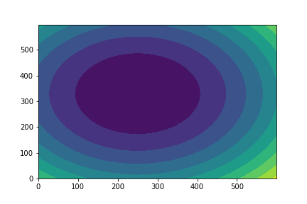

# Домашнее задание

## Easy

Найти производную функции $f(x) в точке $x_0$:

- $f(x)=sin(\frac{1}{x}), x_0=5$
- $f(x)=e^{-\frac{x}{2}}, x_0=2$

Найти $\nabla f$ в точке $x_0$:

- $f(x, y) = (x+y)^2 - 3y + 5, x_0 = (2, 10)$
- $f(x, z, y) = (x+y-z)^2 - 3(y+z)^2, x_0=(-1, -5, 0)$

## Normal

Используя градиентный спуск найти минимум функции с точностью $\varepsilon=10^{-8}$

$$f(x, y) = (x - 3)^2 + (y+5)^2, x_0=(5, 2)$$

Подобрать learning rate, измерить количество итераций.

Проверить себя при помощи функции `minimize` в scipy.

## Hard

Для функции из прошлого задания построить график линий уровня.

Линия уровня - это линия, которая соответствует всем значениям $x$, таким, что $f(x, y) = C$, где $C$ - какая-то константа. Зафиксировав константу, мы можем построить "срез" объемной фигуры. Изменяя константу с каким-то шагом можно увидеть форму фигуры.

Если все сделать правильно, то можно получить вот такой график:

Обычно цветом обозначают значение функции. Темные области соответствуют меньшим значениям, светлые - большим.

**Подсказка:** matplotlib умеет строить такие штуки при помощи функций `contour` и `contourf`.
