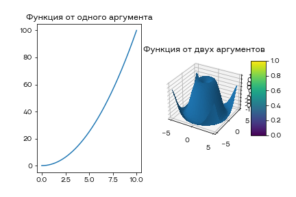
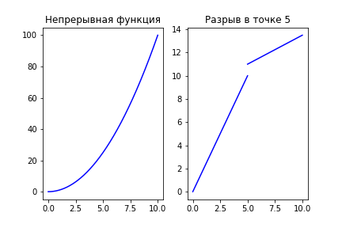
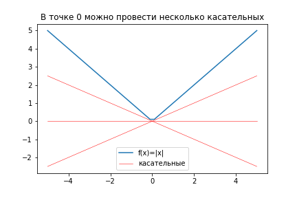
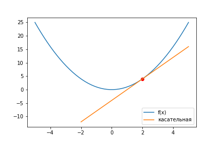
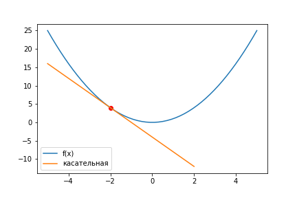
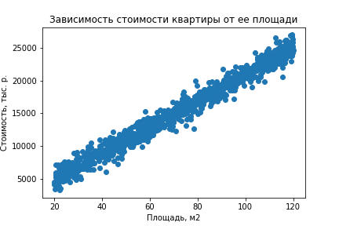
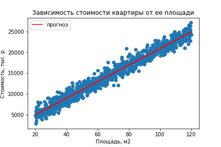

# Урок 2. Функция, производная функции

Начнем с базового для математики понятия - функция. Оно схоже с понятием функции в программировании, но имеет свои особенности.

Давайте сначала поймем, что это такое, а потом дадим формальное определение. Функция - это правило, которое показывает взаимосвязь между двумя (и более) величинами. Например, если мы знаем, что налог на прибыль составляет 13%, то мы всегда можем вычислить, что сумма, которую работник получит на руки будет $x*(1-0.13)$, где $x$ - это сумма, которая прописана в трудовом договоре. Соответственно, можно записать функцию $f(x)$, которая показывает зависимость одной величины от другой: $f(x)=x*(1-0.13)$.

Другой пример - мы хотим посчитать доход предприятия, и пусть он зависит от количества продаж $n$, умноженная на цену одного продукта $p$. Тогда доход будет равен: $n*p$. Здесь функция будет зависеть от двух переменных, поэтому запишем ее так: $g(n, p) = np$.

В математике принято обозначать функции одной буквой. Буквы используют из латинского ($f, g, z, r$) и греческого ($\sigma, \mu, \theta, \omega$) алфавитов.

Дадим формальное определение функции. Пусть у нас есть множество $X$, и каждому элементу множества мы хотим сопоставить какой-то элемент из множества $Y$. Чаще всего функции записываются как некоторое правило, по которому можно из $x \in X$ сопоставить $y \in Y$. Функцию $F$ можно определить так: $F: X \rightarrow Y$.

Множество $X$ называют областью определения функции, а множество $Y$ - множеством значений.

Функции можно рисовать на графике. Это удобный способ графически показать как одна величина зависит от другой. Однако этот способ подходит только для функций, у которых только один или два аргумента.



## Свойства функций

У функций довольно много свойств, у которых есть сложные формальные определения. Ниже мы разберемся с основными свойствами функций, разбираясь лишь с сутью этих свойств, но не затрагивая определений. Если есть желание глубоко разобраться в вопросе, то можно почитать любой учебник по математическому анализу.

**Непрерывной** называется функция, любой промежуток графика которой можно нарисовать, не отрывая ручку от бумаги. Если так сделать нельзя, то говорят, что функция имеет разрыв.



**Монотонность** - свойство функции, когда функция возрастает/убывает на всей своей области определения, то есть для любых $x_1, x_2$, таких что $x_1 < x_2$ всегда будет выполняться $f(x_1) < f(x_2)$ (знак может стоять в другую сторону и может быть нестрогим).

**Дифференцируемость** (или гладкость) - свойство функции, которое означает, что у функции нет углов. Также это означает, что для каждой точки функции можно провести касательную и причем только одну. Недифференцируемой в точке $x=0$ является функция $f(x)=|x|$. Также для дифференцируемых функций можно вычислить производную. О том, что такое производная, раздел ниже.



## Производная функции

**Производная функции** - это функция, которая показывает насколько быстро растет исходная функция. Производную функции $f(x)$ обычно обозначают $f'(x)$ или $\frac{df}{dx}$. Если производная больше нуля, то функция возрастает, если меньше нуля, то убывает, а когда равна нулю... об этом поговорим попозже.

Так как производная - функция, то ее можно вычислить для каждой точки. Давайте возьмем для функции $f(x)=x^2$ (непрерывной и дифференцируемой) точку $x_0=2$ и вычислим ее производную.

Общий принцип такой - прибавим к точке $x_0$ какое-то небольшое число и посмотрим насколько сильно оно повлияло на значение функции. Допустим, это будет число 1. Посчитаем значения функций в этих точках: $f(x_0), f(x_0 + 1)$. Чтобы посмотреть насколько изменилось значение функции, можно посчитать разность между этими значениями. Но сама по себе разность нам ни о чем не скажет, поэтому сделаем поправку на то, что мы добавляли к исходной точке единицу. Тогда можно записать такую формулу:

$$\frac{f(x_0 + 1) - f(x_0)}{(x_0 + 1) - x_0}$$

В числителе разница между функцияим, в знаменателе разница между иксами функций. $x_0$ в знаменателе можно сократить и получим более красивую формулу:

$$\frac{f(x_0 + 1) - f(x_0)}{1}$$

Посчитаем результат:

```python
def f(x):
    return x * x

x0 = 2
(f(x0 + 1) - f(x0)) / 1 # 5
```

Вообще говоря, между $x_0$ и $1$ могло произойти много всего интересного (например, в точке $x_0 + 0.5$ функция могла резко поменять направление), и полученная формула хоть и корректная, но нам бы хотелось более точно оценить насколько увеличение $x_0$ повлияет на результат функции, поэтому вместо единицы возьмем число поменьше, например 0.1, и посчитаем формулу еще раз.

$$\frac{f(x_0 + 0.1) - f(x_0)}{0.1}$$

```python
(f(x0 + 0.1) - f(x0)) / 0.1 # 4.1
```

Можем ли мы быть уверены, что между $x_0$ и 0.1 не произошло каких-то резких изменений? Нет, опять не можем. Давайте обозначим величину, которую мы добавляли к $x_0$ как $\Delta x$ и будем брать ее все меньше и меньше. Возьмем ее бесконечно маленькой (устремим к нулю). Это можно записать так:

$$\lim_{\Delta x \rightarrow 0} \frac{f(x_0 + \Delta x) - f(x_0)}{\Delta x}$$

Теперь мы уверены, что мы возьмем ближайшую точку к $x_0$ и проверим насколько сильно влияет изменение аргумента на изменение значения функции. Это и называется производной функции.

Установим очень маленькое значение для $\Delta x$ и посмотрим чему будет равна формула:

```python
delta_x = 0.000001
(f(x0 + delta_x) - f(x0)) / delta_x # 4.0000010006480125
```

Чем меньше будем брать $\Delta x$, тем ближе результат будет к 4. Для сравнения если возьмем точку -1, то там производная будет -2.

## Геометрический смысла производной

У производной есть и геометрический смысл. Возьмем график функции $f(x)=x^2$ и посмотрим на точку $x_0=2$.

Проведем касательную к графику в этой точке.



Чем более вертикальной будет касательная, тем больше будет возрастать функция в этой точке. В тоже время, если функция будет убывать, то касательная будет направлена в другую сторону.



И опять, чем больше угол наклона, тем сильнее будет убывать функция.

Если мы запишем уравнения для касательной в общем виде, то оно получится вот таким:

$$y = kx + b$$

И зная производную мы можем найти член $k$:

$$f'(x_0) = k$$

И в то же время $k=tg\alpha$, где $\alpha$ - угол наклона касательной.

## Зачем нужны производные?

Прежде всего производные нужны для того, чтобы искать максимальные и минимальные значения функций.

Давайте представим вот такую задачу - нужно научиться прогнозировать цену квартиры по ее параметрам. Параметры могут быть самые разные (площадь, инфраструктура, расстояние до метро и т.д.), но для начала давайте рассмотрим простой случай и рассмотрим только площадь. Пусть у нас есть какая-то выборка из 1000 квартир, для которых мы знаем и площадь и цену.



Самое простое что можно придумать - предположить, что цена линейно зависит от площади:

$$y = kx + b$$

Но как подобрать параметры $k$ и $b$, чтобы точность модели была наилучшей для известных нам данных? Другими словами, нам бы хотелось как-то отследить взаимосвязь точности модели от ее параметров. Для этого мы можем составить функцию, которая бы посчитала такую точность. Назовем площадь наших квартир $x_1, x_2, \dots, x_{1000}$, а цены $y_1, y_2 \dots, y_{1000}$, тогда ошибку можно записать, например, так

$$J(k, b) = \sum_i \frac{(kx_i + b - y_i)^2}{n}$$

Как понимать эту формулу? В верхней части мы посчитали разницу между прогнозом модели и фактическим значением, но из-за того, что прогноз может быть как меньше, так и больше реального значения, то сумма была бы около нуля. Чтобы этого избежать, в числителе стоит возведение в квадрат, которое позволяет избавиться от этого недостатка. После этих преобразований мы делим полученную ошибку на количество примеров.

Теперь наша задача - найти такие значения $k$ и $b$, при которых бы достигался минимум ошибки. Чем меньше ошибка, тем точнее модель.

Минимальные и максимальные значения функций можно искать при помощи производных. Об этом и о том как искать производную от функции с несколькими аргументами мы поговорим в следующем уроке.

Если все же подобрать оптимальные параметры, то получится вот такой результат:



## Таблица производных

На практике производные редко считаются по определению. Для основных функций производные известны и обычно оформляются в виде таблицы.


## Свойства производной

Для практического вычисления производной часто нужны следующие свойства:

$$
c' = 0 \\

x' = 1 \\

(f + g)' = f' + g' \\

(fg)' = f'g + g'f \\

(\frac{f}{g})' = \frac{f'g - g'f}{g^2} \\

f(g(x)) = f'(g(x))g'(x)
$$
