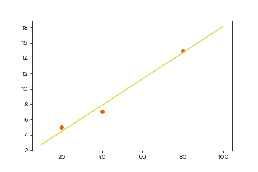

# Нахождение минимума/максимума

Давайте попрактикуемся в нахождении максимума/минимума. Начнем с функции одной переменной.

## Пример 1

Задача: Петя заметил, что цена его любимой акции в ближайший месяц $0 < t < 31$ будет меняться каждый день по следующему закону:

$$f(t) = \frac{-3 t^2 + 93 t - 20}{7}, 0 < t < 31$$

Петя хочет найти наилучший момент, чтобы купить и продать акциии.

### Решение 1

Так как мы знаем когда и какая будет цена на акцию, то можно попробовать найти точки экстремума. Купить нужно в минимальной точке, а продать в максимальной.

Давайте найдем производную:

$$f'(t) = -\frac{6}{7}t + \frac{93}{7}$$

Найдем точку, в которой производная равна нулю:

$$-\frac{6}{7}t + \frac{93}{7} = 0$$

$$\frac{6}{7}t = \frac{93}{7}$$

$$t = 15.5$$

Теперь нужно понять какая это точка - минимум или максимум. Возьмем одну точку слева и одну справа.

$$f'(10) = -\frac{60}{7} + \frac{93}{7} = \frac{33}{7} > 0$$

$$f'(20) = -\frac{120}{7} + \frac{93}{7} = -\frac{27}{7} < 0$$

Слева функция возрастает, справа убывает. Получается, перед нами точка максимума. Получается, оптимальным решением будет купить акцию в начале отрезка, при $t=1$, а затем продать на $t=15.5$. Давайте посчитаем разницу в цене.

$$f(1) = \frac{-3 + 93 - 20}{7} = 10$$

$$f(15.5) = 100\frac{3}{28}$$

Если Петя купить акцию в начале промежутка, то в конце он сможет продать ее в 10 раз дороже.

## Пример 2

Мы хотим построить зависимость стоимости квартиры от ее площади и у нас есть данные о трех квартирах.

$$X=(20, 40, 80)$$

$$Y=(5, 7, 15)$$

Будем строить линейную модель

$$y = kx + b$$

Нужно найти оптимальные коэффициенты для модели.

### Решение 2

Составим функцию ошибки

$$J(k, b) = \frac{(kx_1 + b - y_1)^2 + (kx_2 + b - y_2)^2 + (kx_3 + b - y_3)^2}{3}$$

Подставим значения

$$J(k, b) = \frac{(20k + b - 5)^2 + (40k + b - 7)^2 + (80k + b - 15)^2}{3}$$

Найдем ее частные производные

$$J'_k = \frac{16800k + 280b - 3 160}{3}$$

$$J'_b = \frac{280k + 6b - 54}{3}$$

Приравняем их к нулю и найдем корни. Получили систему уравнений:

$$
\begin{cases}
16800k + 280b - 3 160 = 0 \\
280k + 6b - 54 = 0
\end{cases}
$$

Ее решением будет $b=1, k=0.171$. Если отобразить на графике точки и линию, построенную по нашим параметрам, то получится вот такая картинка:

Вот таким образом происходит подбор параметров модели в простейшем случае.
